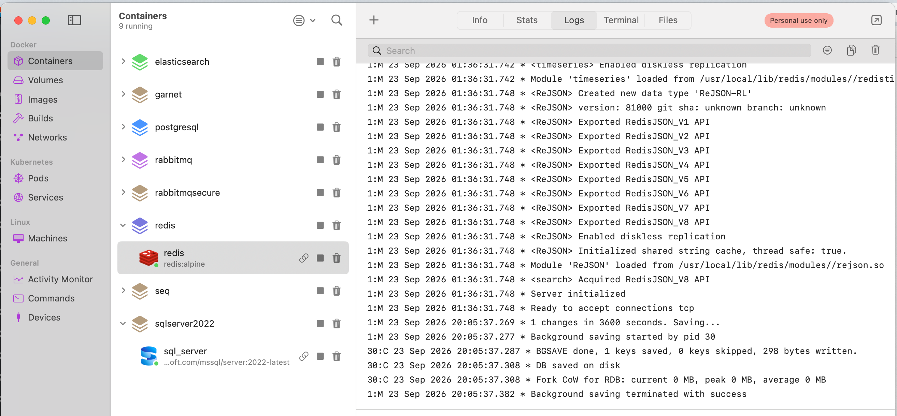
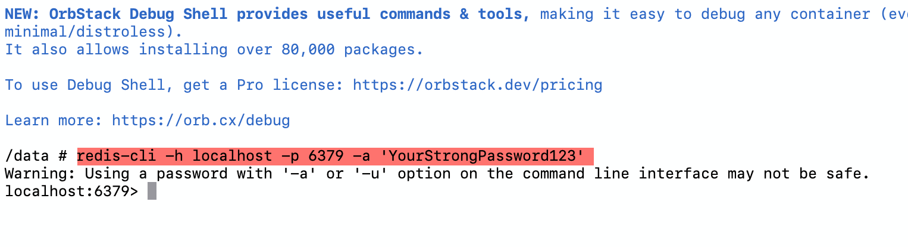
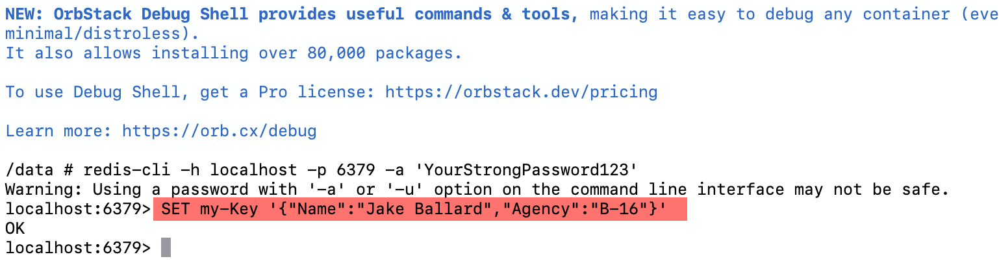
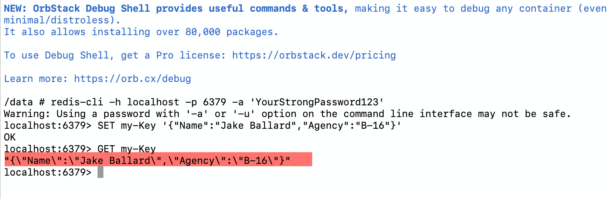

Caching is someting that you will undoubtedly need to do when writing high performance systems, where you are tryng to minimize expensive IO such as:

- Disk reads
- Network reads
- Database reads

[Redis](https://redis.io/), and its compatriots (which we shall look into later) is a solution built around this precise use case.

You can spin up a **Redis** instance using this [docker-compose](https://compose-spec.io/) file:

```yaml
services:
  redis:
    image: redis:alpine
    container_name: redis
    restart: always
    environment:
      - TZ=Africa/Nairobi
    command: ["redis-server", "--requirepass", "YourStrongPassword123"]
    ports:
      - '6379:6379'
```

Once it is running, you should see the following:



Next, we insert some data.

For this we will use the command line.

We start by connecting to the instance and authenticating ourselves.

```bash
redis-cli -h localhost -p 6379 -a 'YourStrongPassword123'
```

If all goes well we should see the following:



We are successfully connected.

Next, we presist an `object`.

The `object` is as follows:

```json
{
  "Name": "Jake Ballard",
  "Agency": "B-16"
}
```

We want to use the key `my-key` to identify  it.

Our command is thus:

```bash
SET my-Key '{"Name":"Jake Ballard","Agency":"B-16"}'
```

If all goes well we should see the following:



We can fetch our object as follows:

```bash
GET my-Key
```

We should get the following:


