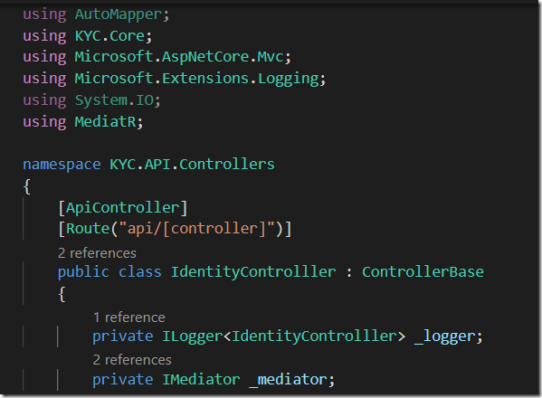
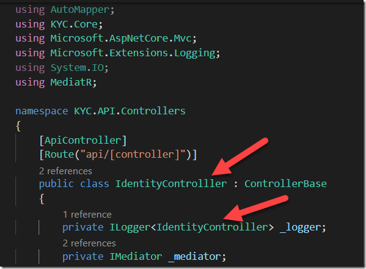

The other day I spent the better part of an hour trying to figure out why a particular controller action was not being hit by a request.

The problem, I finally realized, was this

Thanks to that typo the engine was unable to find the controller at all, let alone the action.

I wonder if there is any way to test for this, either at compile time or at runtime.