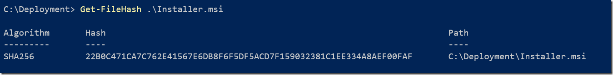
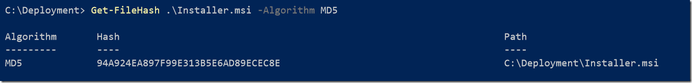

It is often a good idea to verify the file hashes of downloaded files, whether it is to detect that the file you download was actually the one that the developers intended ([see what happened to Handbrake for OSX)](https://www.extremetech.com/computing/249070-handbrake-download-mirror-compromised-macos-malware) or to detect corruption of a download.

Normally on windows you’d have to download one of the many hashing programs available online.

But did you know that Powershell can generate hashes for you?

This is done using the Get-FileHash cmdlet.

Which works like so…

**Get-FileHash <filename>**

But what if you want the MD5 hash?

No problem

These are the supported algorithms

  * MD5
  * SHA1
  * RIPEMD160
  * MACTripleDES
  * SHA256
  * SHA384
  * SHA512

The first two are fully supported for legacy reasons.

Happy hacking!