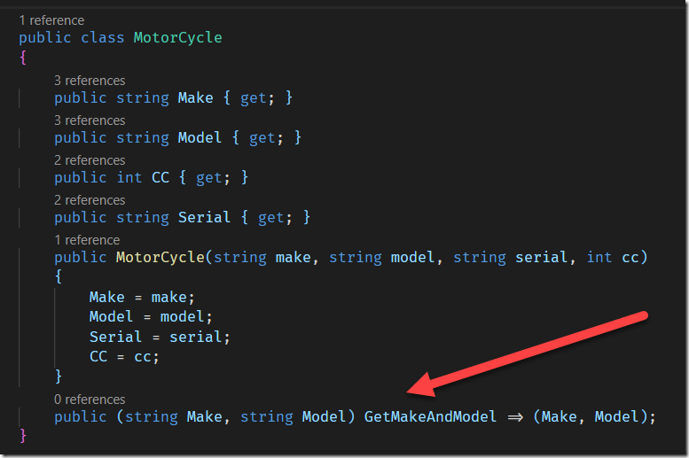
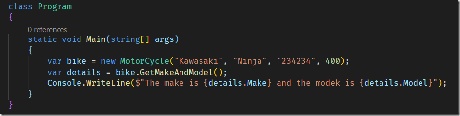
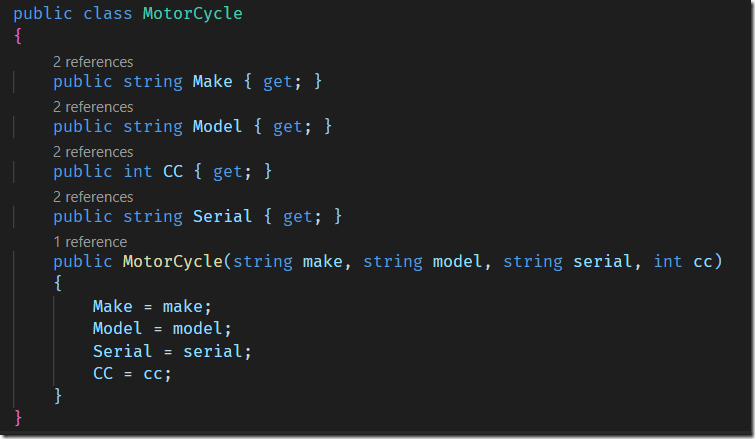

Tuples, or to use their correct name, **ValueTuples**, were introduced in C#.

To cut a long story short tuples are a construct that break the convention that methods return a single value. (Void, by the way, is also considered one of these single value)

But what if you want to return more than one value? There are 3 techniques

  1. Create a class packaging your objects
  2. Use out parameters
  3. Return a tuple object (not a **ValueTuple**) but a special object with properties Item1, Item2, Item3 …

And now you can return an actual **ValueTuple**

So assuming we have a class like this:

And we wanted to return only the make and the model in a method.

We could do it like this

Which can then be used like this

The details object being returned is a **ValueTuple**, with two strongly typed properties – Make and Model.

Essentially, two objects packaged in a tuple are being returned by the call to **_GetMakeAndModel_**()

You can make use of tuples as well in constructors.

Here again is the code for the Motorcycle

Let’s create a new class for cars, and this time use tuples to construct the object.

In our constructor we have made use of tuples by creating one with the four public properties in the class and simply copying the values once from the right (the parameters) to the left (the **_readonly_** properties). In this way we copy the parameters directly to the properties in one assignment rather than four different assignments. _(They are **readonly** properties because they have no **set**; but they can be written to by the constructor)_

You can access the full code from my [Github](https://github.com/conradakunga/BlogCode/tree/master/21%20March%202020%20-%20Tuples%20In%20Constructors)

Happy hacking!