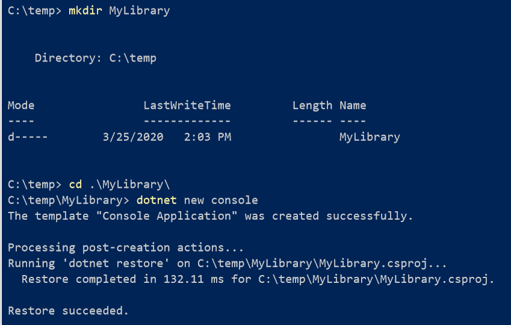
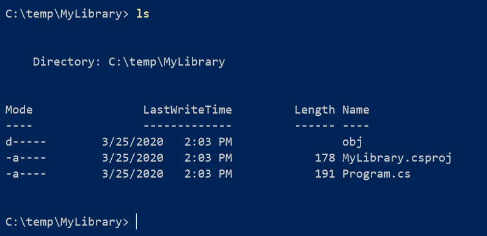
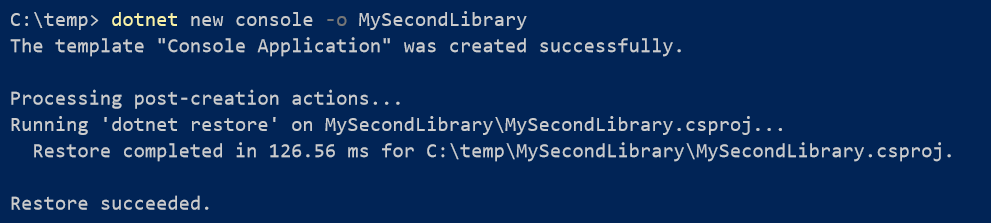
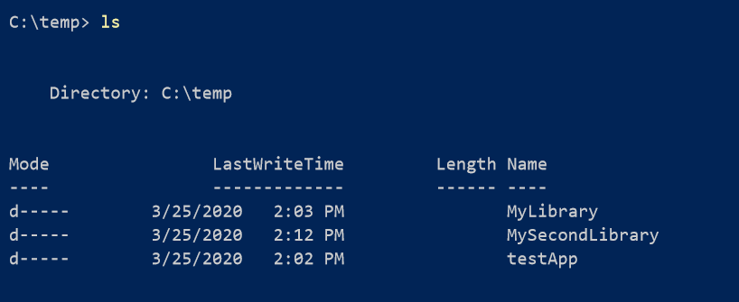
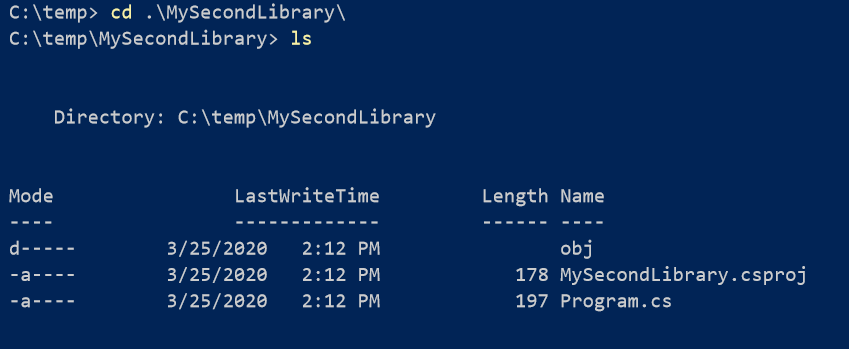

Many of us create .NET Core projects in the following way:

  1. Create a directory
  2. Enter said directory
  3. Invoke the `dotnet` new command

Like so:

If you list the contents you will find that the project name is the name of the directory

Often, you might not want this

  1. You may not want the project to use the name of the directory
  2. You may be creating multiple projects and it is tiresome to create directories and navigate into them just to create the project

There is a solution for this: the `–o` , or `–output` parameter

This allows you to specify the name of your project and where to put it

So we can create a second project from this directory

If we list the current directory we see our new directory created

And if we check the contents of that – our new project correctly named

It will save you a couple of seconds but life is short – those seconds add up!

Happy hacking!