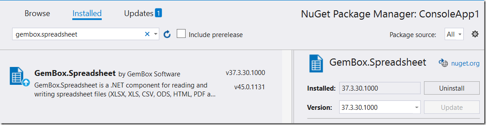
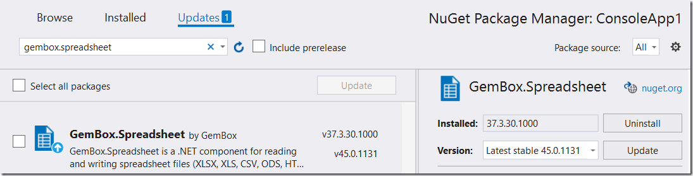
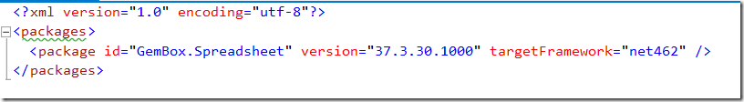
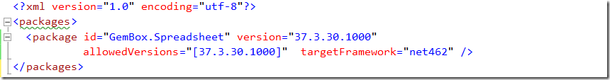
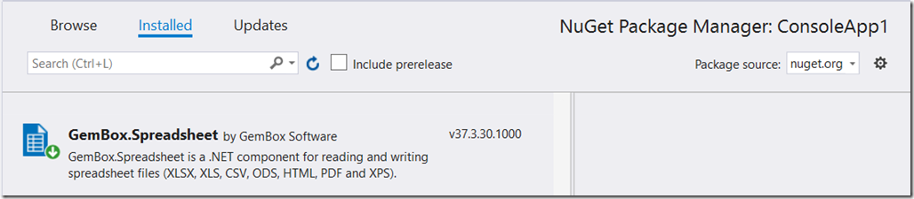

The Nuget package management system has been a godsend when it comes to managing libraries and dependencies in your projects.

One of its benefits is that it can detect outdated versions of a library you have in use and prompt you to upgrade it.

Take this example where I am making use of the excellent [Gembox.Spreadsheet](https://www.gemboxsoftware.com/spreadsheet)

I can see that there is an update available

Clearly I am several versions behind, and all I need to do is click **update** and the latest version will be downloaded and installed.

But what if I do not want this?

Maybe

  * There is a breaking change in their API that it am unable or unwilling to backport
  * We have decided as an organization on a standard version
  * The new version requires a new, or a different license

So for whatever reason you don’t want to upgrade. Ordinarily you don’t have to do anything.

But nuget will keep informing you that you have an update. And you may inadvertently update this library while doing an ‘update all’.

Alternatively, you may be working in a team and your colleagues may not know you want to retain this particular version.

There is, luckily, a solution for this.

Open the packages.config. It should look like this:

Add the attribute **“allowedVersions”** and specify the version you want to enforce. Note the square brackets! These are important

If we go back to the package manager note that it no longer shows that there is an update

You can read more about package pinning (including specifying minimum and maximum versions) from the Microsoft Nuget reference [here](https://docs.microsoft.com/en-us/nuget/concepts/package-versioning)

Happy hacking!