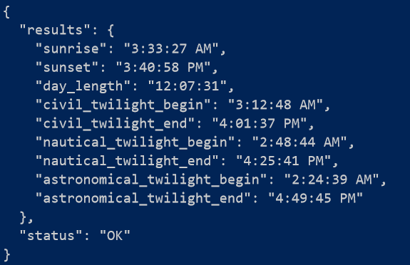
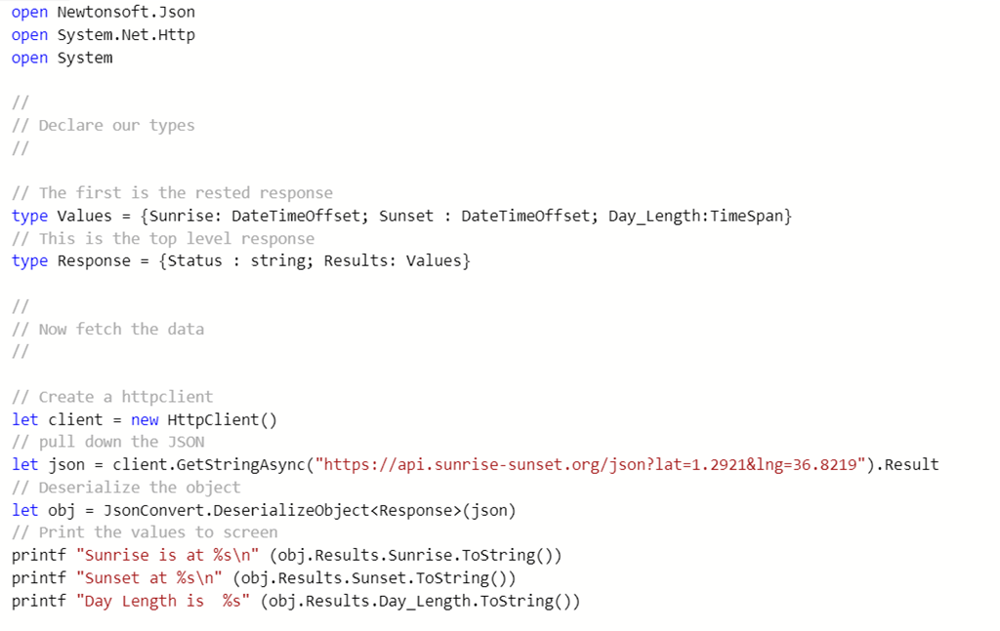
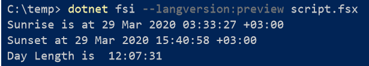

One of the brilliant improvements in [F# 4.7](https://devblogs.microsoft.com/dotnet/announcing-f-4-7/) is the ability to make use of [Nuget](https://www.nuget.org/) packages in your scripts.

This makes it very convenient to experiment with code without having to create an actual project.

This is accomplished using the `#r nuget: {PACKAGE NAME}.Json` declaration.

For example I have some code here that downloads the sunrise and sunset times in Nairobi and prints them to console

This code makes of `Newtonsoft.Json` and `HttpClient` libraries.

The web service I am using is the [Sunshine Sunset api](https://sunrise-sunset.org/api), that takes as parameters the latitude and longitude of the desired location (yours is a quick google away!)

The response itself looks like this:

First the is the root, that contains the **status** (a string) and the **results** (a nested object)

I have created a number of simple types to capture only the data that I am interested in that will be deserialized into from the JSON response.

The code is as follows:

Save it in a file, **Script.fsx**

You can run it using the `dotnet fsi` tool as follows:

You must include the `–langversion:preview` when you invoke the command or the Nuget functionality will not work.

You can get the source code for the script on my [github](https://github.com/conradakunga/BlogCode/tree/master/29%20March%202020%20-%20Nuget%20From%20F%23%20Scripts)

Happy hacking!