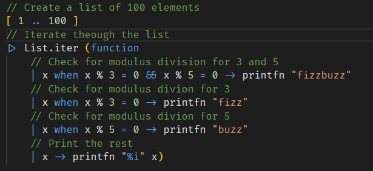
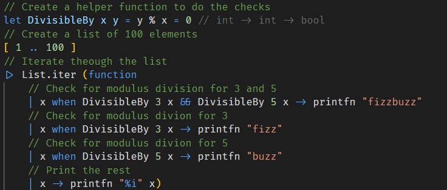
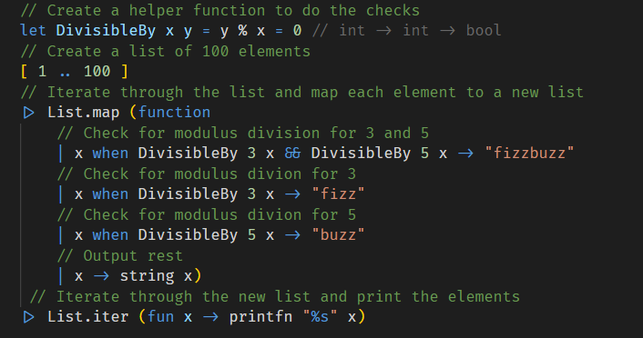
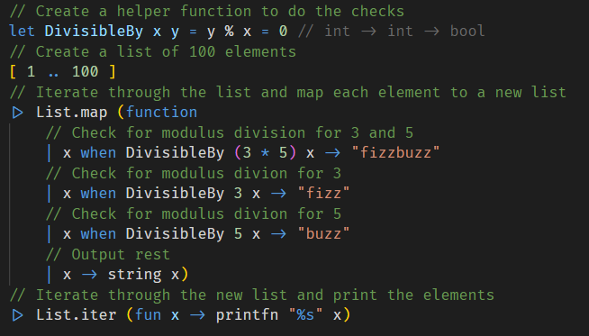

The FizzBuzz problem is one of those ubiquitous industry problems that has been floating around for decades, intended to separate the sheep from the goats.

It is deceptively simple:

> Write a program that prints the numbers from 1 to 100. But for multiples of three print “Fizz” instead of the number and for the multiples of five print “Buzz”. For numbers which are multiples of both three and five print “FizzBuzz”.

How hard can it be?

Let us attempt it in F#.

Here is my first attempt.

The algorithm simply creates a list of 100 elements and then using the `List.iter` construct, loops through the elements and calls a function that does the computation and prints the result

We can make a couple of obvious improvements.

First of all we can get rid of all those modulus divisions and replace them with a function to do that verification for us

The other improvement we can make is that this function is doing two things

  1. Checking for the logic for Fizz and Buzz
  2. Printing to the console

This means that if we wanted to change the logic, for example print **_fizz_** in red and **_buzz_** in green we would have to tinker with the function.

It might make more sense to split the logic checks and the output.

What we can do is create a new list with the correct elements, and then pipe that to a different function that does the printing.

Finally, the string **_FizzBuzz_** should be the output for input divisible by 3 and divisible by 5

There are two was we could potentially handle this

  1. Introduce a new function that calls `DivisibleBy` with 3 and then `DivisibleBy` with 5
  2. Simplify the operation

I think #2 is the simpler way to go.

Here is the final code.

Here is a challenge for you can you eliminate that call that checks for divisible by 3 and divisible by 5 and just retain the two calls?

The code, as usual, is in my [github](https://github.com/conradakunga/BlogCode/tree/master/1%20April%202020%20-%20FizzBuzz%20In%20F%23) repository.

_NB: The typos in the comments have been fixed in the source_

Happy hacking!