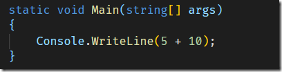
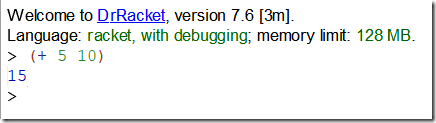
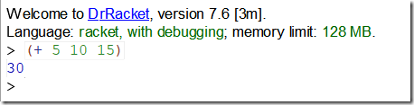
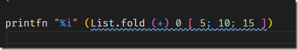
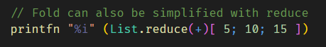
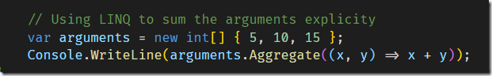

One of the interesting things about using an object oriented language (like C#) vs a functional one (like Racket) is you get an opportunity to see first hand how different things are doing in either paradigm.

One of the differences I have observed is how notation is observed.

Object oriented languages tend to use infix notation. This means given an operand, the arguments are on either side.

For instance, this is how addition is done in C#

The parameters are between the operands.

Things are a bit different in many functional languages, especially in the LISP family.

Take [Racket](https://racket-lang.org/).

Addition uses prefix notation

Now, you might thing that this is the same thing. But what if you wanted to add 3 numbers?

In c# you would do it like this:

In Racket it is done like this

See the difference?

For C# you have to specify ‘**+**’ **(n-1)** times; where n is the number of arguments.

For Racket you specify **+** only once regardless of the number of arguments.

Naturally you can get this behavior in F# natively. You can even get it in C# using LINQ.

What is happening here is we are folding all the elements of the list into a single value using the **List.fold** construct.

We are starting with an initial sum of 0, then adding 5; then to the result of that addition adding 10; and so on until we get the final result.

The squiggly line is the F# linter helpfully pointing out that there is no need to fold over addition – the same result can be gotten with **List.sum**

You can also achieve the same result with **List.reduce**

 

The equivalent code in C# is as follows, using the LINQ aggregate extension method.

Naturally LINQ has a Sum extension method as well.

Such a design makes it very easy to write powerful programs composed of building blocks that are flexible in terms of their argument handling.

You can access the code on my [Github](https://github.com/conradakunga/BlogCode/tree/master/5%20April%20Infix%20vs%20Prefix%20Notation).

Happy hacking!