One of the features of C# (and the .NET platform in general) is the support of properties as a first class citizen of the runtime.

Properties have a number of benefits:

  1. Control of access: the property can be read only, or read-write; unlike a field
  2. Granular access control: the property can be read-write, but you can control what can modify it
  3. You can have logic that validates values prior to setting them, and reject invalid states

Take the following example that demonstrates a number of these constructs.

This is an animal class with a bunch of properties:

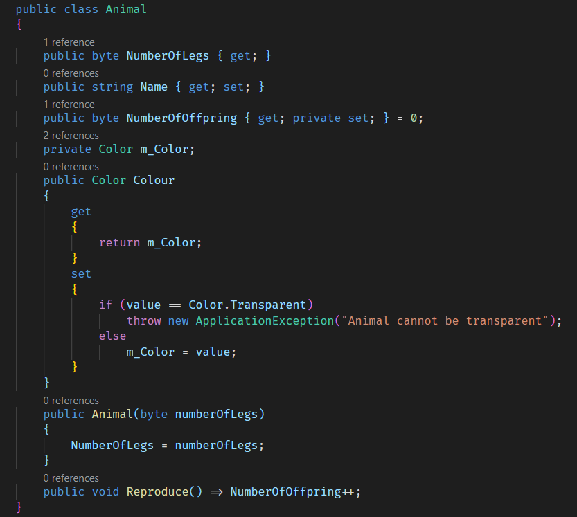

  * **NumberOfLegs** is a read only property. This means only the constructor can set it
  * **Name** is a read-write property. Anything, whether internal to the Animal class or external can set it
  * **NumberOfOffspring** is a read only property; but can be set by the constructor or any method in the class. When the public method **Reproduce()** is called, this is incremented.
  * **Colour** is a read-write property that uses a private backing field, m_Color. When the property is set by any code outside the class; it rejects setting a transparent colour

Having laid this out, have you ever wondered what happens behind the scene when this code is compiled?

There are a number of ways to view this.

If you are offline, or intend to do this kind of thing a lot, you can use the (free) [JetBrains dotPeek](https://www.jetbrains.com/decompiler/). If you take this root you need to change the default configuration in the settings and turn this indicated feature **on**

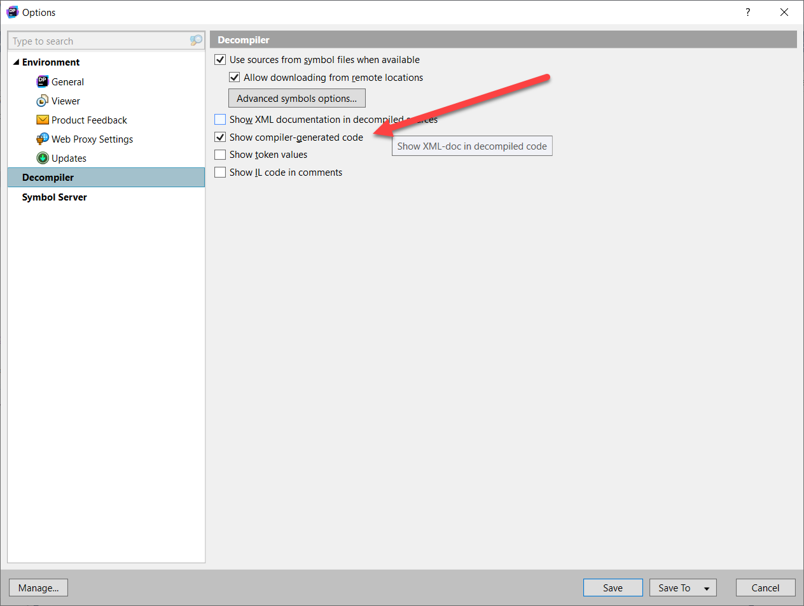

This is because by default the tool will not show you the compiler-generated code.

Once this is done, build the class library, then navigate to the bin/debug or bin/release folder and look for the compiled DLL.

Drag and drop this onto the dotPeek window.

It should look like this once you have expanded the class

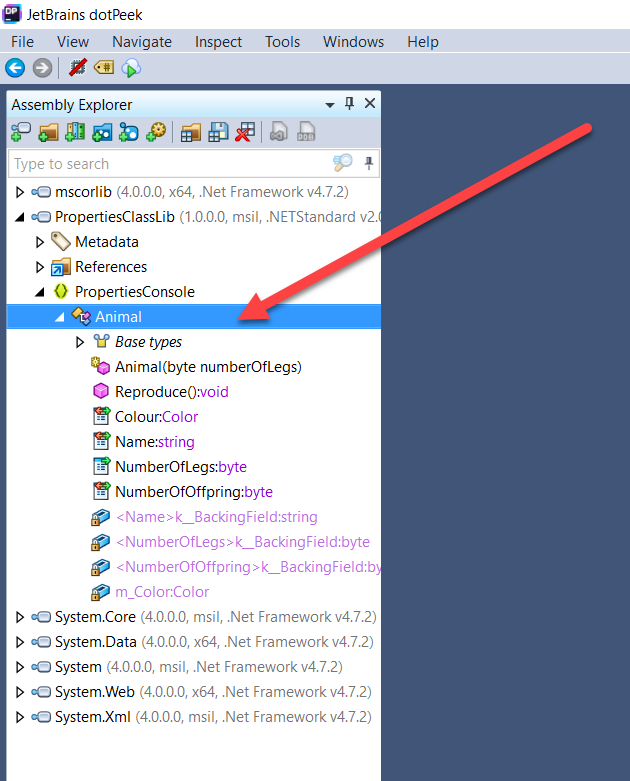

Finally, right-click the Animal class and select **Decompiled Sources**

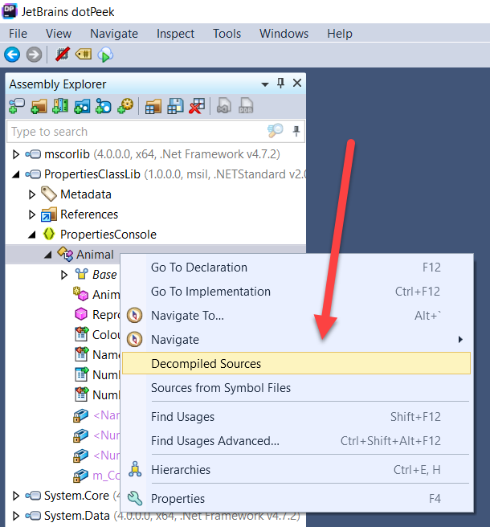

You should see the following

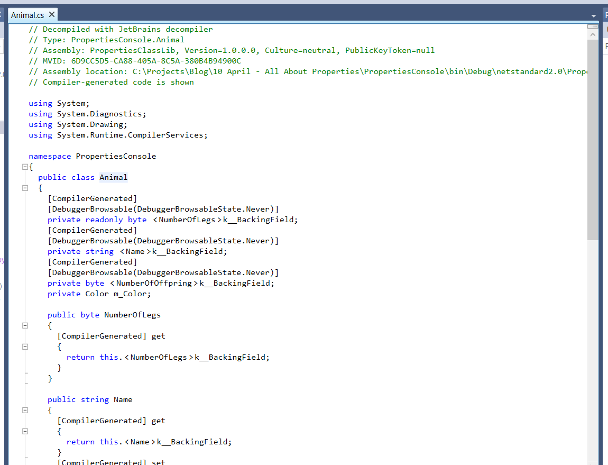

Alternatively, there is an excellent online tool called [SharpLab.io](https://sharplab.io/)

Copy and paste the source code into the tool.

You should see the following

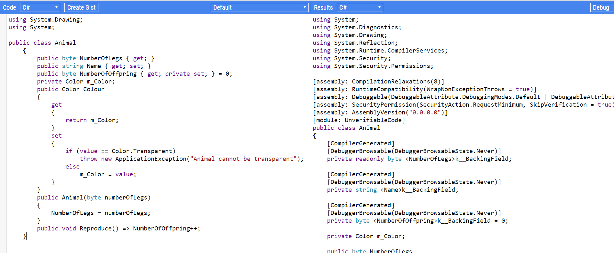

Whichever tool you prefer, what you see generated is what the compiler generates under the hood prior to generating the MSIL that is executed by the runtime.

There are a number of interesting things to note about this code. Let us examine it property by property.

#### Colour

The code for this is identical to our source. The compiler does not do anything.

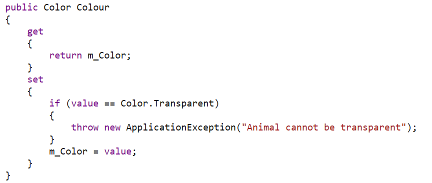

#### Name

This is the read write property. A couple of things have been generated by the compiler.

The first is the backing field

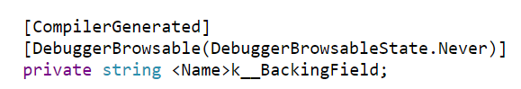

The first attribute, **CompilerGenerated**, is self-explanatory.

The second attribute is to prevent debugging tools from stepping into the property.

The compiler finally introduces a private backing field with the cryptic name **<Name>k__BackingField**

The second is a pair of methods – a get and a set, that are also compiler-generated.

The **get** retrieves the backing field value. The **set** updates it. These methods are called getters and setters

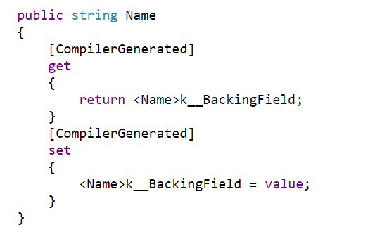

If you compare this to the code for **Colour** that we wrote, you notice the form and structure is **identical** – the compiler generates for us the plumbing code behind the scenes.

**Name** here is what is referred to as an auto-implemented property.

If you do not have any custom logic around the getting and setting of the property, this is the way to go. Under the hood, it is the same thing.

Otherwise, you can implement the backing field and custom logic yourself.

#### Number Of Legs

This is the read-only property that has with a public getter and no setter.

The compiler generates the following:

First, a backing field

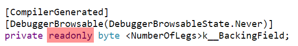

Note that the backing field here is **read-only**, signifying the intent only the constructor can set it.

Next the getter.

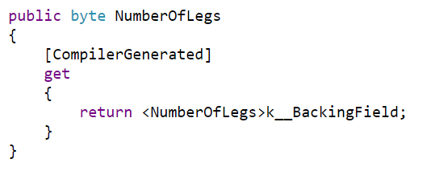

There is no setter because nothing other than the constructor can set it, as we can see here.

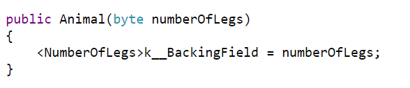

#### NumberOfOffspring

Offspring is the property with the public getter and a private setter.

First, we have the backing field.

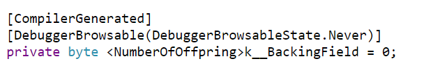

Then we have the generated getters and setters.

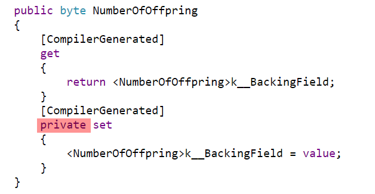

Note that the set is **private** to the class.

Note the subtle difference between this and the read-only public property **NumberOfLegs** that has no setter at all.

This property is changed with the method `Reproduce()` is called

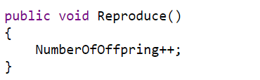

That is what happens under the hood when you use auto-implemented properties.

The source code is available on my [GitHub](https://github.com/conradakunga/BlogCode/tree/master/10%20April%20-%20All%20About%20Properties),

Happy hacking!