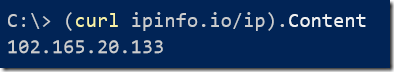
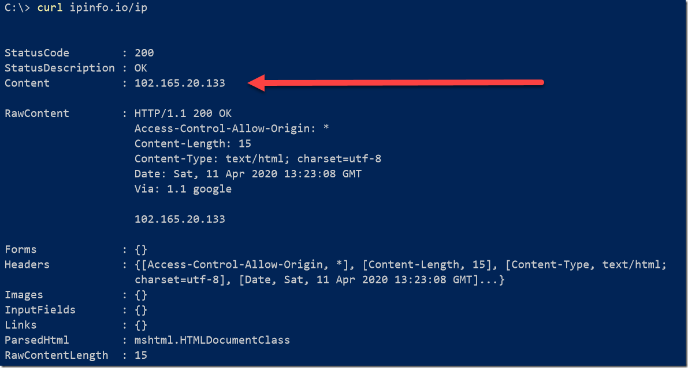

Suppose, for whatever reason, you need to know your ISP assigned IP address.

Generally you’d launch a browser to do this, using a site like [WhatIsMyIP](https://www.whatismyip.com/)

You can get that information using this handy expression

Curl is of course an alias for **Invoke-WebRequest**

Here we are using the excellent website [ipinfo.io](https://ipinfo.io/) that has a [dedicated web](https://ipinfo.io/ip) page that returns your IP address

Putting the expression in brackets so that we can access the Content property makes it easier to access the relevant information. 

To get the raw response, execute the following

We don’t need everything here – all we need is the content, hence the simplified expression above

Try it!

> 

**(curl ipinfo.io/ip).Content**

Happy hacking!