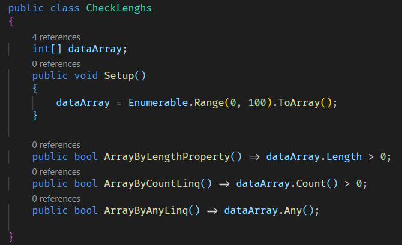
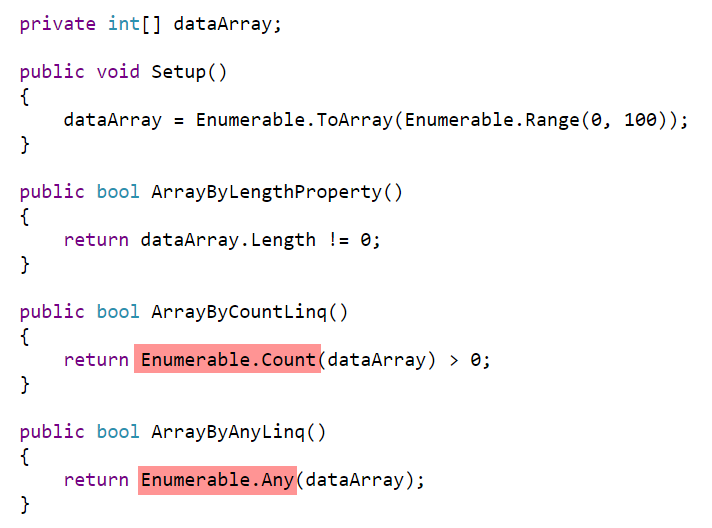
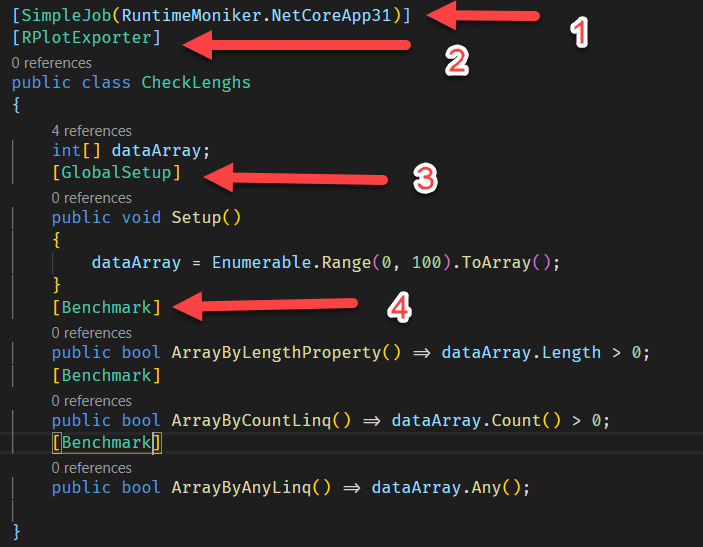
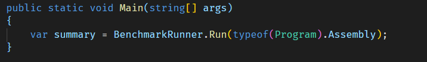
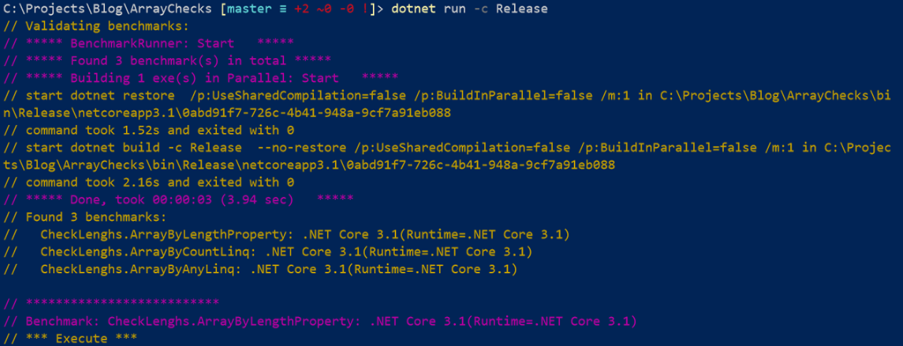
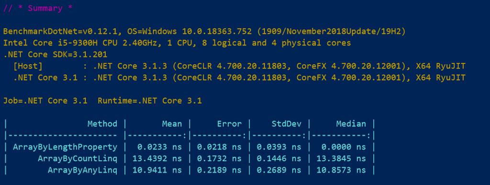
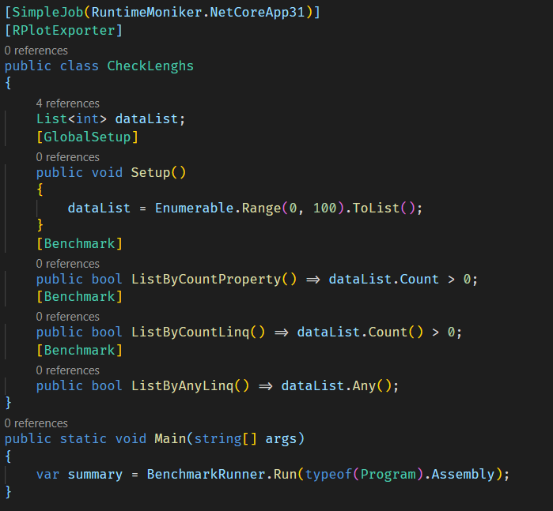
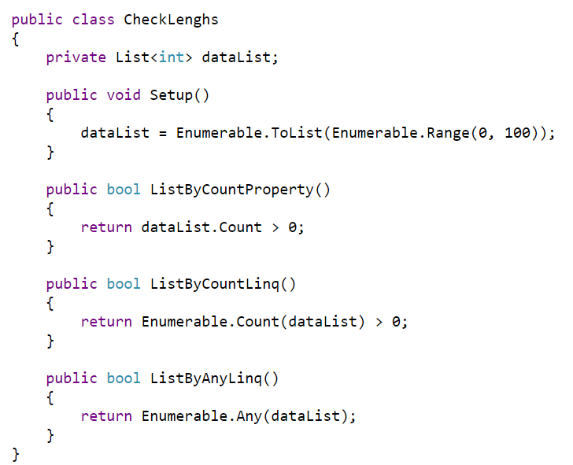
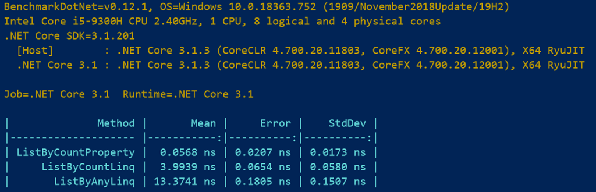

When working with collections there are several ways that you can determine if a collection is empty.

For arrays you have the following:
  * Length property
  * Count() extension method
  * Any() extension method

For lists you have the following:
  * Count property
  * Count() extension method
  * Any() extension method

Most of the time you use these interchangeably.

But have you ever wondered what is running under the hood?

Let’s look at some code.

We will be using a console application.



This class has a private array that is setup with 101 elements.

Then there are 3 methods that check if the array is empty in 3 different ways.

If we look at the code generated by the compiler using [SharpLab](https://sharplab.io/) we see the following:



Couple of things of interest:
  1. **dataArray.Count()** is replaced with **Enumerable.Count**
  2. **dataArray.Any()** is replaced with **Enumerable.Any()**

We can use a `Stopwatch` to time the performance of each of these methods, but a much better (and more scientific) way of doing it is with the tooling provided by [Benchmarkdotnet](https://benchmarkdotnet.org/)

We start by adding a reference with nuget

```powershell
dotnet add package benchmarkdotnet
```

Then we add a couple of attributes to the code:



  1. **SimpleJob** here specifies that we want to benchmark the code using the .NET Core 3.1 runtime
  2. **RPlotExporter** generates a number of graphs of data
  3. **GlobalSetup** runs any initialization we need before running the benchmarks
  4. **Benchmark** marks the code as code to be benchmarked

Once this is done we can now run the benchmarks.

To do so, change the `Main()` so that the benchmark infrastructure can initiate the benchmarks



To run benchmarks, run the application in release mode like so:

```powershell
dotnet run –c Release
```

If all goes well you should see some text starting with the following:



As you can see it has found the 3 benchmarks and is proceeding to execute them.

It does this several times (by default it automatically selects between 15 and 100), factoring in cold starts so that the final numbers are representative of performance.

It then computes statistics such as mean (average), median and standard deviation.

Once it has completed you can scroll down the intermediate statistics to the table of results.



You can see here that the `Length` property is **significantly** faster than `Count()` or `Any()`.

This is likely due to the fact that an array size must be known prior before declaring and instantiating it, therefore it is a cheap operation to get this value.

As opposed to `Count()` or `Any()` – the Linq extension methods that have to do a little more work.

So if you have code in a critical section of your application that is called repeatedly and performance is an issue – you know what approach to take.

We can do the same benchmarks for lists.



The code is virtually identical, except for the fact that lists do not have a `Length` property – they have a `Count` property instead.

Running the code through [SharpLab](https://sharplab.io/) yields the following



Almost identical.

Running the benchmarks yields the following:



A couple of interesting things:

  1. Determining the emptiness of an array is twice as **slow** as for a list
  2. The `Count()` extension method is much faster for a list than for an array
  3. The `Any()` extension method is marginally faster.

Moral – use `Length` for an array, and `Count` for a list to get the fastest performance.

In the project folder, there is a folder named **BenchmarkDotNet.Artifacts** – therein you can get all the statistical data in Excel, as well as a bunch of graphs generated by R.

You can get R from [here](https://www.r-project.org/) or you can install it using the package manager of your choice - [chocolatey](https://chocolatey.org/) (Windows), apt / yum (Linux) or [Homebrew](https://brew.sh/) (OSX)

If you are keen on mining the raw data, those files will be invaluable.

The code is in my [github](https://github.com/conradakunga/BlogCode/tree/master/2020-04-14%20-%20Collection%20Empty%20Checks).

Happy hacking!