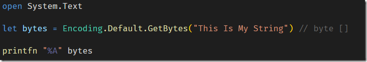

Suppose you need to extract the byte values of a string from F#

An obvious way is to use the Encoding class from System.Text

Like so:

An even quicker way to to it natively is as follows:

Note the **B** at the end

The code is in my [github](https://github.com/conradakunga/BlogCode/tree/master/25%20April%20-%20F%23%20Bytes)

Happy hacking!