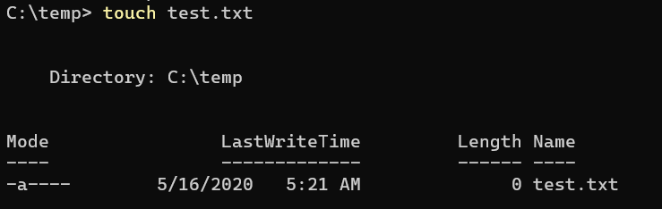

In Unix / Linux land there is a handy command to create an empty file.

This command is called `touch`

If you run the following command

```bash
touch test.txt
```

It creates an empty file named **test.txt** in the current directory.

Touch has the additional effect of updating the last write time if the file specified exists.

Very handy.

We can create our own version in PowerShell.

Open your profile using your favourite text editor.

Mine is notepad++

```powershell
Notepad++ $Profile
```

The code is as below:

```powershell
function Touch-File() {
    $fileName = $args[0]
    # Check of the file exists
    if (-not(Test-Path $fileName)) {
        # It does not exist. Create it
        New-Item -ItemType File -Name $fileName
    }
    else {
        #It exists. Update the timestamp
        (Get-ChildItem $fileName).LastWriteTime = Get-Date
    }
}

### Create an alias for touch

# Check if the alias exists
if (-not(Test-Path -Path Alias:Touch)) {
    New-Alias -Name Touch Touch-File -Force
}
```

We are doing a couple of things here:

First, we create a function named `Touch-File`

Within the function we capture the first argument passed to it, and assign it to the variable `$fileName`

Next we check if the file exists. If it does not we create an empty file named from the `$fileName` variable.

This is done using the `New-Item` cmdlet, specifying the object we want is a file and passing the file name

If the file exists, we update its last update time.

This is done by setting the `LastWriteTime` property of the file

Finally, after creating the function, we create an alias so we can use either `Touch-File` or the shorter `Touch`. We use the `–Force` parameter so that in case the alias already exists, we re-bind it

Note you cannot set the alias from inside the function as it seems you cannot create an alias for a function that has not been fully parsed and bound.

To test this close and open a new PowerShell window and try it out.

```powershell
touch test.txt
```

You should see the new file created



You can access the code in my [Github](https://github.com/conradakunga/BlogCode/tree/master/16%20May%20-%20Touch%20In%20PowerShell).

Happy hacking!