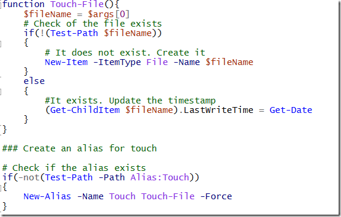
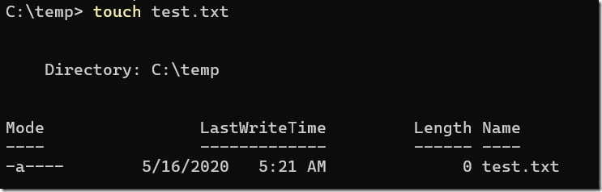

In Unix / Linux land there is a handy command to create an empty file.

This command is called **touch**.

If you run the following command

> touch test.txt

It creates an empty file named **test.txt** in the current directory.

Touch has the additional effect of updating the last write time if the file specified exists.

Very handy.

We can create our own version in Powershell.

Open your profile using your favourite text editor.

Mine is notepad++

> Notepad++ $Profile

The code is as below

We are doing a couple of things here

First, we create a function named Touch-File

Within the function we capture the first argument passed to it, and assign it to the variable **$fileName**

Next we check if the file exists. If it does not we create an empty file using **$fileName**

This is done using the **New-Item** cmdlet, specifying the object we want is a file and passing the name

If the file exists, we update its last update time.

This is done by setting the **LastWriteTime** property of the file

Finally, after creating the function, we create an alias so we can use either **Touch-File** or the shorter **Touch**. We use the –Force parameter so that in case the alias already exists, we re-bind it

Note you cannot do this inside the function as it seems you cannot create an alias for a function that has not been fully parsed and bound.

To test this close and open a new PowerShell window and try it out

> touch test.txt

You should see the new file created

You can access the code in my [Github](https://github.com/conradakunga/BlogCode/tree/master/16%20May%20-%20Touch%20In%20PowerShell).

Happy hacking!