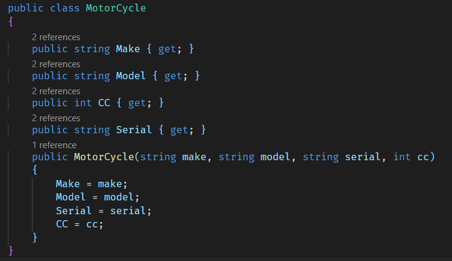
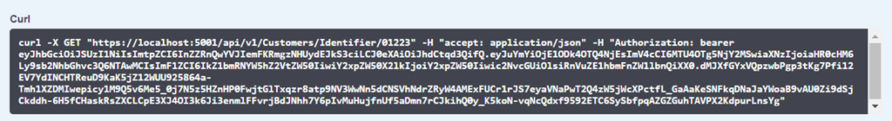
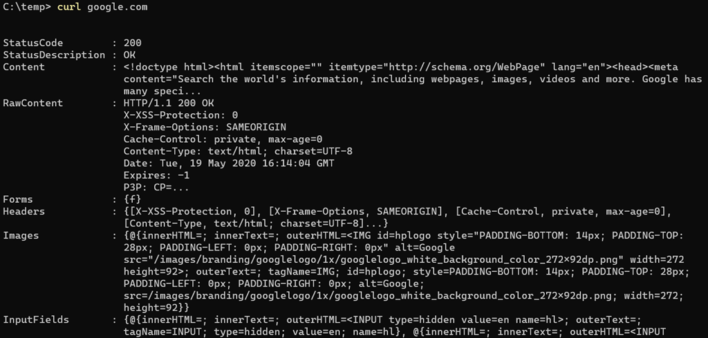
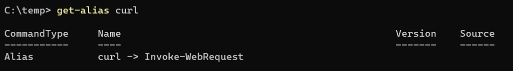
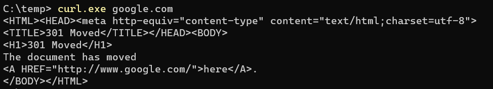
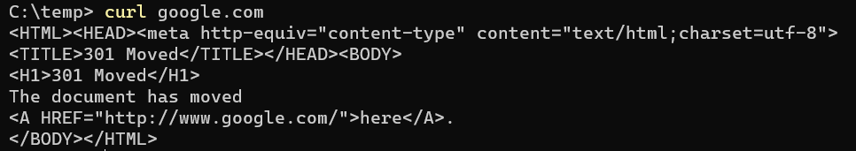

A useful tool to have in your toolbelt is an ability to make web requests and retrieve responses from the command line.

There are many tools that can do this for you, my favourite being these two:

  1. [httpie](https://httpie.org/)
  2. [curl](https://curl.haxx.se/)


It is the second that I want to turn my attention to.

Curl is a very popular utility that comes installed in many Linux distributions.

If you use tools like [Swashbuckle](https://github.com/domaindrivendev/Swashbuckle.AspNetCore/blob/master/README.md), it generates examples in curl format



If you are developing on Windows, curl is something you will need to install.

On my machine I use the [chocolatey](https://chocolatey.org/) package manager

You can install it using

```powershell
choco install curl
```

Once it installed and you have reloaded the shell you might do the following

```powershell
curl google.com
```

A response will come back as follows



You might say to yourself “mission accomplished”

You would be **wrong**.

What has in fact happened here is that curl has **not run at all**!

What has in fact run is the PowerShell cmdlet `Invoke-WebRequest`

Why? Because out of the box PowerShell has a pre-configured alias for this – **curl**

You can verify this as follows

```powershell
get-alias curl
```

You should see the following



So the question is how do we run curl the application?

There are two ways to do it.

The first is to leave PowerShell in no doubt you are referring to an application by providing the extension `.exe`

```powershell
curl.exe google.com
```



You can see the results are very different because curl has (in my opinion) the sensible default of not printing the headers if invoked without parameters.

This technique works but is very tiresome because you have to keep remembering to provide the extension.

The other (more sensible) solution is to **remove** the curl alias.

You can do this from your profile. Using your favourite text editor, open your profile.

Today we will use Visual Studio Code

In a PowerShell prompt type the following:

```powershell
code $profile
```

Scroll to the bottom (if your profile already has entries and add this line).

```powershell
Remove-Item Alias:\curl
```


Save the file and then reload the shell – or close and open it again.

Now try and run curl (without the extension)



This second approach makes this change persistent across PowerShell sessions.

If you just want it temporarily you can run `Remove-Item` in the current session and it will be reset the next time you start the shell.

You can access the code on my [Github](https://github.com/conradakunga/BlogCode/tree/master/19%20May%20-%20Using%20Curl%20in%20PowerShell).

Happy hacking!