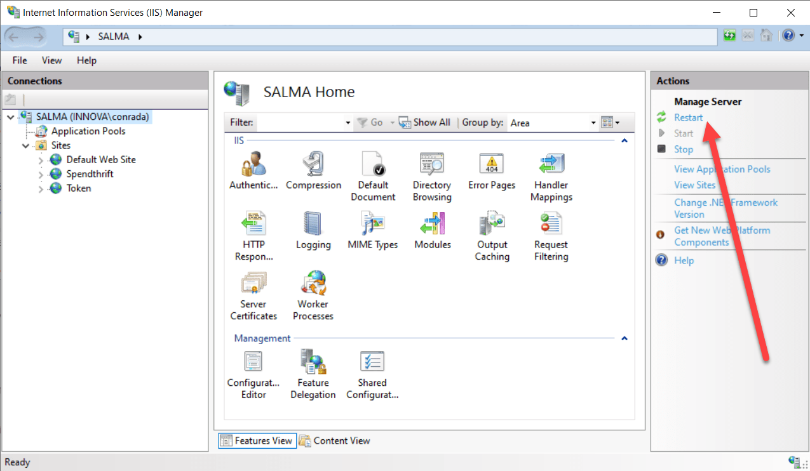
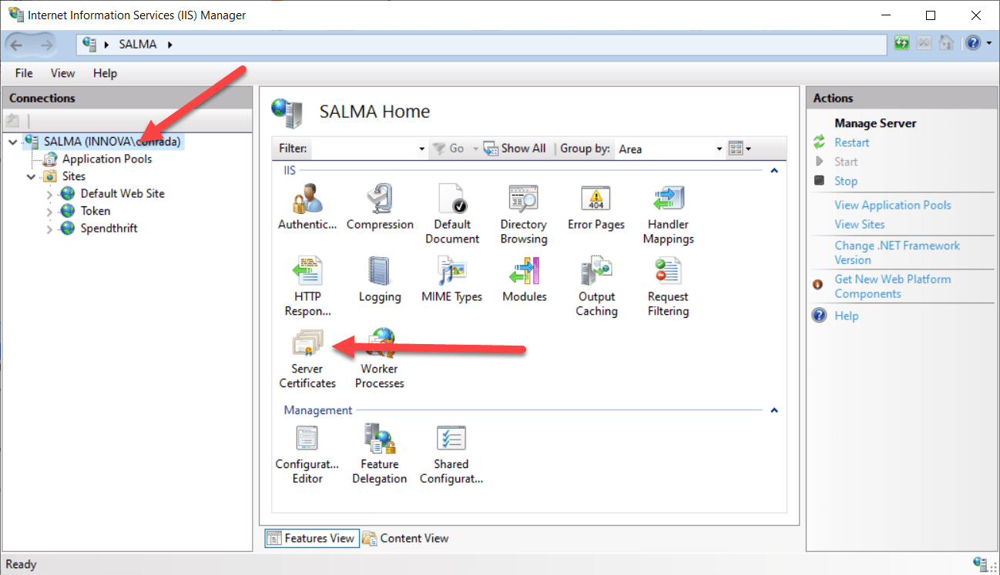
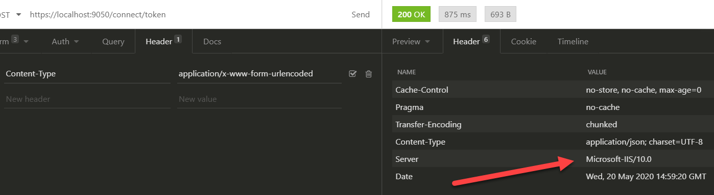

**Kestrel**, the web server that powers ASP.NET Core is highly optimized for running ASP.NET Core code, and running it fast.

However there is a lot more that is contained in a web application:

  1. CSS
  2. HTML
  3. JavaScript
  4. Images
  5. Other files e.g. PDFs

Kestrel can in fact serve these items, but it is not optimized for this.

You will probably need something more robust that can take care of the above items with additional benefits like:

  * Response output caching
  * Compression
  * Load balancing
  * Logging
  * HTTP redirect rules
  * Running multiple apps on the same port

If you are on Windows, the web server that can perform this actions is Internet Information Server (IIS)

It is possible to set up your server (or dev machine) to run ASP.NET core applications on Kestrel with IIS in front of it. This configuration is known as “reverse proxy”


All requests will be handled by IIS, and will be forwarded as appropriate to the ASP.NET Core engine.

To set this up you need to do the following.

First, go to the .NET Core downloads for the latest version of .NET Core.

Currently this is version 3.1, and can be found [here](https://dotnet.microsoft.com/download/dotnet-core/3.1)


Next look for the Hosting Bundle, and download it


Next, install IIS if you do not already have it.

This can be done using the **Turn Windows Features On** control panel


Ensure Internet Information Services looks like this:


These are the default settings for a basic IIS web server configuration. The items will be pre-selected for you once you choose **Web Management Tools** and **World Wide Web Services**

Click **OK** to install.

Once IIS is installed, run the installer for the hosting bundle.

Once that is complete, restart IIS.

You can do this from the IIS console itself



Next step is to publish the ASP.NET application.

This can be scripted as follows:

```powershell
dotnet publish -c Release --self-contained -r win10-x64 -o $TargetPath
```

**$TargetPath** here refers to where the files for the application will be placed.

Once this is done, on the IIS Console right click on Sites and then click **Add Website**


You will get this screen


Give the site a name that you will be able to remember, and browse to the **$TargetPath** created earlier to set the Physical Path.

Next is the bindings.

A binding is how you configure IIS to find the website, which ports to bind it to and whether to use http, https or both.

By default we do not want to create a http binding – we want all traffic to be encrypted.

So click the drop down that says **http** and change to **https**.

Once you do this the screen will change, and you will be asked for a port.

Specify any, although the traditional port is 443.

Leave the host name **blank**, unless you are hosting a publicly facing web application with a registered domain.

You will also be asked to select a certificate.

If you already have one installed, select it


If there is no SSL certificate in the list, cancel then go to the root of the console and select **Server Certificates**



For development and testing purposes you can create a self signed certificate


Give it a name and select web hosting as the certificate store.


Once this is done go back and create the https binding as outlined above. The name from this step is what you will use to select the certificate.

The final step is to configure the **Application Pools**

Click on the node and then double click the Application Pool with the **name** of the site you have created


Change the .NET CLR version to **No Managed Code**


Much as IIS can run .NET applications, the settings refer to the full .NET Framework and not the .NET Core. 

Finally, navigate to the new site you have created and on the right bar, restart it.


To test that it works, use [Insomnia](https://insomnia.rest/) (or [Postman](https://www.postman.com/)) or [curl](https://curl.haxx.se/) or [httpie](https://httpie.org/) – any tool that allows you to see the returned http headers from a HTTP request.

If you see **Kestrel** as the server, the configuration is not complete, and you have missed one of the steps above. Check in particular that you restarted IIS after installing the web hosting bundle.


If the configuration has worked correctly, you should see the following:



The exact version of IIS will vary based on your operating system (Windows 10 or Windows Server). But whichever the case it will show Microsoft IIS somewhere in the server header.

Mission accomplished!