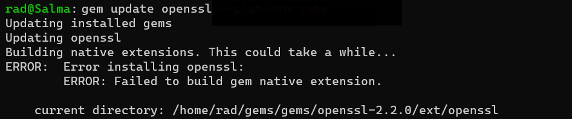
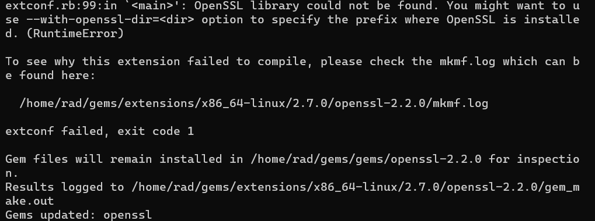
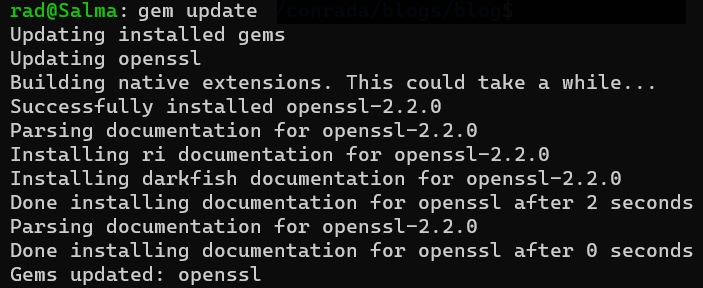

So like I mentioned in my [last post](), I have migrated from [WordPress](http://wordpress.org/) to [Jekyll](https://jekyllrb.com/) as my content management system.

Initially I tried to [install and run](https://jekyllrb.com/docs/installation/) it on Windows.

Running Ruby natively on Windows is not something I would recommend for anyone that enjoys their sanity, in particular if you need to build gems. 

It's not impossible - it's just difficult. You have to install a whole bunch of supporting plumbing and infrastructure to get everything working correctly, and these are the problem because finding native Windows equivalents is usually a challenge. Also, you may have to recompile some of this dependencies and the native tooling for Windows becomes an additional challenge.

After getting a huge number of [cryptic errors](https://gist.github.com/KelseyDH/11198922) I changed tack.

So I ended up running it on Ubuntu on the [Widows Subsystem for Linux](https://docs.microsoft.com/en-us/windows/wsl/install-win10) (WSL).

Works perfectly.

Now Jekyll is actually a bunch of Ruby gems, and as a good housekeeper I attempted to update them all to the bleeding edge.

```bash
gem update
```

However I got an error with one of the gems, OpenSSL.

When I tried to update it independently ...



With the following details.



The (very un-intuitive) solution to this is to install some missing libraries.

```bash
sudo apt-get install libssl-dev
```

This will pull down and install the necessary libraries for the OpenSSL gem to be compiled.



Mission accomplished!

Happy hacking!