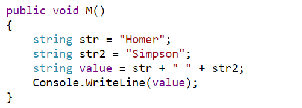
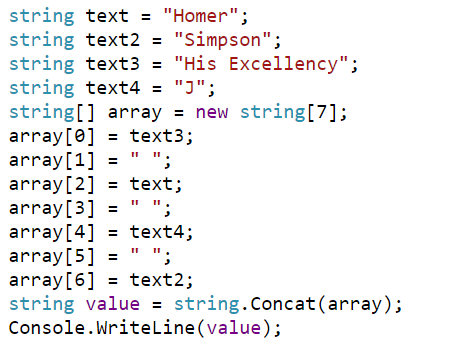

This is Part 1 in the series of **Joining stings**

* Joining Strings - Part 1 : The + Operator
* [Joining Strings - Part 2 : String.Concat]()
* [Joining Strings - Part 3 : StringBuilder]()
* [Joining Strings - Part 4 : String.Format]()

In the course of writing a typical application, you will generally find the need to combine a string with one or more other strings.

The first, and most obvious way to do it is to concatenate the string using the `+` operator.

Remember that a string is immutable - you cannot modify a string once you have created it. Any operations that purport to modify the string in fact create a new string! This can be a performance bottleneck especially if you are manipulating a large number of strings.

Let us take this sample code:

```csharp
var firstName = "Homer";
var surname = "Simpson";
var fullName = firstName + " " + surname;
Console.WriteLine(fullName);
```

Let us use [SharpLab.io](https://sharplab.io/) to paste our code and view the compiler generated code.

This is pretty straightforward.



Now let us assume Homer had a few more names.

```csharp
var firstName = "Homer";
var surname = "Simpson";
var title = "His Excellency";
var initial = "J";
var fullName = title + " " + firstName + " " + initial + " " + surname;
Console.WriteLine(fullName);
```

If we paste the code in [SharpLab.io](https://sharplab.io/) we see a large difference.



Here the compiler has done a couple of things:

1. Determined that there are in fact 7 strings - the names and then the spaces we are concatenating between them.
2. Created an `array` of 7 string elements.
3. Copied each of the strings to an element of the array.
4. Called `string.Concat()`, passing the array; and then assigned the new string to a variable.

You might ask - at what point does the compiler decide not to use the + operator and switch to the `string.Concat()` method?

The magic number appears to be 4 strings. Anything more will result in the second behaviour.

In other words, the compiler works very hard to optimize what was originally poorly performant code.

The compiler also has some additional optimizations.

Take this code:

```csharp
var children = "Bart" + " " + "Lisa" + " " + "Maggie";
Console.WriteLine(children);
```

Running it through [SharpLab.io](https://sharplab.io/) yields this:


Here the compiler has realized that this code can be optimized at compile time and has gone ahead to strip away the concatenation code and merged the strings directly.

In the next installment we will look at `string.Concat()`

The code is in my [Github](https://github.com/conradakunga/BlogCode/tree/master/28%20May%20-%20Joining%20Strings%20-%20Part%201).

Happy hacking!