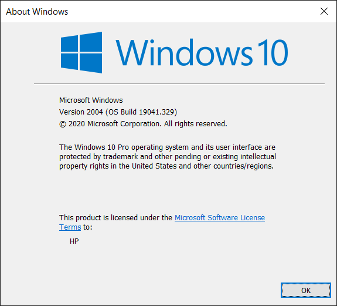
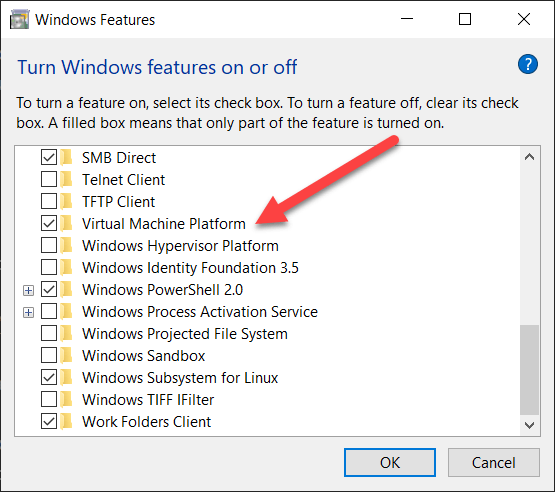
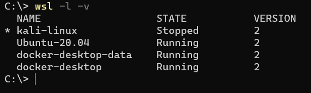

---
layout: post
title: Upgrading To WSL 2
date: 2020-06-10 11:26:42 +0300
categories:
  - WSL
---
Good news if you have been running on [Windows Subsystem For Linux](https://docs.microsoft.com/en-us/windows/wsl/) (WSL) and have wanted to upgrade to version 2 but have not been willing to join the Windows Insider Program - WSL2 is now out in the main release.

You can find out which version you are running using this command in your favourite terminal:

```powershell
winver
```

You should get a dialog like this:



This is the latest version as I am writing this.

If you have that version, then you already have WSL 2 support.

To enable support for WSL 2 you need to do three things
1. Enable virtual machine support
2. Download and install the latest kernel
3. Upgrade your existing Linux environments

# Enabling Virtual Machine Support
For this, launch **Turn Windows Features On And Off**.

Scroll down to **Virtual Machine Platform** and check that box.



Click **OK** to complete.

# Download and Install the Latest Kernel
If you are using an X86 64 bit machine (which you probably are) the latest kernel can be obtained here [https://wslstorestorage.blob.core.windows.net/wslblob/wsl_update_x64.msi](https://wslstorestorage.blob.core.windows.net/wslblob/wsl_update_x64.msi)

If you are using an ARM machine the kernel can be found here [https://wslstorestorage.blob.core.windows.net/wslblob/wsl_update_arm64.msi](https://wslstorestorage.blob.core.windows.net/wslblob/wsl_update_arm64.msi)

The official documentation from Microsoft on the kernel update is [here](https://docs.microsoft.com/en-us/windows/wsl/wsl2-kernel) 

An extended benefit is [Docker](https://docs.docker.com/docker-for-windows/), if you have it running, will automatically prompt you to use WSL 2.

You really should use WSL 2 as there are a number of performance gains.

# Update Existing Linux Environments
To list the existing environments, run the following:

```powershell
wsl -l -v
```
This will list for you your existing Linux environments, and their WSL version.



If you have just upgraded the Version column will read 1.

To convert to version 2 run the following command:

```powershell
wsl --set-version [LinuxVersion] 2
```

So for example to upgrade my Ubuntu instance I ran the following:

```powershell
wsl --set-version Ubuntu-20.04 2
```

If all goes well you will get the message "**Conversion Complete**"

However you might get a bunch of errors errors that look like this:

```bash
Importing the distribution failed. 
 ./usr/lib/ruby/2.5.0/rdoc/generator/template/darkfish/js/jquery.js: Hard-link target './var/lib/gems/2.5.0/doc/rubygems-update-3.1.2/rdoc/js/jquery.js' does not exist.
 ./usr/lib/ruby/2.5.0/rdoc/generator/template/darkfish/fonts/Lato-Light.ttf: Hard-link target './var/lib/gems/2.5.0/doc/rubygems-update-3.1.2/rdoc/fonts/Lato-Light.ttf' does not exist.
 ./usr/lib/ruby/2.5.0/rdoc/generator/template/darkfish/fonts/Lato-LightItalic.ttf: Hard-link target './var/lib/gems/2.5.0/doc/rubygems-update-3.1.2/rdoc/fonts/Lato-LightItalic.ttf' does not exist. 
 ./usr/lib/ruby/2.5.0/rdoc/generator/template/darkfish/fonts/Lato-Regular.ttf: Hard-link target './var/lib/gems/2.5.0/doc/rubygems-update-3.1.2/rdoc/fonts/Lato-Regular.ttf' does not exist. 
 ./usr/lib/ruby/2.5.0/rdoc/generator/template/darkfish/fonts/Lato-RegularItalic.ttf: Hard-link target './var/lib/gems/2.5.0/doc/rubygems-update-3.1.2/rdoc/fonts/Lato-RegularItalic.ttf' does not exist.
```

This is clearly [Ruby](https://www.ruby-lang.org/en/) throwing a spanner in the works.

The solution I found around this is as follows:

First, uninstall Ruby

```bash
sudo apt remove ruby
```

Then, clear out the directory `/var/lib/gems/`

```bash
rm -rf /var/lib/gems/
```

Then run the conversion.

You can verify the success by re-running:

```powershell
wsl -l -v
```

Verify that the version is now 2.

Once it is done you can then re-install Ruby.

```bash
sudo apt install ruby-full build-essential zlib1g-dev libssl-dev
```

And you're done!

Run the same process for all the instances you wish to convert.

Happy Hacking!