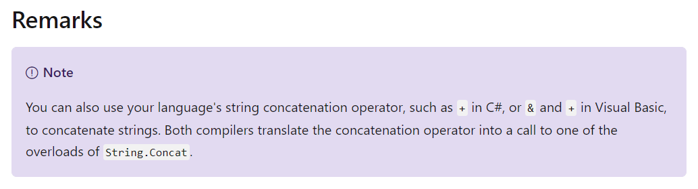

This is Part 2 in the series of **Joining stings**

* [Joining Strings - Part 1 : The + Operator]()
* Joining Strings - Part 2 : String.Concat
* [Joining Strings - Part 3 : StringBuilder]()
* [Joining Strings - Part 4 : String.Format]()

The second way to join strings is to use the `String.Concat` method.

This method has several signatures that take between two and four strings.

Here is the version that takes [two strings](https://docs.microsoft.com/en-us/dotnet/api/system.string.concat?view=netcore-3.1#System_String_Concat_System_String_System_String_):

```csharp
var son = String.Concat("Bart", "Simpson");

Console.WriteLine(son);
```

Here is the version that takes [three strings](https://docs.microsoft.com/en-us/dotnet/api/system.string.concat?view=netcore-3.1#System_String_Concat_System_String_System_String_System_String_):

```csharp
var daughter = String.Concat("Lisa", "Marie", "Simpson");

Console.WriteLine(daughter);
```

And here is the version that takes [four strings](https://docs.microsoft.com/en-us/dotnet/api/system.string.concat?view=netcore-3.1#System_String_Concat_System_String_System_String_System_String_System_String_):

```csharp
var mother = String.Concat("Marjorie", "Jacqueline", "Bouvier", "Simpson");

Console.WriteLine(mother);
```

Of course the question arises - what if you call `String.Concat` with more than four strings? Can you?

You can!

```csharp
var clown = String.Concat("Herschel", "Shmoikel", "Pinchas", "Yerucham", "Krustofsky");

Console.WriteLine(clown);
```

What happens here is that there is an overload that takes a [`string` array](https://docs.microsoft.com/en-us/dotnet/api/system.string.concat?view=netcore-3.1#System_String_Concat_System_String___) as its parameter.

There is also a version that takes an [`IEmumerable<string>`](https://docs.microsoft.com/en-us/dotnet/api/system.string.concat?view=netcore-3.1#System_String_Concat_System_Collections_Generic_IEnumerable_System_String__) object as it's parameter.

This means that you can pass anything that implements `IEnumerabe<string>` such as a `List<string>`

```csharp
var list = new List<string>();

list.Add(son);
list.Add(daughter);
list.Add(mother);
list.Add(clown);

var characters = String.Concat(list);
```

Of note is that there are overloads that instead of taking two to four `strings` as parameters, it they take [`ReadOnlySpan<char>`](https://docs.microsoft.com/en-us/dotnet/api/system.readonlyspan-1?view=netcore-3.1) instead.

If you are writing highly performant code using [Spans](https://docs.microsoft.com/en-us/dotnet/api/system.span-1?view=netcore-3.1), these overloads would be more appropriate choices.

In the documentation for [String.Concat](https://docs.microsoft.com/en-us/dotnet/api/system.string.concat?view=netcore-3.1) is a remark that touches on what we discovered in the [previous post in the series]()



The code is in my [Github](https://github.com/conradakunga/BlogCode/tree/master/2020-06-15%20-%20Joining%20Strings%20-%20Part%202)

Happy hacking!