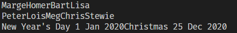
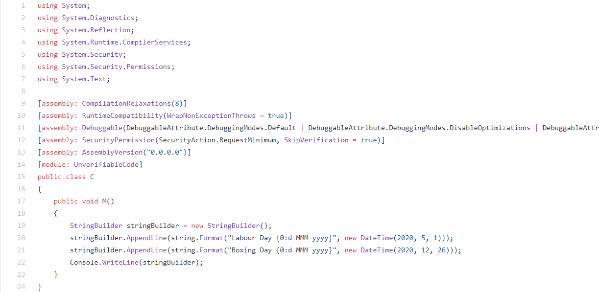

---
layout: post
title: "Joining Strings - Part 3 : StringBuilder"
date: 2020-06-22 03:29:19 +0300
layout: post
categories:
  - .NET
  - Under The Hood
---

This is Part 1 in the series of **Joining stings**

* [Joining Strings - Part 1 : The + Operator]()
* [Joining Strings - Part 2 : String.Concat]()
* Joining Strings - Part 3 : StringBuilder
* [Joining Strings - Part 4 : String.Format]()

The third way to join strings is to use a class called the `StringBuilder`.

The [StringBuilder](https://docs.microsoft.com/en-us/dotnet/api/system.text.stringbuilder?view=netcore-3.1) is a mutable string of characters. (Remember that a `string`, by design, is immutable).

You typically interact with a `StringBuilder` by creating one, and then adding strings to it using the [Append](https://docs.microsoft.com/en-us/dotnet/api/system.text.stringbuilder.append?view=netcore-3.1) method.

```csharp
// Create a new, empty StringBuilder 
var simpsons = new StringBuilder();
simpsons.Append("Marge");
simpsons.Append("Homer");
simpsons.Append("Bart");
simpsons.Append("Lisa");

// Write string to console
Console.WriteLine(simpsons);
```

You can also create a `StringBuilder` with a constructor that takes a `string`.

```csharp
// Create a StringBuilder that is initialized
var griffins = new StringBuilder("Peter");
griffins.Append("Lois");
griffins.Append("Meg");
griffins.Append("Chris");
griffins.Append("Stewie");

// Write string to console
Console.WriteLine(griffins);
```

Should you want to manipulate the strings prior to appending them, there is a method that allows you to append strings using the `String.Format` syntax

```csharp
var holidays = new StringBuilder();
holidays.AppendFormat("New Year's Day {0:d MMM yyyy}", new DateTime(2020, 1, 1));
Console.WriteLine(holidays);
```

With string interpolation, you can do this directly:

```csharp
holidays.Append($"Christmas { new DateTime(2020, 12, 25):d MMM yyyy}");
```

If you look at the output, it looks something like this:



You might ask - what if you want to introduce newlines between each string?

There are two ways.

The simplest is instead of using the [Append](https://docs.microsoft.com/en-us/dotnet/api/system.text.stringbuilder.append?view=netcore-3.1) method, you use the [AppendLine](https://docs.microsoft.com/en-us/dotnet/api/system.text.stringbuilder.appendline?view=netcore-3.1) method.

```csharp
var newHolidays = new StringBuilder();
newHolidays.AppendLine($"Labour Day { new DateTime(2020, 5, 1):d MMM yyyy}");
newHolidays.AppendLine($"Boxing Day { new DateTime(2020, 12, 26):d MMM yyyy}");
Console.WriteLine(newHolidays);
```

Alternatively you can use either `AppendFormat` or string interpolation to introduce the newlines.

Interestingly, when you use string interpolation, the compiler rewrites the code to use AppendFormat.
  
The former code, when passed to [SharpLab](https://sharplab.io/), generates the following:



Given that a `StingBuilder` is mutable, this allows a number of operations that are generally not possible with immutable strings.

You can **modify** the contents of a `StringBuilder`.

```csharp
newHolidays[6] = '-';
```

This will change the output from:

```plaintext
Labour Day 1 May 2020
```

to:

```plaintext
Labour Day-1 May 2020
```

You can also **insert** text into any position in the `StringBuilder`.

In the example below we are inserting text at the very beginning.

```csharp
newHolidays.Insert(0, $"Valentines' Day {new DateTime(2020, 2, 14):d MMM yyyy}{Environment.NewLine}");
```

Regardless of the number of strings you are joining, the `StringBuilder` internally adjusts its capacity to accommodate the changes.

This means that if you are manipulating a large number of strings, you can get a lot of performance benefits from using a `StringBuilder`.

The code is in my [Github](https://github.com/conradakunga/BlogCode/tree/master/25%20Jun%202020%20-%20Joining%20Strings%20-%20Part%203).

Happy hacking!