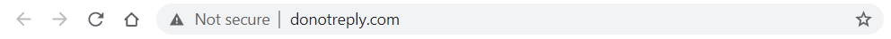
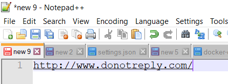

Here is a site I am visiting on Chrome.

I then, for whatever reason, decide that I want to copy that URL and paste it somewhere else.

To my surprise, this is what gets pasted.

Notice that the `http://www.` and the trailing `/` do not appear anywhere in the browser URL bar.

I am not sure this is a good thing, because I believe in the principal of least astonishment. In this case what I copy should be what I paste.

Happy hacking!

