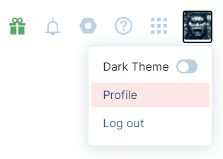

[YouTrack](https://www.jetbrains.com/youtrack/) is a robust web based platform for issue tracking, Sprint and Kanban management.

It is imperative to be able to leverage this in terms of pushing data into, and pulling data out of, using automated means - via API.

Given the amount of data contained therein, in terms of bugs, new features, improvements etc as well as sprints and Kanban boards, it can be beneficial to be able to pull data out of YouTrack, for several reasons:

1. Generate release notes
2. Automated capture and logging of runtime errors
3. Extraction of analytics from issues
    - Time from logging to assignment
    - Time from assignment to closing
    - Assignments to team members
    - Issues by priority
    - Issues by assignment
    - Issues by type
    - Issues by reporter

There is an open source .Net Core Nuget package, [YouTrackSharp](https://github.com/JetBrains/YouTrackSharp) that can achieve the levels of integration we are interested in.

The first thing to be done is to connect to the YouTrack instance. This is done using a `BearerTokenConnection`, that takes as parameters the URL to the instance and a token.

This is done as follows

```csharp
var connection = new BearerTokenConnection("https://YOUR-YOUTRACK-INSTANCE", "{TOKEN}");
```

`TOKEN` here is a value that is used to identify you to the API.

You will need to generate this token. This is done as follows:

Go to your profile



Then access your profile page


Then go to the authentication page


You will see a list of all your active token, if any


To generate a new token click **New Token**


Tokens have two components:
- A Name, that it will be referred to with
- A scope, which is a list of the applications to be accessed


Scopes can be selected from a list


Once you generate a token you get the following dialog


The token is the value

`perm:Y29ucmFkYQ==.NjEtMw==.ba3Tt3qi47KIa33MgcQa0ty26LjqXB`

Note that once you close this window, the actual token is no longer available. Make sure you save this value somewhere.

You can have more than one token, if you need to segregate your applications.

Once you delete the token any applications using that token can no longer connect.

Once you have a `BearerTokenConnection`, you can connect to various aspects of the instance:

- Issues
- Projects
- Time Tracking
- Time Tracking Management
- User management

The following code will connect to the API and iterate all the projects that I am in.

```csharp
var connection = new BearerTokenConnection("https://YOUR-YOUTRACK-INSTANCE", "perm:Y29ucmFkYQ==.NjEtMw==.ba3Tt3qi47KIa33MgcQa0ty26LjqXB");
var projectsService = connection.CreateProjectsService();
var projectsForCurrentUser = await projectsService.GetAccessibleProjects();
foreach (var project in projectsForCurrentUser)
{
	$"{project.Name} - {project.ShortName}".Dump();
}
```
	
The output is as follows

```plaintext
Test Project - TP
Other Test Project - OT
```

Retrieving issues is similar.

The example below is retrieving the first 100 issues fixed in Version 1.0.0

```csharp
var isssuesService = connection.CreateIssuesService();
var version = "1.0.0";
var issues = await isssuesService.GetIssues($"Fix versions: {version}", take: 100);
var filtered = issues.OrderBy(i => i.GetField("reporterFullName").AsString());
var temp = "";
$"# Version: {version} - ({issues.Count} items resolved)".Dump();
foreach (var issue in filtered)
{
	var reporter = issue.GetField("reporterFullName").AsString();
	var updater = issue.GetField("updaterFullName").AsString();
	var created = issue.GetField("created").AsDateTime();
	var resolved = issue.GetField("resolved")?.AsDateTime();
	var type = string.Join(",", issue.GetField("Type").AsCollection());
	var priority = string.Join(",", issue.GetField("Priority").AsCollection());
	var state = string.Join(",", issue.GetField("State").AsCollection());
}
```

A couple of things here

1. `GetIssues()` takes a filter, to restrict the returned items, and a `Take` to control the number of returned values
2. Field values are typed as `objects`, and can be retrieved using the `GetField("xxxxx")` method and typed with the `AsXXXX()` method. The main types are
    - `DateTime`
    - `String`
    - `Collection`
3. It is possible that the `GetField()` method will return `null`, so it is important to check for that.
4. The `Issue` object is strongly typed, but it only exposes a few properties directly. Most of the underlying fields are accessed using the `GetField()` method.
5. The filter is in the standard YouTrack filer format

Happy Hacking!

