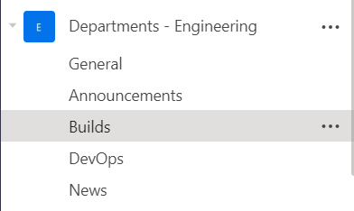

[Microsoft Teams](https://www.microsoft.com/en-us/microsoft-365/microsoft-teams/group-chat-software) makes use of an API, the [Microsoft Graph API](https://docs.microsoft.com/en-us/graph/overview), that is leveraged to push data into, and pull data out of various Microsoft Products, chiefly Office 365.

The premise in Teams is communications happens in the context of `channels`, that are child entities of `teams`.



To communicate with a `channel`, you require a `webhook`. By default, channels do not have webhooks.

`Channels` & `webhooks` can be added by owners of the teams, or administrators.

This is done in the settings of the team.


This opens the following dialog, allowing specification of multiple connectors.


Identify `Incoming Webhook` and click **Configure**

In the resulting screen you can configure the following

- A **name** (which is mandatory)
- An **image** (to give the integrating application a distinctive look)


You will need to scroll down to save


Once you save you will get the following screen


The URL there is the `webhook`. 

You will need this for any application or script that interfaces with Teams. It is pretty long, but there is an icon that will copy it to the clipboard.

If you need to access the webhook, or change the name, click the `Connectors` menu again.

This time click `Configured`


The resultant screen will show you a link with the existing configured connectors. 


Click that link to access the setup


There are two main ways to leverage this integration

##### HTTP Request
This is a normal HTTP request using whatever technique - `Powershell`, `Curl`, `HTTPie` or other such technique.

**Bash on macOS or Linux**
```bash
curl -H 'Content-Type: application/json' -d '{"text": "Hello World"}' <YOUR WEBHOOK URL>
```

**Bash on Windows**
```bash
curl.exe -H "Content-Type:application/json" -d "{'text':'Hello World'}" <YOUR WEBHOOK URL>
```
Note for windows the `.exe` is important otherwise the shell will consider `curl` as an alias for `invoke-webrequest`

You can install curl directly [here](https://curl.haxx.se/windows/). Alternatively you can use [Chocolatey](https://chocolatey.org/) package manager. In which case you run this command from your favourite shell

```bash
choco install curl
```


**Powershell**
```powershell
Invoke-RestMethod -Method post -ContentType 'Application/Json' -Body '{"text":"Hello World!"}' -Uri <YOUR WEBHOOK URL>
```


# Resources

1. [Microsoft Graph API](https://docs.microsoft.com/en-us/graph/overview)
2. [Sending messages to connectors & webhooks](https://docs.microsoft.com/en-us/microsoftteams/platform/webhooks-and-connectors/how-to/connectors-using#setting-up-a-custom-incoming-webhook)
3. [Microsoft Teams Developer Platform](https://docs.microsoft.com/en-us/microsoftteams/platform/)


Happy hacking!