I have recently discovered a glorious online streaming radio station, [WXQR - New York's Classical Music Radio Station](https://www.wqxr.org/). This station streams classical music pretty much 24 hours a day.

While the site is open, the information of what is playing is displayed both at the top at the bottom of the page.

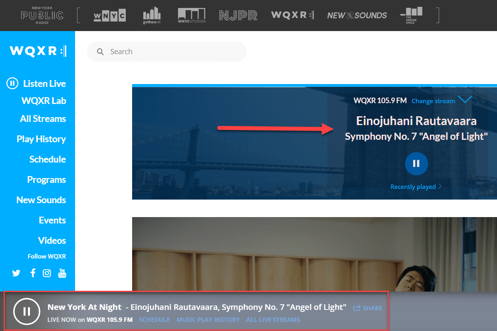

As these change dynamically, one wonders how this information is updated.

The developer tab to the rescue

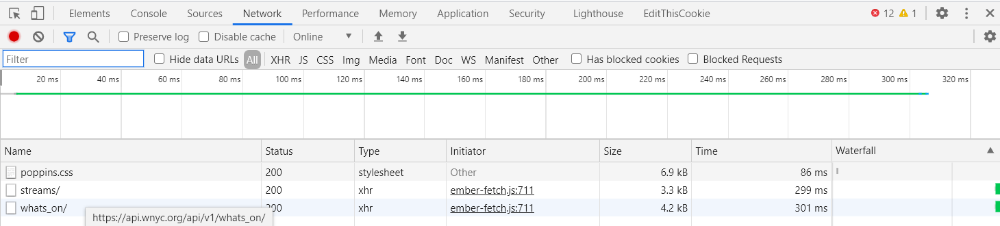

There seems to be a URL being hit that looks promising, with a promising URL.

If we wait a bit longer ...

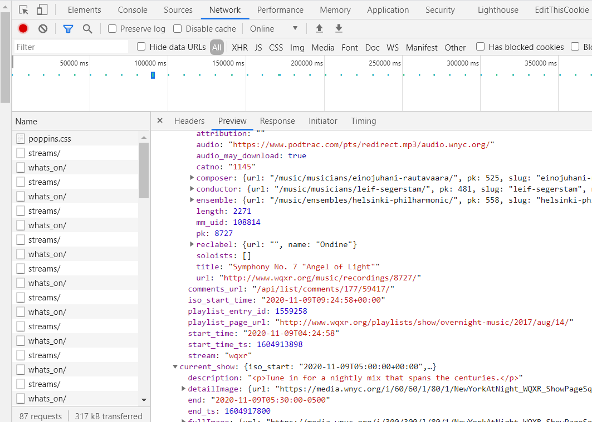

There seem to be quite a number of requests to this end point, and the results appear to be JSON.

If we hit the endpoint directly in the browser we get something like looks like this:

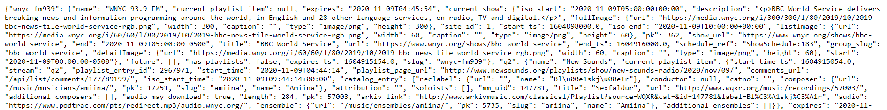

The next step is to try and reverse engineer the JSON to figure out what's going on.

To do this we need to better visualize the JSON.

[JSonFormatter](https://jsonformatter.curiousconcept.com/) to the rescue.

This page allows you to paste the JSON and visualize it better.

Collapsed, it looks something like this:

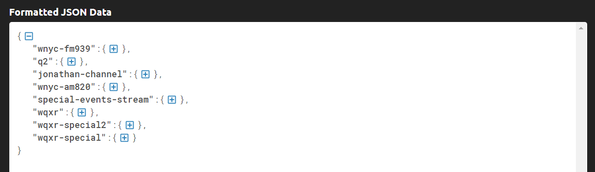

If we expand the first node ..

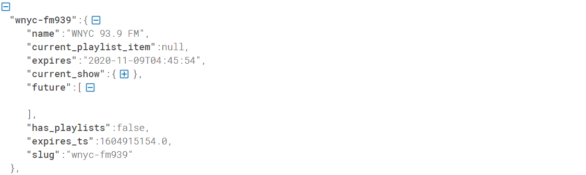

And we expand the second node ...

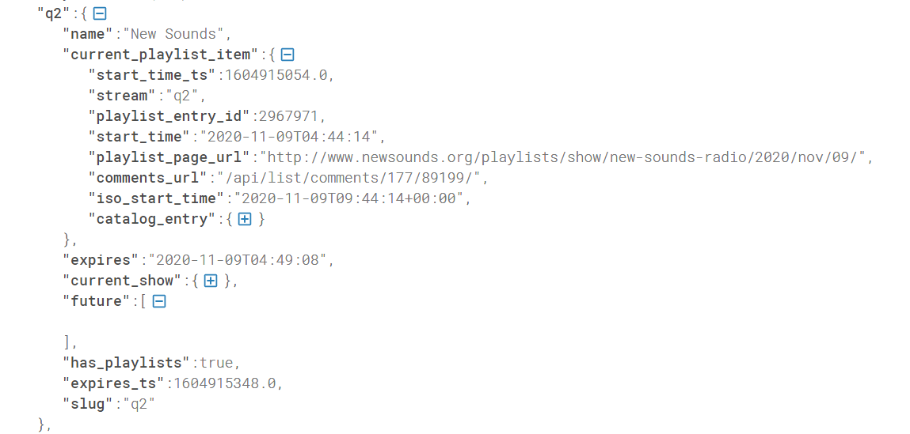

And we expand the third node ...

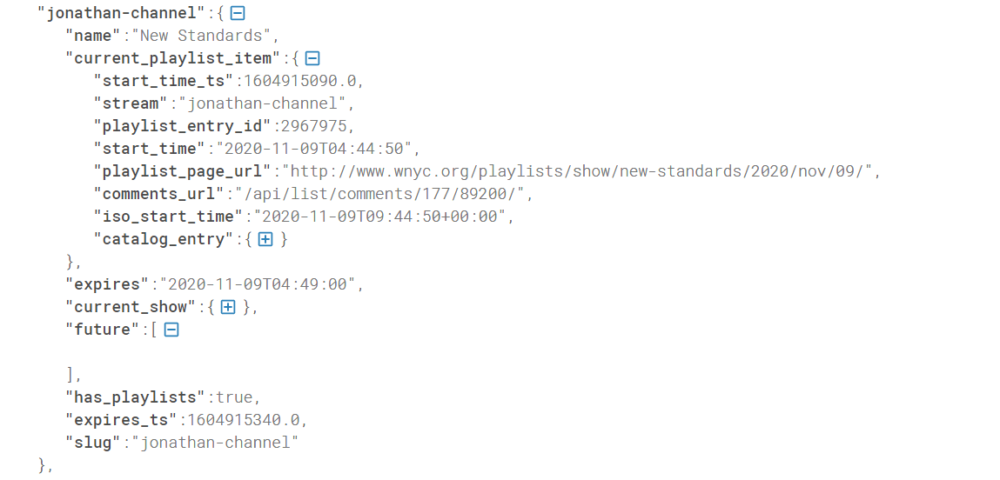

From a quick analysis this seems to be the structure
1. The entire payload consists of a bunch of `channels` - so each top level item is a `channel`
2. Each `channel` has some metadata, consisting of the following key properties:
   1. Channel name
   2. Current play list item (which may be null)
   3. Current show
3. Each `current play list item` has some metadata, consisting of the following key properties:
   1. Start time
   2. Catalog entry
   3. Title
   4. Playlist page
   5. Catalog entry
4. Each `catalog entry` has some metadata, consisting of the following key properties:
   1. Record label
   2. Conductor
   3. Composer
   4. Soloists
   5. Title
   6. URL
   7. Ensemble
5. Each `current show` has some metadata, consisting of the following key properties:
   1. Description
   2. Full image
   3. List image
   4. URL
   5. Title
   
An expanded catalog entry is as follows:

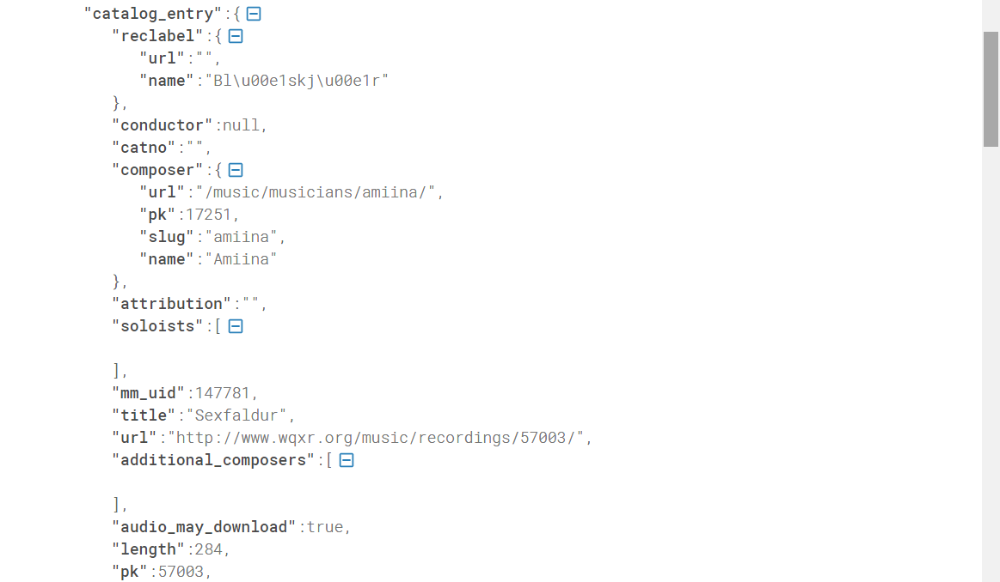

An expanded current show is as follows:

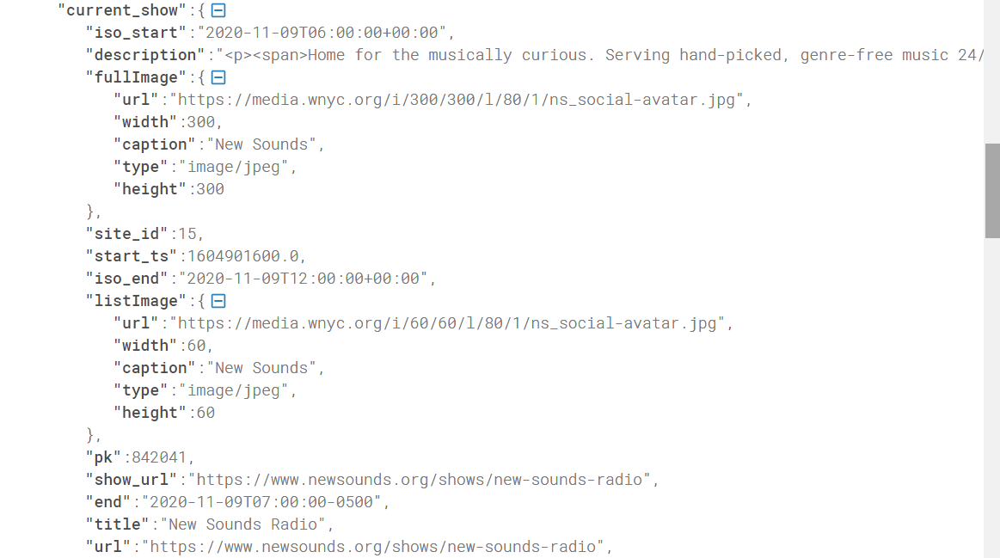

If you don't want to use an online tool and want to visualize the JSON formatted for yourself in an easy to read format, you can use this code in a console application, or [LinqPad](https://www.linqpad.net/):

```csharp
using (var client = new HttpClient())
{
	var response = await client.GetStringAsync("https://api.wnyc.org/api/v1/whats_on/");
	var formattedResponse = JToken.Parse(response).ToString();
	Console.Write(formattedResponse);
}
```

This should give you the following

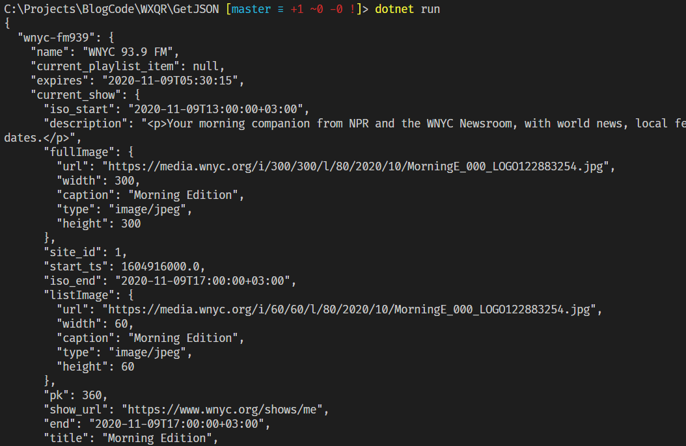

So we have solved one problem - we can get the data of the currently playing channels and shows.

The other problem is how do we know which channel is currently playing?

After some trial and error experimentation, it seems that you append the `slug` of the `channel` you are interested in to the end of the API URL to get the JSON data for the `channel` you are interested in.

So the API call is made to:

```plaintext
api.wnyc.org/api/v1/whats_on/[*insert slug here*]
```

Here are the `slugs` retrieved from the output from the initial request to the root API:

| Channel  | Slug |
|----------|----------|
| WNYC 93.9 FM| wnyc-fm939 |
| New Sounds| q2 |
| New Standards| jonathan-channel |
| WNYC AM 820| wnyc-am820 |
| Holiday Standards| special-events-stream |
| WQXR 105.9 FM| wqxr |
| Holiday Channel| wqxr-special2 |
| Operavore| wqxr-special |

You can verify the channels on the UI.

If you click on **change stream** you get a list of the alternative channels

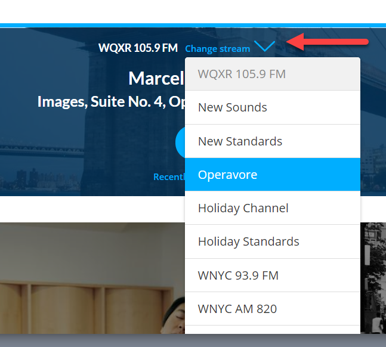

So, to get the currently playing track on the Holiday Channel, we make a request to the following URL

```plaintext
https://api.wnyc.org/api/v1/whats_on/wqxr-special2
```

The code is as follows:

```csharp
using (var client = new HttpClient())
{
   var response = await client.GetStringAsync("https://api.wnyc.org/api/v1/whats_on/wqxr-special2");
   var formattedResponse = JToken.Parse(response).ToString();
   Console.Write(formattedResponse);
}
```
If we run this code we get ...

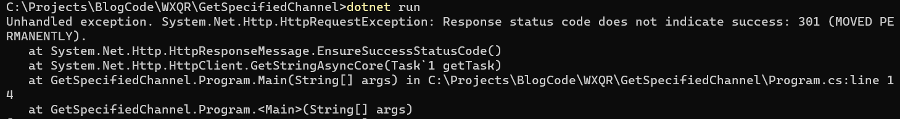

An error.

Looking closely at the error it would seem that request is not returning any JSON, but is in fact returning a [HTTP 301](https://developer.mozilla.org/en-US/docs/Web/HTTP/Status/301) (Permanently moved) error.

The problem here is that the [HttpClient](https://docs.microsoft.com/en-us/dotnet/api/system.net.http.httpclient?view=netcore-3.1) does not natively follow redirects, so we have to rewrite our code around this.

```csharp
var url = "http://api.wnyc.org/api/v1/whats_on/wqxr-special2";
	
using (var client = new HttpClient())
{
	var formattedResult = "";
	
	// Make the initial request
	var response = await client.GetAsync(url, HttpCompletionOption.ResponseHeadersRead);
	
	// Check if the status code of the response is in the 3xx range
	if ((int)response.StatusCode >= 300 && (int)response.StatusCode <= 399)
	{
		// It is a redirect. Extract the location from the header
		var finalResponse = await client.GetAsync(response.Headers.Location);
		if (finalResponse.IsSuccessStatusCode)
		{
			// Now make the request for the json
			var jsonResult = await finalResponse.Content.ReadAsStringAsync();
			// Format the json
			formattedResult = JToken.Parse(jsonResult).ToString();
		}
	}
	else
	{
		// This isn't a redirect. Read the response
		formattedResult = JToken.Parse(await response.Content.ReadAsStringAsync()).ToString();
	}
	
	// Output the json
	Console.Write(formattedResult);
}
```
This code now handles both normal requests as well as redirected requests.

The difference is that for some reason, the initial `https` URL has been permanently moved to a `http` location.

If we make this request the response is as follows:

```json
{
  "has_playlists": true,
  "future": [],
  "current_show": {
    "iso_start": "2020-11-09T14:00:00+03:00",
    "description": "<p>WQXR welcomes the 2020 holiday season with a 24-hour stream dedicated to classical Christmas and wintertime favorites. </p>",
    "fullImage": {
      "url": "https://media.wnyc.org/i/300/300/l/80/1/WQXR_HolidayChannel.png",
      "width": 300,
      "caption": "",
      "type": "image/png",
      "height": 300
    },
    "site_id": 2,
    "start_ts": 1604919600.0,
    "iso_end": "2020-11-09T20:00:00+03:00",
    "listImage": {
      "url": "https://media.wnyc.org/i/60/60/l/80/1/WQXR_HolidayChannel.png",
      "width": 60,
      "caption": "",
      "type": "image/png",
      "height": 60
    },
    "pk": 899627,
    "show_url": "https://www.wqxr.org/shows/wqxr-holiday-channel",
    "end": "2020-11-09T20:00:00+03:00",
    "title": "WQXR Holiday Channel",
    "url": "https://www.wqxr.org/shows/wqxr-holiday-channel",
    "end_ts": 1604941200.0,
    "schedule_ref": "ShowSchedule:1409",
    "group_slug": "wqxr-holiday-channel",
    "detailImage": {
      "url": "https://media.wnyc.org/i/60/60/l/80/1/WQXR_HolidayChannel.png",
      "width": 60,
      "caption": "",
      "type": "image/png",
      "height": 60
    },
    "start": "2020-11-09T14:00:00+03:00"
  },
  "expires": "2020-11-09T09:55:44",
  "current_playlist_item": {
    "start_time_ts": 1604933055.0,
    "stream": "wqxr-special2",
    "playlist_entry_id": 2968462,
    "start_time": "2020-11-09T09:44:15",
    "playlist_page_url": "http://www.wqxr.org/playlists/show/wqxr-holiday-channel/2020/nov/09/",
    "comments_url": "/api/list/comments/177/89203/",
    "iso_start_time": "2020-11-09T17:44:15+03:00",
    "catalog_entry": {
      "reclabel": {
        "url": "",
        "name": "RCA"
      },
      "conductor": {
        "url": "/music/musicians/robert-shaw/",
        "pk": 2706,
        "slug": "robert-shaw",
        "name": "Robert Shaw"
      },
      "catno": "68805",
      "composer": {
        "url": "/music/musicians/various/",
        "pk": 3685,
        "slug": "various",
        "name": "Various"
      },
      "attribution": "",
      "soloists": [],
      "mm_uid": 112645,
      "title": "Christmas Suite II",
      "url": "http://www.wqxr.org/music/recordings/12240/",
      "additional_composers": [
        {
          "url": "/music/musicians/robert-russell-bennett/",
          "pk": 6789,
          "slug": "robert-russell-bennett",
          "name": "Robert Russell Bennett"
        }
      ],
      "audio_may_download": true,
      "length": 679,
      "pk": 12240,
      "arkiv_link": "http://www.arkivmusic.com/classical/Playlist?source=WQXR&cat=68805&id=112645&label=RCA",
      "audio": "https://www.podtrac.com/pts/redirect.mp3/audio.wnyc.org/",
      "ensemble": {
        "url": "/music/ensembles/robert-shaw-chorale/",
        "pk": 1240,
        "slug": "robert-shaw-chorale",
        "name": "Robert Shaw Chorale"
      },
      "additional_ensembles": [
        {
          "url": "/music/ensembles/rca-victor-orchestra/",
          "pk": 275,
          "slug": "rca-victor-orchestra",
          "name": "RCA Victor Orchestra"
        }
      ]
    }
  }
}
```

Note that in this response the root nodes are a different level, given there is no channel information.

The next step is to convert the JSON to a **strongly typed** object.

One way is do to his manually from the JSON but a quicker way is to use one of the many online services, such as [QuickType](https://quicktype.io/csharp/).

Here you paste the JSON on the left pane and it generates the corresponding C# on the right. You can then rename the root class. Here I called it `Current`, but you can use any name.

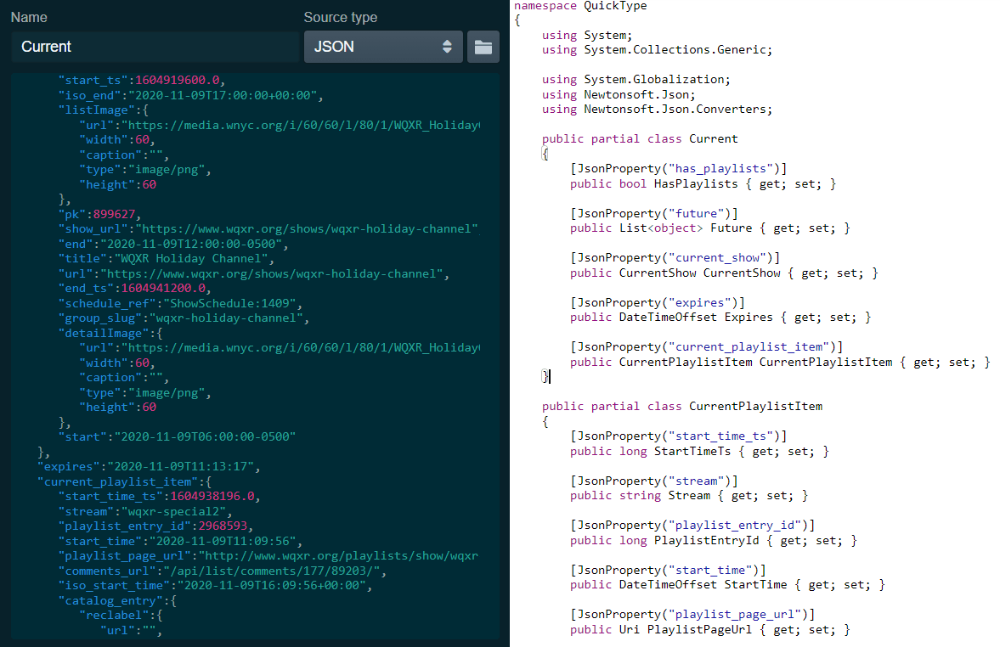

There are two modifications to make:
1. It will generate the `catno` in the `CatalogEntry` as a `long`. Change this to a `string` instead.
2. It will decorate the `catno` property with a ` [JsonConverter(typeof(ParseStringConverter))]` attribute. This should be **removed**.

You can then paste the entirety of the code in a new .cs file in your project.

Finally you modify your code slightly to get the results as a typed object.

The final code looks like this:

```csharp
var url = "https://api.wnyc.org/api/v1/whats_on/wqxr-special2";

using (var client = new HttpClient())
{
	var result = "";

	// Make the initial request
	var response = await client.GetAsync(url, HttpCompletionOption.ResponseHeadersRead);

	// Check if the status code of the response is in the 3xx range
	if ((int)response.StatusCode >= 300 && (int)response.StatusCode <= 399)
	{
		// It is a redirect. Extract the location from the header
		var finalResponse = await client.GetAsync(response.Headers.Location);
		if (finalResponse.IsSuccessStatusCode)
		{
			// Now make the request for the json
			result = await finalResponse.Content.ReadAsStringAsync();
		}
		else
		{
			Console.WriteLine($"Could not get the result, error: {finalResponse.StatusCode}");
		}
	}
	else
	{
		// This isn't a redirect. Read the response
		result = await response.Content.ReadAsStringAsync();
	}

	// Type the response
	var currentItem = JsonConvert.DeserializeObject<Current>(result);

	// Output the results

	var sb = new StringBuilder();

	sb.AppendLine($"The current track playing is: {currentItem.CurrentPlaylistItem.CatalogEntry.Title}");
	sb.AppendLine($"The composer is: {currentItem.CurrentPlaylistItem.CatalogEntry.Composer.Name}");
	sb.AppendLine($"It is playing on:  {currentItem.CurrentShow.Title}");

	Console.Write(sb);
}
```

If you run the code, you should get something like the following:

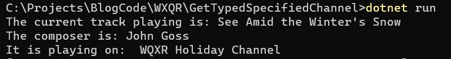

With a strongly typed object it is easier to use the class in code, as you not only get strong types but also intellisense.

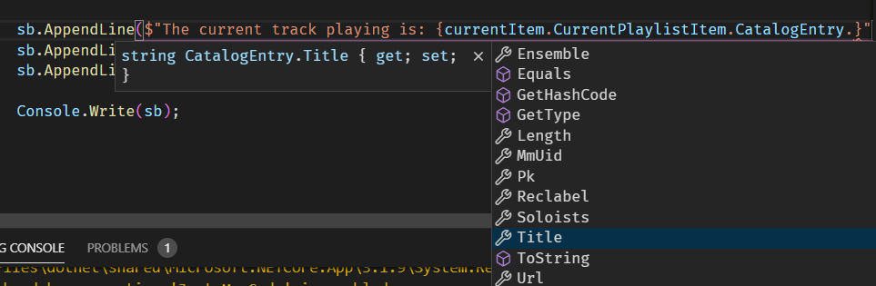

You can even make improvements by removing properties you're not interested in, or adding additional ones for your own purposes.

**Note:** it is entirely possible for the `current play list item` to be `null` - there may be no current program for the selected channel, for whatever reason.

In this case it is advisable to use [null conditional expression](https://csharp.today/c-6-features-null-conditional-and-and-null-coalescing-operators/) (or Elvis operator) to avoid having to keep checking for `nulls`.

The code changes slightly to be like this:

```csharp
sb.AppendLine($"The current track playing is: {currentItem?.CurrentPlaylistItem?.CatalogEntry?.Title}");
sb.AppendLine($"The composer is: {currentItem?.CurrentPlaylistItem?.CatalogEntry?.Composer?.Name}");
sb.AppendLine($"It is playing on:  {currentItem?.CurrentShow?.Title}");
```

The code is in my [Github](https://github.com/conradakunga/BlogCode/tree/master/9%20Nov%202020%20-%20Getting%20Now%20Playing%20Information%20From%20WQXR).

Happy hacking!

### Update
[SaraBee](https://sarabee.github.io/2020/09/13/is-this-mahler/)([@sarabee](https://twitter.com/sarabee)) had not only [already done something similar](https://github.com/SaraBee/nowplaying), she also outputted the now playing information to an eInk display. How awesome is that?


