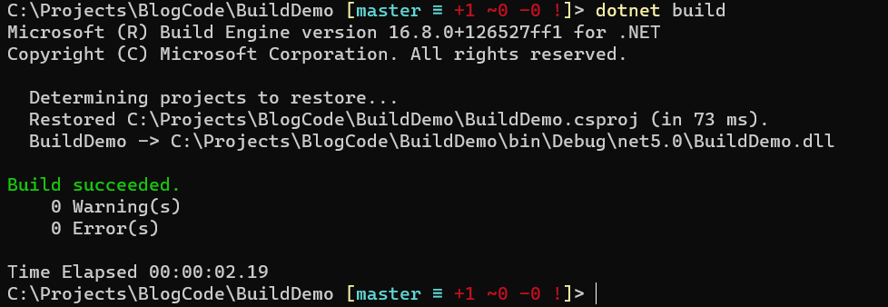
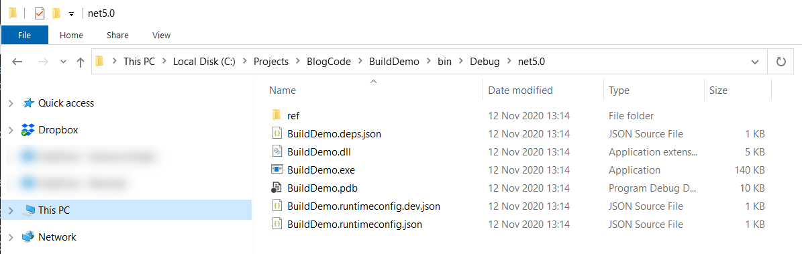
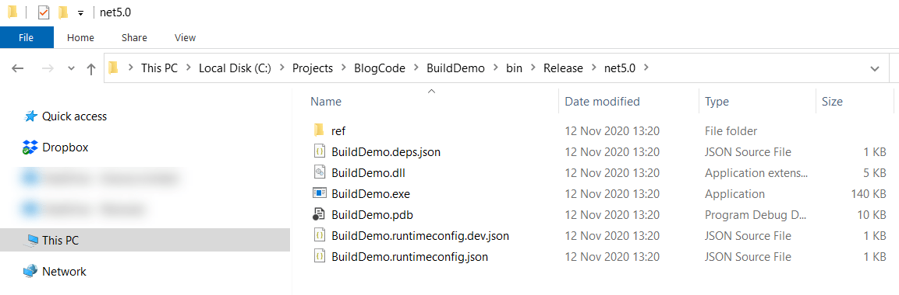
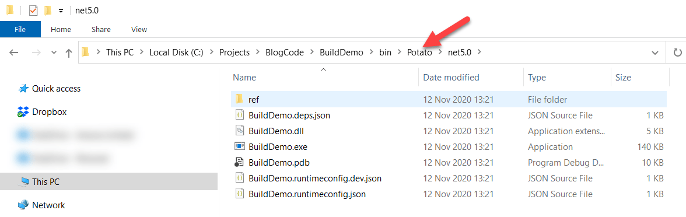
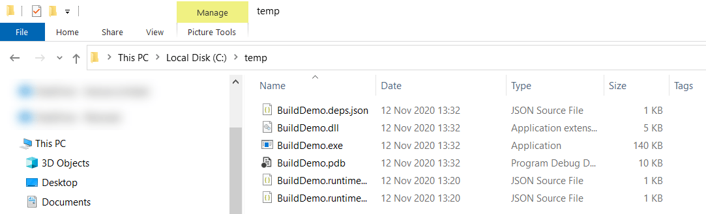
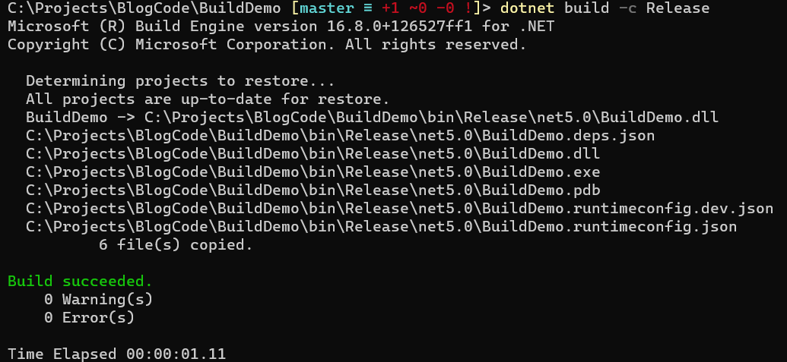
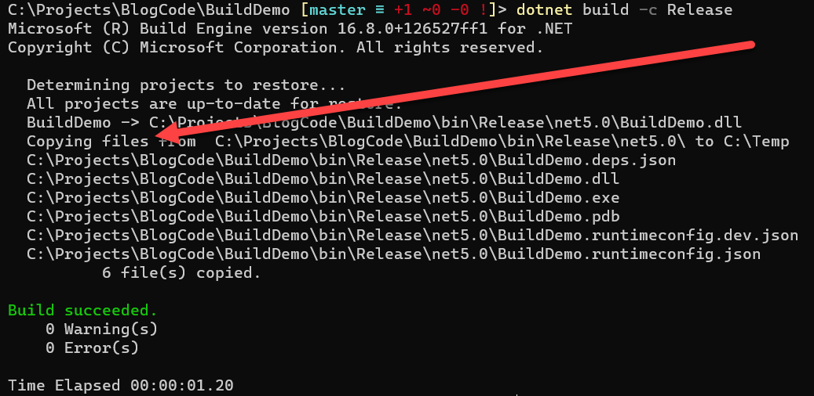

The [Microsoft Build Engine](https://docs.microsoft.com/en-us/visualstudio/msbuild/msbuild?view=vs-2019), MSBuild, is responsible for controlling the build process that translates source code to object code and its relevant artifacts.

MSBuild itself uses an XML file format to define various parameters that control the build process.

Below is a sample a sample .Net Core .csproj file for a console application.

```xml
<Project Sdk="Microsoft.NET.Sdk">
  <PropertyGroup>
    <OutputType>Exe</OutputType>
    <TargetFramework>net5.0</TargetFramework>
  </PropertyGroup>
</Project>
```

The code itself is pretty simple

```csharp
static void Main(string[] args)
{
    Console.WriteLine("Hello World!");
}
```

To build this we run the `dotnet build` command



Pretty straightforward so far.

By default, unless told otherwise, the compiler will emit a `Debug` build.

You can verify this by viewing the outputted files.



You can control the build this with the `-c` or `--configuration` (configuration) parameter.

So to get a release build we simply pass that as a parameter.

`dotnet build -c Release`

The output is as follows.



By the way, you can call the build configuration anything.

`dotnet build -c Potato`



You might want some conditional logic to happen during the build process, perhaps to output to a certain folder depending on the build configuration.

Let us say for instance we want the binary copied to a different folder, say `C:\Temp`. But only if it is a `Release` build.

We can add some configuration to the .cs project file to instruct MSBuild what to do.

It will look like this:

```xml
<Project Sdk="Microsoft.NET.Sdk">
  <PropertyGroup>
    <OutputType>Exe</OutputType>
    <TargetFramework>net5.0</TargetFramework>
  </PropertyGroup>

  <Target Name="PostBuild" AfterTargets="PostBuildEvent" Condition="'$(Configuration)'=='Release'">
    <Exec Command="copy $(TargetDir)* C:\Temp" />
  </Target>
</Project>
```

There are a few key attributes here
* Name -  name for the target
* [AfterTargets](https://docs.microsoft.com/en-us/visualstudio/msbuild/target-element-msbuild?view=vs-2019) - when the logic should fire. In this case, we want it to happen after a successful build
* [Condition](https://docs.microsoft.com/en-us/visualstudio/msbuild/msbuild-conditions?view=vs-2019) - the logic that controls the execution. Here we are checking if the build is `Release`.

The logic we want is to copy the outputted file to a target directory, using a `command`. The argument is the command to execute.

You might be wondering what `$(TargetDir)` is. This is a [macro](https://docs.microsoft.com/en-us/cpp/build/reference/common-macros-for-build-commands-and-properties?view=msvc-160) that MSBuild will expand to the full path to the generated output, in this case the full path to the .output. This will save you from having to hardcode the path.

If we run the `Release` build configuration, yo should see this in your **C:\Temp**



The output from the command should be like this:



To prove it only works for the `Release` build, you can clear the **Temp** folder and then run the build for a  `Debug` configuration.

There is a slight challenge that it is not possible to visually tell from examining the output from the build process what has happened.

This can be solved using a [Message](https://docs.microsoft.com/en-us/visualstudio/msbuild/message-task?view=vs-2019) task.

What we want to achieve is to output a message to the console that informs the observer what the build engine is doing.

The updated `.csproj` would look as follows:

```xml
<Project Sdk="Microsoft.NET.Sdk">
  <PropertyGroup>
    <OutputType>Exe</OutputType>
    <TargetFramework>net5.0</TargetFramework>
  </PropertyGroup>
  <Target Name="PostBuild" AfterTargets="PostBuildEvent" Condition="'$(Configuration)'=='Release'">
    <Message Text="Copying files from  $(TargetDir) to C:\Temp" Importance="High" />
    <Exec Command="copy $(TargetDir)* C:\Temp" />
  </Target>
</Project>
```

The `importance` needs to be set to high so that MSBuild always prints the message. By default, messages that are not of high priority are not printed.

If you run the `Release` build, the output should have this additional line



The code is in my [Github](https://github.com/conradakunga/BlogCode/tree/master/2020-11-12%20-%20Conditional%20Logic%20In%20MSBuild).

Happy hacking!