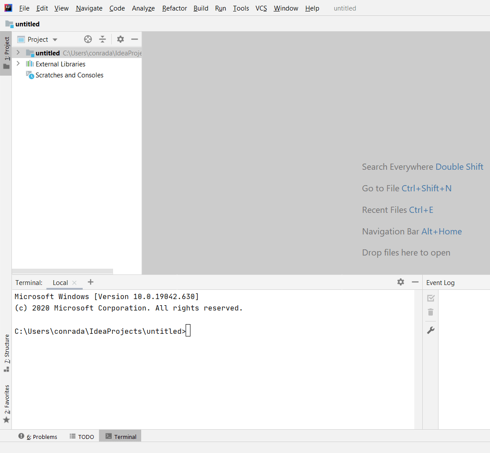
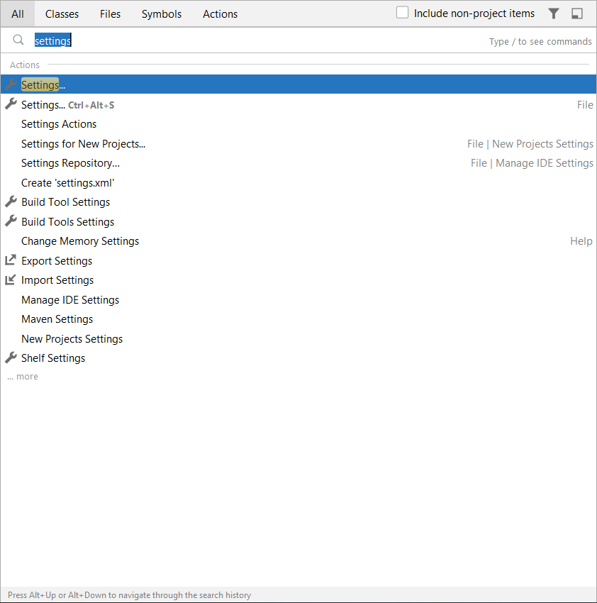
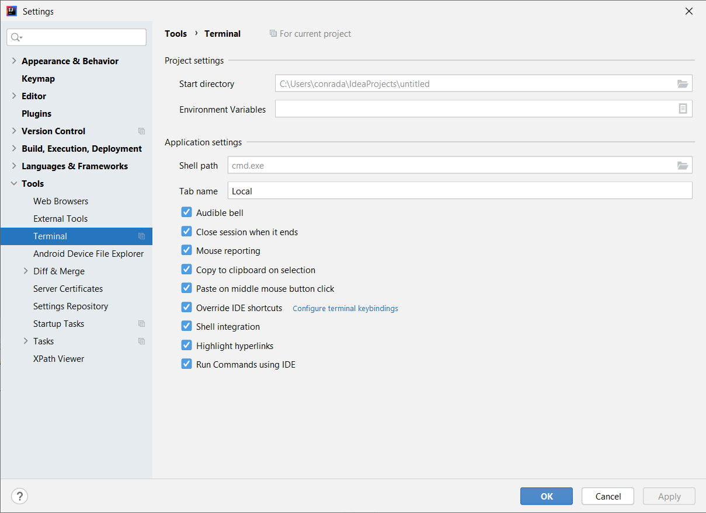
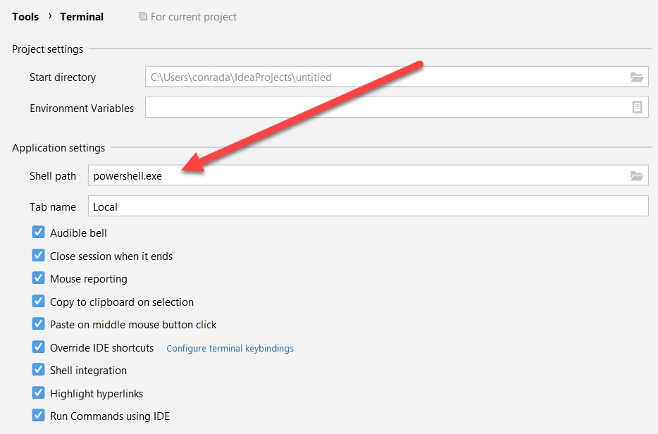
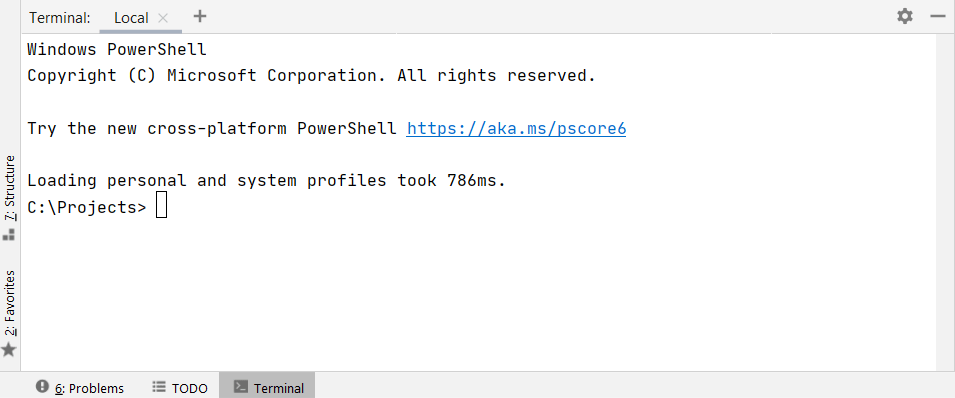

The default shell in [IntelliJ](https://www.jetbrains.com/idea/) (and its children IDEs) is the [Windows Command Prompt](https://docs.microsoft.com/en-us/windows-server/administration/windows-commands/windows-commands).

If, like me, you have long used [Powershell](https://docs.microsoft.com/en-us/powershell/scripting/overview?view=powershell-7.1) as your default shell, it gets jarring to enter commands like `ls` and have them rejected.

It is possible to change your default shell.

Launch the **settings** page, or enter `settings` into the global search.

This should open the **settings** page.

Navigate to **Tools > Terminal**.

You should see that the default shell is indeed the Windows Command Prompt `cmd.exe`.

You can update this to `powershell.exe`. There is no need to specify the complete path, as it should already be in you global search path.

Restart the IDE and you should see the following.

This should work for the rest of the IntelliJ Family of IDEs, including [Android Studio](https://developer.android.com/studio)

Happy hacking!