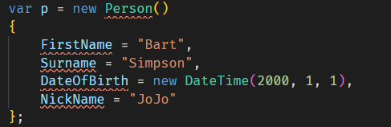
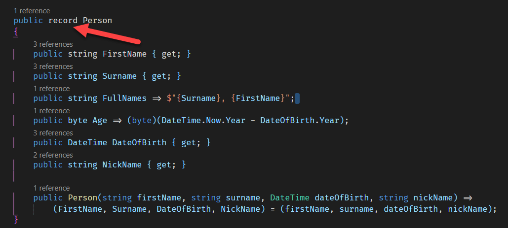
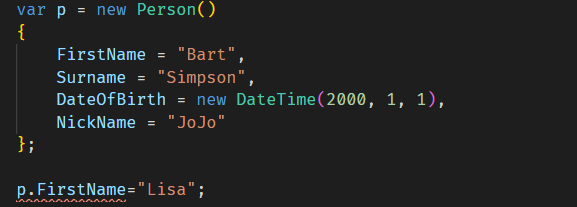

I recently had an opportunity to revisit some very old code (to the tune of almost a decade) and saw it as an opportunity to make some improvement and cleanup.

The code itself was for an API that returned data encapsulated in `Person` class.

The code itself was as follows:

```csharp
public class Person
{
    public string FirstName { get; set; }
    public string Surname { get; set; }
    public string FullNames { get; set; }
    public int Age { get; set; }
    public DateTime DateOfBirth { get; set; }
    public string NickName { get; set; }
}
```

There is nothing inherently wrong with the code, but it could use a few improvements.

The first one is the `Age` is an [int](https://docs.microsoft.com/en-us/dotnet/csharp/language-reference/builtin-types/integral-numeric-types). 

This means that it ranges between **-2,147,483,648** and **2,147,483,647**. 

No human being will ever be 2,147,483,647 years old, at least for the purposes of business logic. And human beings certainly will never have a negative age.

What other integral types are there?

C# type/keyword	|Range|	Size|	.NET type|
---|---|---|--|
sbyte|-128 to 127|	Signed 8-bit integer|	System.SByte|
byte|	0 to 255|	Unsigned 8-bit integer|	System.Byte|
short|	-32,768 to 32,767|	Signed 16-bit integer|	System.Int16|
ushort|	0 to 65,535|	Unsigned 16-bit integer|	System.UInt16|
int|	-2,147,483,648 to 2,147,483,647|	Signed 32-bit integer|	System.Int32|
uint|	0 to 4,294,967,295	|Unsigned 32-bit integer	|System.UInt32|
long|	-9,223,372,036,854,775,808 to 9,223,372,036,854,775,807	|Signed 64-bit integer	|System.Int64|
ulong|	0 to 18,446,744,073,709,551,615|	Unsigned 64-bit integer|	System.UInt64|

Of interest is that there is an **unsigned** version, `unit`, that ranges from **0** to **4,294,967,295**

For all intents and purposes, the most appropriate type here is the `byte` type.

So we can change `Age` from `int` to `byte`,  like this:

```csharp
public byte Age { get; set; }
```

The next issue is that `DateOfBirth` and `Age` are both separate properties, whereas they shouldn't be. Your age is directly dependent on your date of birth, and therefore can be expressed as a function of that.

Doing this avoids logic bugs from forgetting to set one or the other, or independently setting them resulting in an inconsistency between the age and the date of birth.

We can achieve this using an expression:

```csharp
public byte Age => (byte)(DateTime.Now.Year - DateOfBirth.Year);
public DateTime DateOfBirth { get; set; }
```

For the purpose of this algorithm, we are not interested in the granular age as a function of your actual date of birth - we just want a quick estimate of your age in years and consider you a year older when the year changes.

For those interested this is actually not a simple problem - you would be tempted to get the difference in days and divide by 365 - but that does not handle a bunch of considerations:

- Leap Years
- Daylight Savings Time
- How to handle fractional components

An additional improvement is rather than assume `Age` is always a function of the current date, you can pass any arbitrary date you are interested in and the expression will compute the `Age` from that date.

Our next problem is the `Fullname` property.

For the purposes of our business logic, the full name is standardized as `Surname, Firstname`

So if your **first name** is `Bart` and your **surname** is `Simpson`, your **fullname** is `Simpson, Bart`.

In the code, the **fullname** can be independently set, which could lead to inconsistencies between the `Surname`, `Firstname` and `Fullname`.

So we can make that property an expression as follows:

```csharp
public string FullNames => $"{Surname}, {FirstName}";
```

Our next problem is a bit more subtle.

So far we have refactored our code, and now we can construct a Person object in this way, verifying that it works correctly using a unit test.

```csharp
[Fact]
public void Person_Is_Constructed_Correctly()
{
    var p = new Person()
    {
        FirstName = "Bart",
        Surname = "Simpson",
        DateOfBirth = new DateTime(2000, 1, 1),
        NickName = "JoJo"
    };
    p.FirstName.Should().Be("Bart");
    p.Surname.Should().Be("Simpson");
    p.DateOfBirth.Should().Be(new DateTime(2000, 1, 1));
    p.NickName.Should().Be("JoJo");
    p.FullNames.Should().Be("Simpson, Bart");
    p.Age.Should().Be(20);
}
```

If we run the tests (assuming you run them during the year 2020):

So far so good.

The problem is that you can do the following in your code:

```csharp
var p = new Person()
{
    FirstName = "Bart",
    Surname = "Simpson",
    DateOfBirth = new DateTime(2000, 1, 1),
    NickName = "JoJo"
};

p.FirstName = "Lisa";
```

From a code perspective this is 100% legit, but from a business rules angle, this makes no sense - you can't in fact change your first name in this fashion.

So we would like to enforce that you cannot in fact change any of the properties once the object has been received, perhaps via a REST API invocation.

We do this in two steps:
1. Remove the setters for the properties
2. Create a construction to set the properties

Our updated class will now look like this:

```csharp
public class Person
{
    public string FirstName { get; }
    public string Surname { get; }
    public string FullNames => $"{Surname}, {FirstName}";
    public byte Age => (byte)(DateTime.Now.Year - DateOfBirth.Year);
    public DateTime DateOfBirth { get; }
    public string NickName { get; }

    public Person(string firstName, string surname, DateTime dateOfBirth, string nickName) =>
        (FirstName, Surname, DateOfBirth, NickName) = (firstName, surname, dateOfBirth, nickName);
}
```

Our original test now is broken, now that the properties cannot be set directly.



We fix this as follows:

```csharp
var p = new Person(
    firstName: "Bart",
    surname: "Simpson",
    dateOfBirth: new DateTime(2000, 1, 1),
    nickName: "JoJo");
```

Verify that the tests sill work correctly.

What we have done here is make the type [immutable](https://en.wikipedia.org/wiki/Immutable_object). Once you create the type, its values cannot be changed directly.

Over and above being a good development practice, this is a common requirement in moving data between applications, or application layers. A class whose purpose is to encapsulate types for transmission.

These are usually referred to  as **data transmission objects**, or **DTOs**.

This is such a common use case that the C# 9 compiler now supports this natively - using the `record` keyword.

First we update our original person class, replacing the `class` keyword with `record`.



We can now run our tests and everything still works.

But we are not quite through.

The next thing is to delete the constructor.

Which makes one wonder - how then are the read only properties set?

That is where some of the magic from the record construct comes in.

There is a new keyword for use where the setter was usually defined: `init`.

The type should now look like this:

```csharp
public record Person
{
    public string FirstName { get; init; }
    public string Surname { get; init; }
    public string FullNames => $"{Surname}, {FirstName}";
    public byte Age => (byte)(DateTime.Now.Year - DateOfBirth.Year);
    public DateTime DateOfBirth { get; init; }
    public string NickName { get; init; }
}
```

Our test is now broken, because we are calling a constructor, which we have removed.

We can amend the test as follows:

```csharp
var p = new Person()
{
    FirstName = "Bart",
    Surname = "Simpson",
    DateOfBirth = new DateTime(2000, 1, 1),
    NickName = "JoJo"
};
```

The test should pass successfully.

Note that you can still retain the constructor if you want to perform some additional logic such as sanity checks before instantiating the objects. In other words the constructor for a record is optional.

But the question arises - this looks exactly like the original test. What is different?

The difference is we cannot change any of these properties.

So you cannot do this:

```csharp
var p = new Person()
{
    FirstName = "Bart",
    Surname = "Simpson",
    DateOfBirth = new DateTime(2000, 1, 1),
    NickName = "JoJo"
};

p.FirstName="Lisa";
```

Attempting to change the `FirstName` get this error:



This essentially means the `init` and `record` keywords specifies your intent, as well as enforcing the logic that the property can only be set in an initialization context and cannot be changed after that.

This makes records very useful for DTOs by removing the need to write the boilerplate code needed to enforce immutability, as well as signaling intent to anyone reading the code.

You can also use `init` in a normal class to indicate that particular property is only meant to be set once.

Which begs the question - when do you use a `record` and when do you use a normal `class`?

A rule of thumb is if you intend all the properties to be immutable, or you are using the type as a data transfer object, that is probably best served as a `record`.

There are some additional benefits of records that you get for free.

# Easy cloning of new records

You can create a new `Person` based on the current properties of an existing record.

So assume we wanted to cleate a clone of Bart that was identical apart from the `FirstName` (and obviously the `FullNames`).

The code would be as follows, verified by a test:

```csharp
var bart = new Person()
{
    FirstName = "Bart",
    Surname = "Simpson",
    DateOfBirth = new DateTime(2000, 1, 1),
    NickName = "JoJo"
};

var bartsTwinSister = bart with { FirstName = "Lisa" };

bartsTwinSister.FirstName.Should().Be("Lisa");
bartsTwinSister.Surname.Should().Be("Simpson");
bartsTwinSister.DateOfBirth.Should().Be(new DateTime(2000, 1, 1));
bartsTwinSister.NickName.Should().Be("JoJo");
bartsTwinSister.FullNames.Should().Be("Simpson, Lisa");
bartsTwinSister.Age.Should().Be(20);
```
You can also clone an object as follows:

```csharp
var bart = new Person()
{
    FirstName = "Bart",
    Surname = "Simpson",
    DateOfBirth = new DateTime(2000, 1, 1),
    NickName = "JoJo"
};

var bartsTwinSister = bart with { };
```

# Value Comparison

A common problem is to compare whether two objects are equal based on the values.

This commonly fails in classes, unless you write your own logic, as by default the equality operator uses internal class state and semantics to determine equality.

This is different for records where by default the values are used to determine equality. For a record the values are the relevant comparison points, not the internal structure of the type.

The code below creates two different objects and then checks if they are equal using the `==` operator as well as checking if they are `ReferenceEqual`

A record at the end of the day is still a `reference` type, like a class.

```csharp
var bart = new Person()
{
    FirstName = "Bart",
    Surname = "Simpson",
    DateOfBirth = new DateTime(2000, 1, 1),
    NickName = "JoJo"
};

var bartTwo = new Person()
{
    FirstName = "Bart",
    Surname = "Simpson",
    DateOfBirth = new DateTime(2000, 1, 1),
    NickName = "JoJo"
};

(bart == bartTwo).Should().BeTrue();
ReferenceEquals(bart, bartTwo).Should().BeFalse();
```

# Inheritance

A `record` supports the same inheritance and polymorphic constructs of a `class`.

This allows you to do this:

```csharp
public record SmallPerson : Person
{
    public byte Height { get; init; }
}
```

The code is in my [Github](https://github.com/conradakunga/BlogCode/tree/master/21%20Nov%202020%20-%20Refactoring%20With%20Records).

Happy hacking!