Today we will setup an environment where we can develop and debug code remotely on a Linux environment.

This is useful for a number of reasons:
* The remote machine is a server environment (that is to say, there is no UI component)
* You do not have physical access to the environment
* You want to use your local IDE, environment and configuration.

**On the machine you want to develop on**, setup a SSH client.

# 1 - Setup SSH Client

| Operating System | Instructions |
|------------------|----------|
| Windows 10 1803+ / Server 2016/2019 1803+|	[Install the Windows OpenSSH Client](https://docs.microsoft.com/en-us/windows-server/administration/openssh/openssh_install_firstuse)|
|Earlier Windows|	[Install Git for Windows](https://git-scm.com/download/win)|
|Debian/Ubuntu|Run `sudo apt-get install openssh-client`|
|RHEL / Fedora / CentOS|	Run `sudo yum install openssh-client`|

# 2 - Install Visual Studio Code

If you haven't already, install Visual Studio Code. The easiest way is through [chocolatey](https://chocolatey.org/)

```bash
choco install vscode
```
# 3 - Install The Remote Development Pack

In VS Code, [install this the remote development pack extension ](https://marketplace.visualstudio.com/items?itemName=ms-vscode-remote.vscode-remote-extensionpack)

Once installed you should see this in the extensions pane

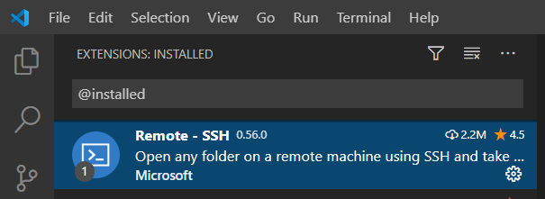

**On the machine you want the code to run on**, setup a SSH server, if you do not already have one.

If you are using Debian, or a Debian based Linux you can check with this command

```bash
dpkg -s openssh-server | grep Status
```
 
You should get a response like this if it is installed
 
 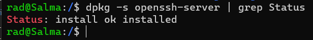
 
If it's not installed, here are the steps for your OS

| Operating System | Instructions |
|----------|----------|
|Debian 8+ / Ubuntu 16.04+|	Run `sudo apt-get install openssh-server`|
|RHEL / CentOS 7+|	Run `sudo yum install openssh-server && sudo systemctl start sshd.service && sudo systemctl enable sshd.service`|
|SuSE 12+ / openSUSE 42.3+|	In Yast, go to Services Manager, select "sshd" in the list, and click Enable. Next go to Firewall, select the Permanent configuration, and under services check sshd.|
Windows 10 1803+ / Server 2016/2019 1803+|	Install the [Windows OpenSSH Server](https://docs.microsoft.com/en-us/windows-server/administration/openssh/openssh_install_firstuse)|
macOS 10.14+ (Mojave)|	Enable [Remote Login](https://support.apple.com/en-ke/guide/mac-help/mchlp1066/mac)|

Once that is setup now we can attempt a connection.

For the rest of this example, I will be connecting to a remote Ubuntu box.

First, hit `Ctrl + P` to open the command bar. Type `remote-ssh` into the command.

As it filters, `select connect to host`

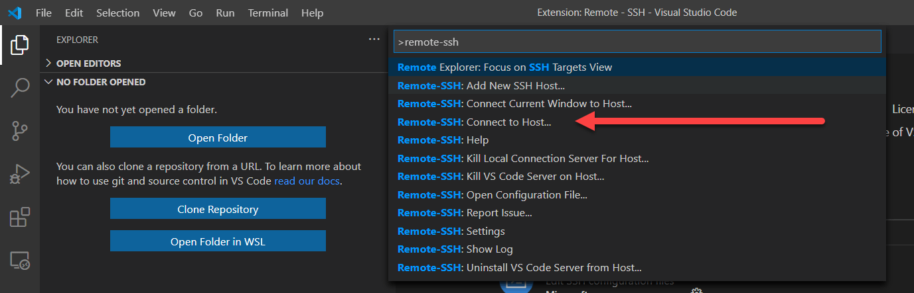

Given we have never connected before, we will get a prompt to configure the remote host.

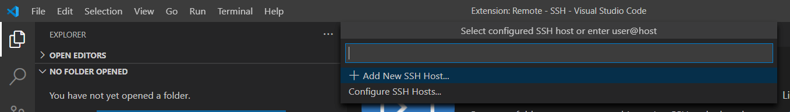

Here we choose `Add New SSH Host`

You'll get this prompt:

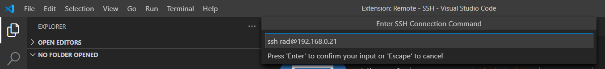

Here you key in the command to access the remote machine.

In my case, that is 

```bash
ssh rad@192.168.0.21
```

I have setup [password-less authentication](https://www.tecmint.com/ssh-passwordless-login-using-ssh-keygen-in-5-easy-steps/), which saves a lot of bother. If you are on windows [this post]() contains a script that you will need

Next you will be asked where to save the config. I believe it should not matter which you choose.

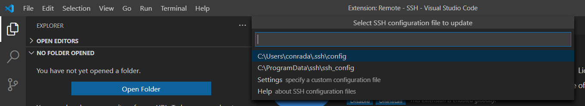

You should get a prompt to choose the remote server type - Linux, Windows or OSX. I chose Linux.

You should get this confirmation.

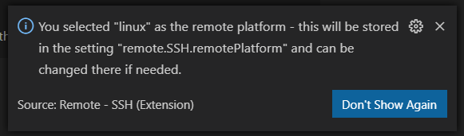

Finally you should see this:

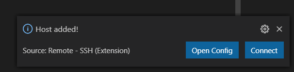

Go ahead and click `Connect`. You should see this prompt as VS Code remotely sets up the infrastructure it needs to work its magic.

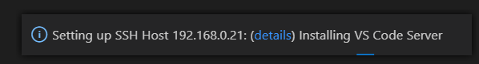

Finally if all goes well you should get the main screen of VS Code.

The next thing is to create a new project.

Open a terminal as follows:

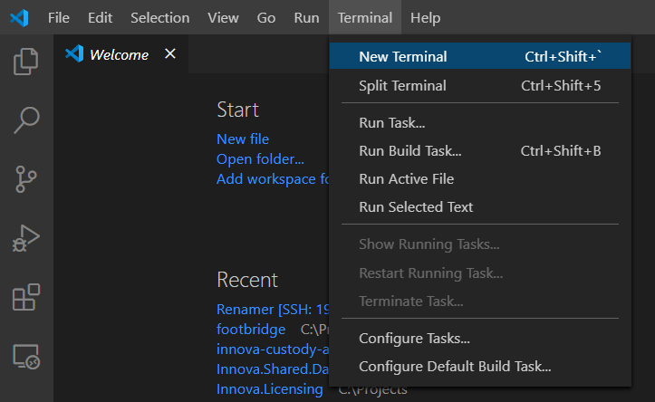

You can also use the shortcut `Ctrl + Shift + ``

This should give you a terminal **on the machine you are connected to**, not locally.

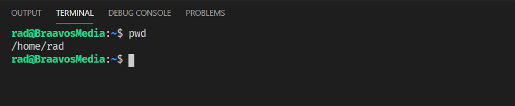

We can then go on and create a new project.

```bash
dotnet new console -o Hello
```

This creates a console project and places it in the folder `Hello`.

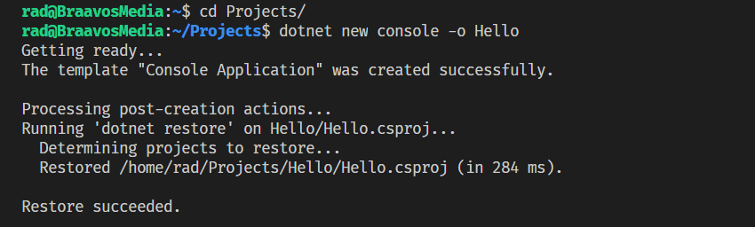

Finally we can open this project. Click `Open Folder`

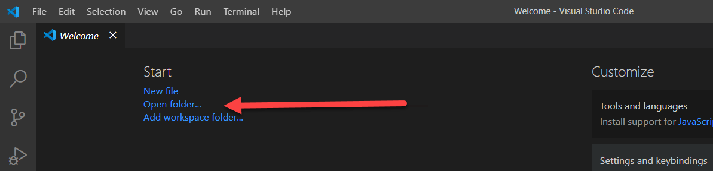

You should get the following prompt. Not that the file system displayed is the **remote** file system.

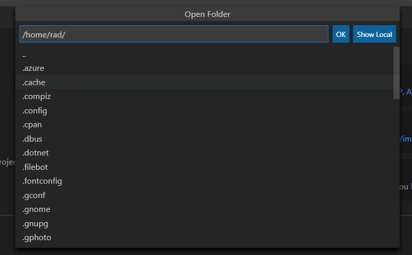

Here you browse to the location of the project just created.

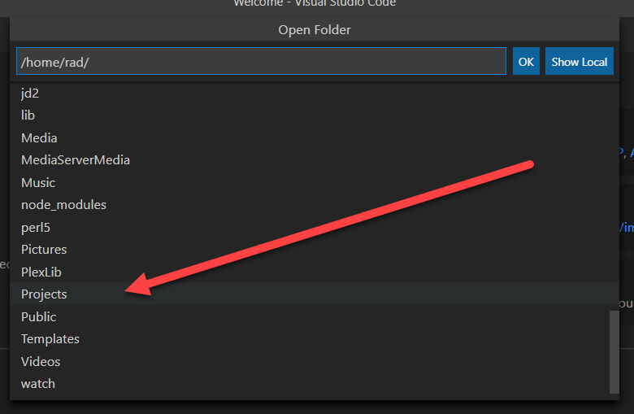

And finally:

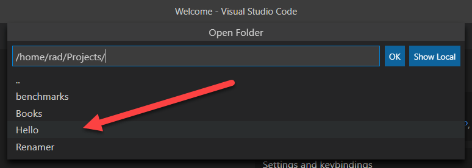

If all went well, the project should open.

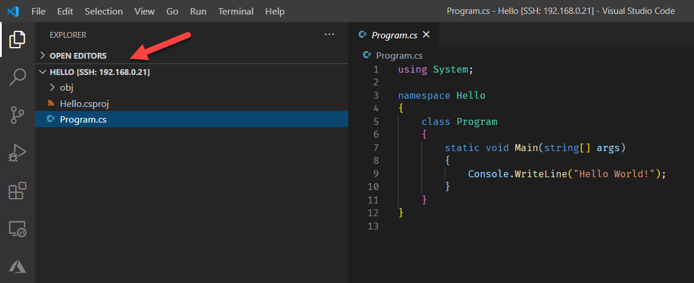

You may also see VS Code configuring the C# plugin.

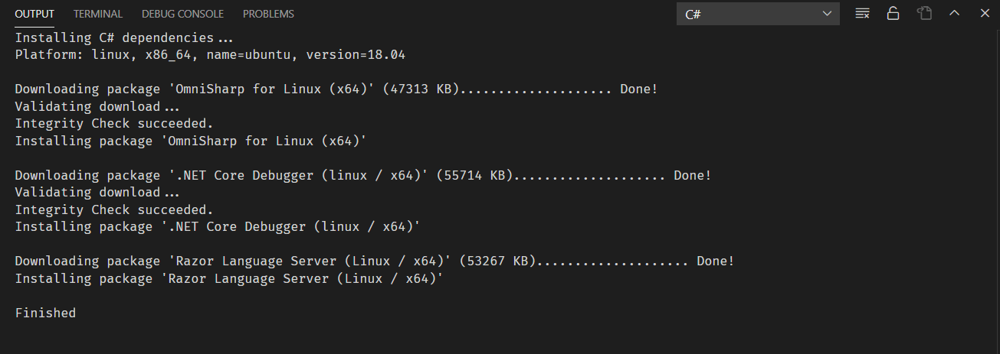

Next let us run the project.

Click the `Debug` button.

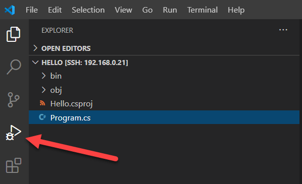

Then click `Run`. Alternatively, press `F5`

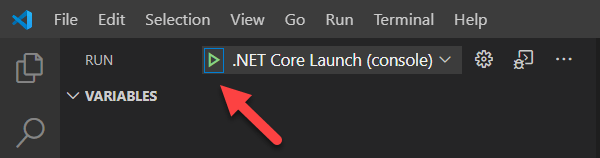

In the debug window we should see status messages from the debugger and finally our output.

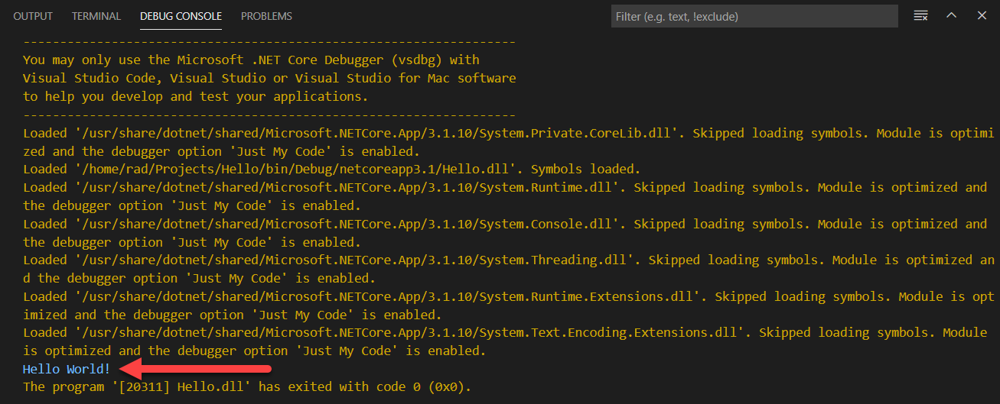

To prove that the debugger works, we set a breakpoint in our code by clicking in the margin.

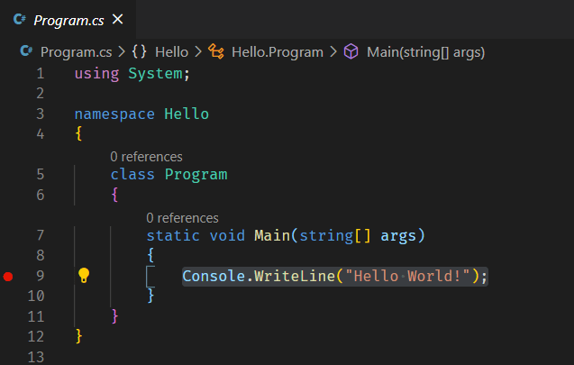

If we now run the debugger again, VS Code will stop execution at the breakpoint.

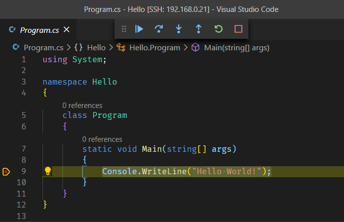

And there you have it. You can now remotely create, develop and debug applications from your primary machine.

You can always tell where you are connected on the status bar of VS Code.

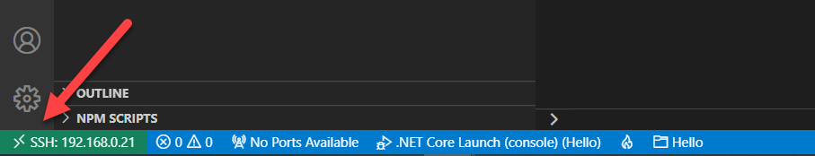

Happy hacking!

