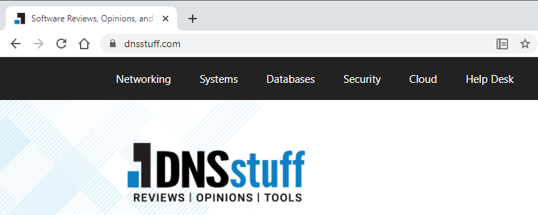
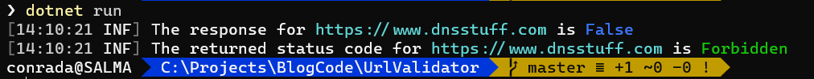
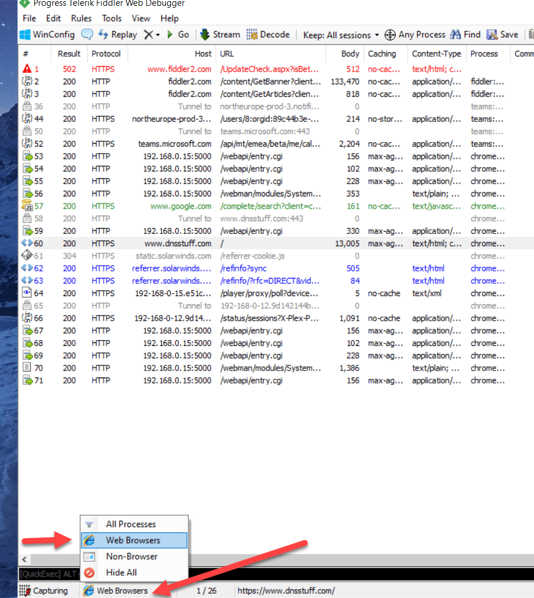
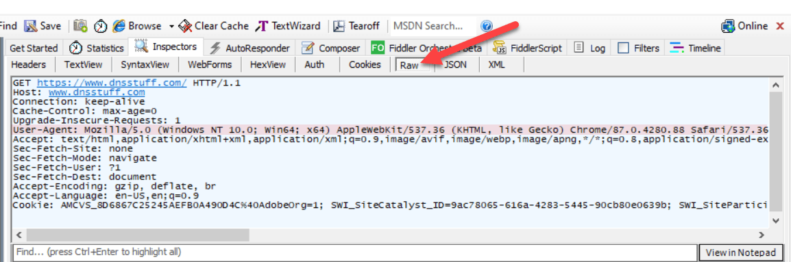

I ran into an interesting problem the other day.

I have some code that validates whether a URL exists.

It is very simple code, using a `HttpClient` to make a request and check if the response is a **success** (in the 200-299 range)

```csharp
var url = "<insert url here>";
var client = new HttpClient();
var res = await client.GetAsync(url, HttpCompletionOption.ResponseHeadersRead);
var response = res.IsSuccessStatusCode;
```

It mostly works, (and could be made more robust to [handle redirects]() but for our purposes it is ok.

However it was failing for a particular url - `https://www.dnsstuff.com` - it was returning `false`.

Which is strange because I know the URL is ok.



The fact that the return value was false implied that it was returning some other status code.

Let us add some logging to the code.

Here I am using the `Serilog.Sinks.Console` package

```bash
dotnet add package serilog.sinks.console`
```

The updated code is as follows

```csharp
// Setup the logging
var config = new LoggerConfiguration();
config.MinimumLevel.Debug();
config.WriteTo.Console();
Log.Logger = config.CreateLogger();

var url = "https://www.dnsstuff.com";
var client = new HttpClient();
var res = await client.GetAsync(url, HttpCompletionOption.ResponseHeadersRead);
var response = res.IsSuccessStatusCode;
Log.Information("The response for {url} is {response}",url, response);
```

If we run this it prints the following:


Let us then change the code to log the status code.

```csharp
var res = await client.GetAsync(url, HttpCompletionOption.ResponseHeadersRead);
var response = res.IsSuccessStatusCode;
Log.Information("The response for {url} is {response}", url, response);

// Log the returned status code
Log.Information("The returned status code for {url} is {code}", url, res.StatusCode);
```

If we run this, the response is as follows:



So the returned response is `Forbidden`.

Which is strange. We know it works on the browser but it is not working with our code.

What could the problem be?

There must be a difference between how we are sending a request and how the browser is sending it.

My suspicion is the browser is setting some additional headers that our code is not.

We can check what the browser is sending using a tool like [Fiddler](https://www.telerik.com/fiddler).

Install it and run it.

To ensure you see what the browser is sending at the very bottom on the status bar click this and set it to WebBrowser



Then double click on your request


On your right click Raw to view what the browser actually sent.



My first suspect is the `User-Agent` header.

Browsers commonly identify themselves when requesting a resource from a web server.

That string is what Chrome on my machine identifies itself as.

In our code, the `HttpClient` does not actually set this. We can update the code so that it cheats that it is Chrome. The string we use will be copied from Fiddler.

The updated code is as follows:

```csharp
Log.Logger = config.CreateLogger();
var url = "https://www.dnsstuff.com";
var client = new HttpClient();

// Set the default user-agent header
client.DefaultRequestHeaders.Add("User-Agent",
    "Mozilla/5.0 (Windows NT 10.0; Win64; x64) AppleWebKit/537.36 (KHTML, like Gecko) Chrome/87.0.4280.88 Safari/537.36");

var res = await client.GetAsync(url, HttpCompletionOption.ResponseHeadersRead);
var response = res.IsSuccessStatusCode;
Log.Information("The response for {url} is {response}", url, response);

// Log the returned status code
Log.Information("The returned status code for {url} is {code}", url, res.StatusCode);
```

If we run the code now, we get the following:


We can see now that the response has changed from `Forbidden` to `OK`.

So what is happening here?

The site `https://www.dnsstuff.com` is rejecting requests whenever a `User-Agent` is not specified. Which, from a security standpoint, is understandable.

Of course as we have demonstrated you can lie about the identity of the browser, but even that simple restriction can improve server performance by rejecting requests from poorly configured automated bots.

Which begs the question - does it matter what the `user-agent` is?

Let us try setting a different `user-agent`.

Change the line that sets the agent as follows:

```csharp
// Set the default user-agent header
client.DefaultRequestHeaders.Add("User-Agent",
    "The Steward Of Gondor");
```
If we run the code will still get a successful result.

So it doesn't matter what the `user-agent` is - as long as it is specified.

The moral is whenever using a `HttpClient`, get into the habit of setting a `user-agent`.

The code is in my [Github](https://github.com/conradakunga/BlogCode/tree/master/14%20Dec%202020%20-%20URL%20Validation).

Happy hacking!