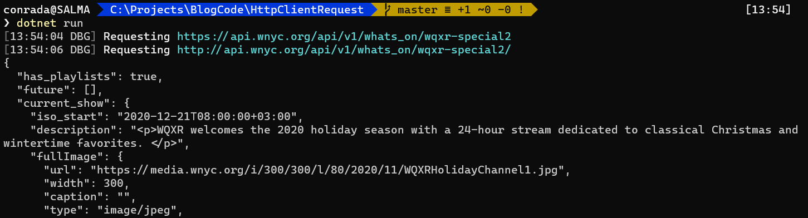

This is another improvement to the logic of making a `Http` request using the [HttpClient](https://docs.microsoft.com/en-us/dotnet/api/system.net.http.httpclient?view=net-5.0).

As [has been discussed before](), a number of problems manifest, the main one being that in .NET Core (and .NET 5) redirects between `http` and `https` are not natively honoured by the `HttpClient`.

In a [previous post where we were getting the details of currently playing music on WQXR](), we had written the following code to check the response for a redirect and then made a second request to the `Uri` specified in the header

```csharp
var result = "";

// Make the initial request
var response = await client.GetAsync(url, HttpCompletionOption.ResponseHeadersRead);

// Check if the status code of the response is in the 3xx range
if ((int)response.StatusCode >= 300 && (int)response.StatusCode <= 399)
{
	// It is a redirect. Extract the location from the header
	var finalResponse = await client.GetAsync(response.Headers.Location);
	if (finalResponse.IsSuccessStatusCode)
	{
		// Now make the request for the json
		result = await finalResponse.Content.ReadAsStringAsync();
	}
	else
	{
		Console.WriteLine($"Could not get the result, error: {finalResponse.StatusCode}");
	}
}
else
{
	// This isn't a redirect. Read the response
	result = await response.Content.ReadAsStringAsync();
}
```

The problem with doing it this way is that we are assuming that there is only **one** redirect.

This is probably often the case, but it is not a good assumption to make. There may be more than one redirect, for any number of reasons.

So we can make couple of improvements to make this better.

The first is that we can encapsulate the logic for checking for http redirects.

We start with this line.

```csharp
if ((int)response.StatusCode >= 300 && (int)response.StatusCode <= 399)
```

Using this logic we can create a static class that we can use to contain an extension method for the [HttpResponseMessage](https://docs.microsoft.com/en-us/dotnet/api/system.web.httpresponse?view=netframework-4.8&viewFallbackFrom=net-5.0) class.

```csharp
public static class HttpResponseExtensions
{
    public static bool IsRedirect(this HttpResponseMessage message)
    {
        return (int)message.StatusCode >= 300 && (int)message.StatusCode <= 399;
    }
}
```

We can then create another extension method for the HttpClient class, in which we don't assume there is a single redirect and we recursively call the method as many times as necessary.

```csharp
public static class HttpClientExtensions
{
	public static async Task<string> MakeRequest(this HttpClient client, string url)
	{
		var formattedResult = "";

		Log.Debug("Requesting {url}", url);

		// Make the initial request
		var response = await client.GetAsync(url, HttpCompletionOption.ResponseHeadersRead);

		// Check if the status code of the response is in the 3xx range
		if (response.IsRedirect())
		{
			// This is a redirect. Make a recursive call
			return await MakeRequest(client, response.Headers.Location.ToString());
		}
		else
		{
			// This isn't a redirect. Read the response
			formattedResult = JToken.Parse(await response.Content.ReadAsStringAsync()).ToString();
		}
		return formattedResult;

	}
}
```

Finally, our encapsulated logic can easily be called as follows:

```csharp
using (var client = new HttpClient())
{
	// Output the json
	Console.Write(await client.MakeRequest("https://api.wnyc.org/api/v1/whats_on/wqxr-special2"));
}
```

Doing it this way means that we can easily reuse this logic.

A further improvement is to make the method return a [HttpResponse](https://docs.microsoft.com/en-us/dotnet/api/system.web.httpresponse?view=netframework-4.8&viewFallbackFrom=net-5.0) object directly, rather than a string. This gives more flexibility in the management of the logic.

Running the code should yield the following:



Note the two logged requests at the very top.

The code is in my [Github](https://github.com/conradakunga/BlogCode/tree/master/21%20Dec%202020%20-%20Http%20Client%20Request%20Improvements).

Happy hacking!


