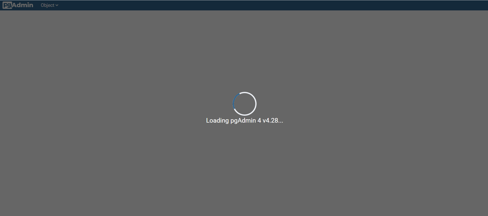
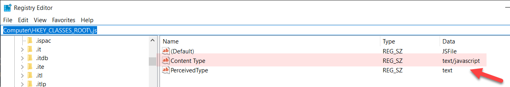
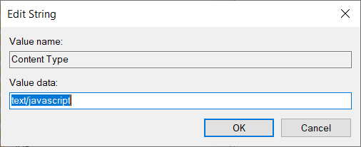
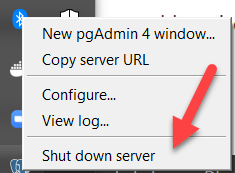

Are you attempting to open the pgAdmin web console and it appears to be loading endlessly?

Are you seeing the following screen?

The problem is the registry association of .js files is broken.

Launch the registry editor [Regedit](https://support.microsoft.com/en-us/windows/how-to-open-registry-editor-in-windows-10-deab38e6-91d6-e0aa-4b7c-8878d9e07b11) and navigate to this key

`Computer\HKEY_CLASSES_ROOT\.js`

If the Content Type here is `text/plaintext` or anything else, double click and change it to `text/javascript`.

Then shut down the server and start it again.

The web console should now load correctly.

Happy hacking!

