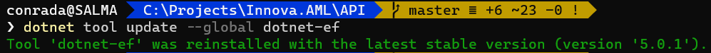

While running the entity framework command to add a migration, I got the following error


```plaintext
The Entity Framework tools version '3.1.2' is older than that of the runtime '5.0.1'. Update the tools for the latest features and bug fixes.
System.Reflection.TargetInvocationException: Exception has been thrown by the target of an invocation.
 ---> System.TypeLoadException: Could not load type 'Microsoft.EntityFrameworkCore.NpgsqlDbContextOptionsExtensions' from assembly 'Npgsql.EntityFrameworkCore.PostgreSQL, Version=5.0.1.0, Culture=neutral, PublicKeyToken=5d8b90d52f46fda7'
```

I had just upgraded to .NET 5, and created a new project.

You will get this problem if your entity framework tools do not match with the version of entity framework used in your code.

In this case my code was using .NET 5.0.1 and the version of entity framework core tools was 3.1.4.

The solution to this was to upgrade entity framework tools, with this command:

```bash
dotnet tool update --global dotnet-ef
```

You should get the following notification:



To verify the current version of entity framework run the following command:

```bash
dotnet ef --version
```

You should get the following notification:


Alternatively, you can run the tool directly without any parameters:

```bash
dotnet ef
```

This will give you the following help prompt, that will also print the version.


Happy hacking!

 