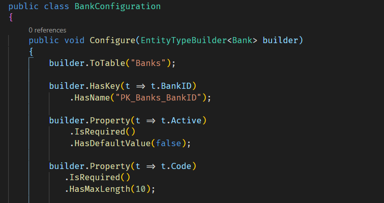
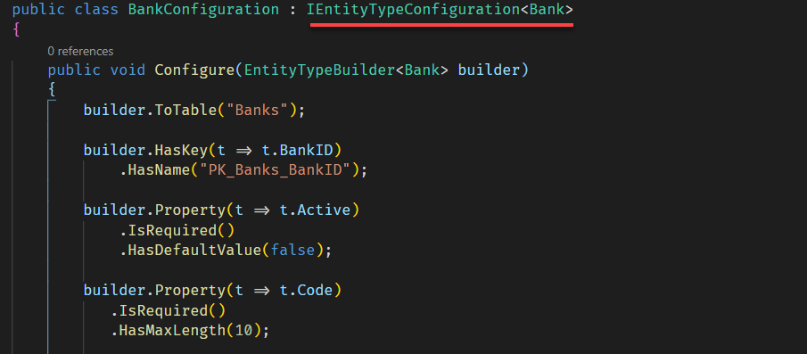

If you are using Entity Framework Core, and are configuring your models using [configuration classes](https://docs.microsoft.com/en-us/dotnet/api/microsoft.entityframeworkcore.ientitytypeconfiguration-1?view=efcore-5.0) (as you [probably should](https://dotnetcoretutorials.com/2020/06/27/a-cleaner-way-to-do-entity-configuration-with-ef-core/)) you might run into a situation where after adding your migrations and updating your database, you find that the resulting schema does not have indexes or unique constraints.

Should you run into this problem check the following

### You Are Overriding OnModelCreating

On your `DbContext` class, make sure that you are overriding `OnModelCreating()`, and within that method you are applying the configurations.

```csharp
protected override void OnModelCreating(ModelBuilder modelBuilder)
{
    modelBuilder.ApplyConfigurationsFromAssembly(typeof(YOURDATABSEContext).Assembly);
}
```

The `ApplyConfigurationsFromAssembly` method here scans the assembly containing the `DBContext` passed and applies all the configurations it finds.


### You Are Correctly Implementing IEntityTypeConfiguration<TEntity>

Make sure that you are correctly implementing `IEntityTypeConfiguration<TEntity>` and calling the `Configure` method.

I spent some hours trying to figure out why this configuration was being skipped.



Can you spot the problem here?

I had inadvertently omitted the crucial bit highlighted here.



If you omit that bit Entity Framework Core will not be able to find and apply your configurations.

Your code should now behave as expected.

Happy hacking!