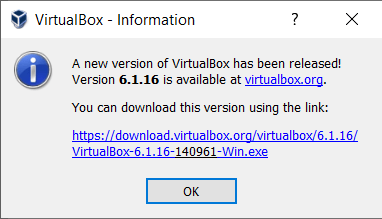

This is the dialog I saw when I launched [Oracle VM VirtualBox](https://www.virtualbox.org/) today.

Pretty useful, at first glance.

Except for the fact that **none of those links are clickable**. They may look like links but they aren't.

You may think that a quick solution is to `Ctrl + C`, which should [get you the text of a message box](https://winaero.com/copy-text-message-box-windows-10/).

Except that this doesn't work either. Nothing gets copied to the clipboard.

**Fail.**

1. Things that look like clickable hyperlinks **should be clickable hyperlinks**.
2. If you want to help the user, **then help the user**. There are options
   - Make the hyperlinks clickable
   - Add a button that when clicked, launches the website to the desired URL
   - Add a button that when clicked, triggers the download process in the background, and then prompts the user to install when done.

Happy hacking!