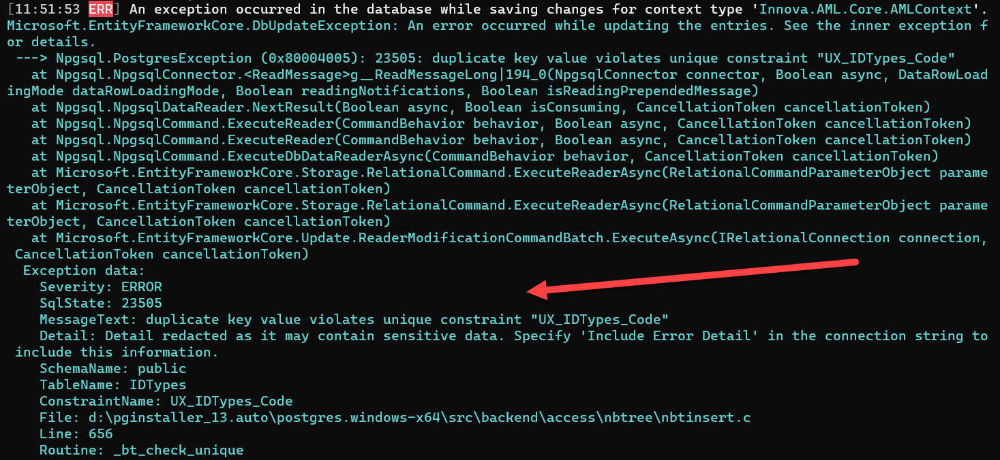

In your traditional database, there are two ways to enforce the restriction that "the value of this column should be unique":
1. Unique constraints
2. Unique indexes

If you attempt to insert a duplicate column value, the database will throw an error and abort the operation.

Both of these are available in entity framework.

Let us take an example that uses the following model:

```csharp
public class IDType
{
    public Guid IDTypeID { get; set; }
    public string Code { get; set; }
    public string Name { get; set; }
}
```

We will configure entity framework using a [configuration class](https://www.learnentityframeworkcore.com/configuration/fluent-api), rather than overriding the `OnModelCreating` event.

The code is like this:

```csharp
public class IDTypeConfiguration : IEntityTypeConfiguration<IDType>
{
    public void Configure(EntityTypeBuilder<IDType> builder)
    {
        // Configure the underlying table
        builder.ToTable("IDTypes");
        // Configure the primary key
        builder.HasKey(t => t.IDTypeID)
            .HasName("PK_IDTypes_IDTypeID");
        // Set the code as required, with a max length of 10
        builder.Property(t => t.Code)
           .IsRequired()
           .HasMaxLength(10);
        // Set the name as required, with a max length of 100
        builder.Property(t => t.Name)
         .IsRequired()
         .HasMaxLength(100);
        // Set the generation of the primary key
        builder.Property(t => t.IDTypeID)
            .HasValueGenerator((IDTypeID, type) => new SequentialGuidValueGenerator())
            .Metadata.SetAfterSaveBehavior(PropertySaveBehavior.Throw);
        // Create the unique constraint
        builder.HasAlternateKey(x => x.Code)
            .HasName("UXC_IDTypes_Code");
    }
}
```

I have gone ahead to wire this model into an actual project, which is a ASP.NET 5 WebAPI application.

I am then using [Insomnia](https://insomnia.rest/) to test the API.

Creating an `IDType` is straightforward.


You can see on the right pane that the `IDType` is created successfully and we receive a `201` with a redirect to the new object.

Now let us try to edit the `IDType` to change the code to an existing one.


We get the above error, which is in my code has been  repackaged and formatted for the API consumers.

The original error is visible in the entity framework logs.


What the error is essentially saying is that the code is read-only, and if I really want to update the code I need to delete the entire existing object, and create a new one with the new code.

This is obviously a convoluted solution.

The solution to this is to not use a **unique constraint** in entity framework but to use a **unique index**.

For this delete this code in the configuration class:

```csharp
// Create the unique constraint
builder.HasAlternateKey(x => x.Code)
    .HasName("UXC_IDTypes_Code");
```

Replace it with this code:

```csharp
// Index the code column, unique
builder.HasIndex(x => x.Code)
   .HasDatabaseName("UX_IDTypes_Code")
   .IsUnique();
```

Create the migrations and update the database, and then try again. Note that the constraint and the index have **different names**, otherwise EF will be confused how to treat the change.

If we try to update the entity to use an existing code we get the following:


The update has failed (as it should), but now the error is coming from the database, and not entiry framework itself.

Remember that the error from the API has been wrapped for downstream clients to consume.

The actual problem can be seen in the logs.



In conclusion - to enforce a unique column in entity framework, don't use a **unique constraint** - use a **unique index**.

The intellisense help for setting up a unique constraints actually warns about this:


Happy hacking!