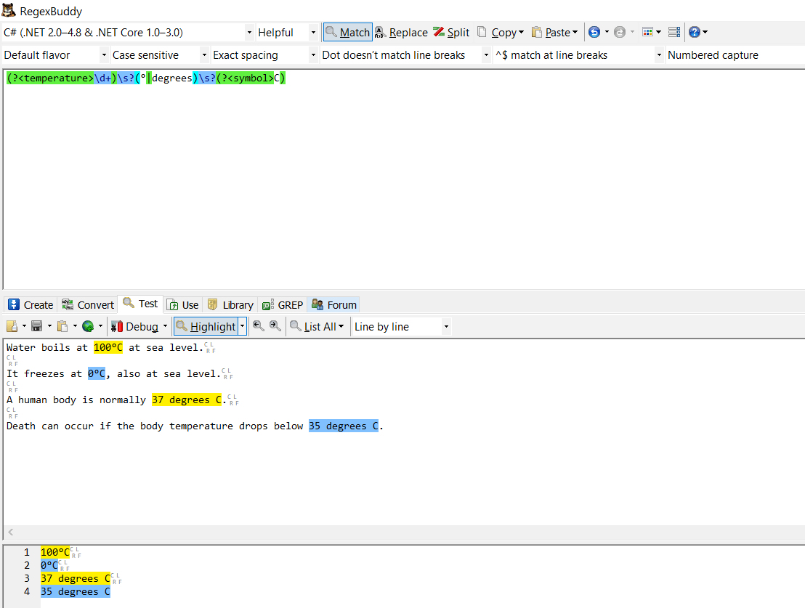

Regular expressions (`Regexes`) are a powerful tool for solving certain types of problems - and in particular looking for a certain pattern of text in a larger string and (optionally) replacing it with another.

But there is a use case where `Regexes` truly shine in their elegance.

Take the following text:

```plaintext
Water boils at 100°C at sea level.

It freezes at 0°C, also at sea level.

A human body is normally 37 degrees C.

Death can occur if the body temperature drops below 35 degrees C.
```

Those who use the metric system (which is everyone except the USA and Liberia) would understand this off the bat.

Our friends who don't use the metric system would have some difficulty understanding this.

We need to convert the temperatures in this text from degrees Centigrade (or Celsius) to degrees Fahrenheit.

To do this we have to:
1. Identify all the temperatures in the text
2. Convert them to degrees Fahrenheit
3. Replace their occurrences in the text

For this we will use our old friend the regular expression.

The pattern we want is this

```plaintext
[number][space][symbol]
```

My preferred tool of choice for writing and testing regular expressions is [RegexBuddy](https://www.regexbuddy.com/)



The final regex I have developed is this:

```csharp
(?<temperature>\d+)\s?(?<notation>(°|degrees))\s?(?<symbol>C)
```

Let me attempt to break it down.

1. Look for any digits (`\d`), and if found, match as many sequential digits as possible. Capture this into the group `temperature`
2. After the digits there may or may not be a space (`\s`)
3. The temperature is indicated **either** by the degree symbol, `°` or the word `degrees`. Find what was used, and capture into the group `notation`
4. After that there may or may not be a space
5. After that there is a C, used to indicate Celsius

Now you might ask, how will we capture, convert and replace the temperatures?

Regular Expression [MatchEvaluators](https://docs.microsoft.com/en-us/dotnet/api/system.text.regularexpressions.matchevaluator?view=net-5.0) to the rescue!

The `MatchEvaluator` is a delegate (pointer to a method) that takes as a parameter the [Match](https://docs.microsoft.com/en-us/dotnet/api/system.text.regularexpressions.match?view=net-5.0) object populated by the Regex engine.

We will write a function to do the heavy lifting.

```csharp
public string ConvertToFahrenheit(Match match)
{
	// Get the temperature string, and convert
	var celsius = Convert.ToDecimal(match.Groups["temperature"].Value);
	// Get the original notation used
	var notation = match.Groups["notation"].Value;
	// Convert the temperature
	var fahrenheit = ((9M / 5M) * celsius) + 32M;
	// Return the new string
	return $"{fahrenheit} {notation} F";
}
```

Then in our main method, we will pass the text to be converted to the `Regex` and call the [Replace()](https://docs.microsoft.com/en-us/dotnet/api/system.text.regularexpressions.regex.replace?view=net-5.0) method.

```csharp
void Main()
{
	var regex = new Regex(@"(?<temperature>\d+)\s?(?<notation>(°|degrees))\s?C");
	var sourceText = @"Water boils at 100°C at sea level.

It freezes at 0°C, also at sea level.

A human body is normally 37 degrees C.

Death can occur if the body temperature drops below 35 degrees C.";

	var targetText = regex.Replace(sourceText, new MatchEvaluator(ConvertToFahrenheit));
	Console.WriteLine(targetText);

}
```
  
If all goes well the following should be printed:

```plaintext
Water boils at 212.0 ° F at sea level.

It freezes at 32.0 ° F, also at sea level.

A human body is normally 98.6 degrees F.

Death can occur if the body temperature drops below 95.0 degrees F.
```

If we want 100% fidelity to the text, we can additionally capture whether spaces were used between the temperature and the symbol and substitute accordingly, but that is an exercise I leave to you!

You can also decide to standardize and use one notation - either ° or degrees.

Say for example we want to standardize with °.

If that were the case we would replace this line:

```csharp
return $"{fahrenheit} {notation} F";
```

with this:

```csharp
return $"{fahrenheit} ° F";
```

This technique would be very useful on a scientific website serving both metric and non-metric users. Users can choose whichever notation they prefer and the code will seamlessly convert back and forth.
  
Contributors can write with whichever notation they are comfortable with and readers can read it in whichever notation they prefer.

In this case we would write a second regex like so:

```csharp
(?<temperature>\d+)\s?(?<notation>(°|degrees))\s?F
```

Note the `F` at the end. With this regex we are searching for Fahrenheit.

Note that the original regex would ignore Fahrenheit temperatures if they were already in the text.

So this text:

```plaintext
Water boils at 100°C at sea level.

It freezes at 0°C, also at sea level.

A human body is normally 37 degrees C.

Death can occur if the body temperature drops below 35 degrees C.

Zero degrees C is 35° F
```

Would yield

```plaintext
Water boils at 212.0 ° F at sea level.

It freezes at 32.0 ° F, also at sea level.

A human body is normally 98.6 degrees F.

Death can occur if the body temperature drops below 95.0 degrees F.

Zero degrees C is 35° F
```

Note the last temperature is unchanged.

The code is in my [Github](https://github.com/conradakunga/BlogCode/tree/master/2%20Feb%202021-%20%20Using%20Regular%20Expression%20Match%20Evaluators).

Happy hacking!


