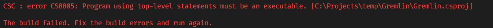
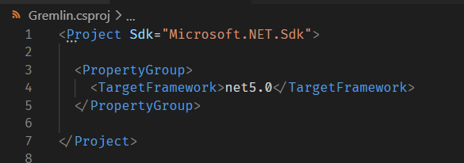
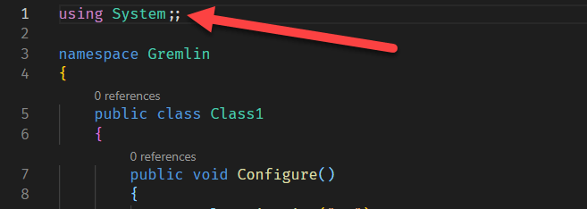

So today in a rather large project I began getting the following error when I ran a build:



```plaintext
CSC : error CS8805: Program using top-level statements must be an executable. [C:\Projects\temp\Gremlin\Gremlin.csproj]

The build failed. Fix the build errors and run again.
```

This left me scratching my head as the project had been building perfectly.

This is a .NET 5.0 class library project that does pretty normal stuff.

Note that the error message tells you nothing about where exactly the problem is - the `.proj` file was perfectly OK.



I knew it had to be one of the classes I had recently added, and so the only way to find the culprit was to remove the classes one by one.

I finally found the problem:



Yes, that extra semicolon here

```csharp
using System;;
```
was the source of the problem.

It seems to confuse the compiler into thinking the class has top level statements.

So if you get the error 

```plaintext
CSC : error CS8805:
```

Check your namespace imports.

Happy hacking!