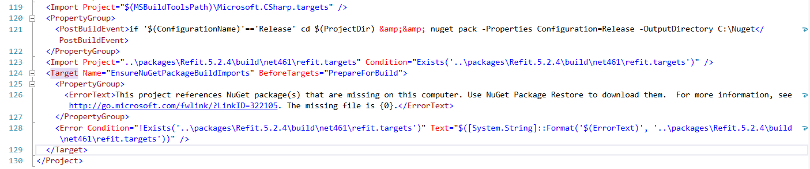

[Refit](https://reactiveui.github.io/refit/) is a very brilliant library that allows you to call REST APIs with minimal code.

You just need to define an interface and write an implementation. Refit does the rest.

```csharp
public interface ICountry
{
    [Get("/api/Countries")]
    Task<List<CountryDTO>> ListCountries();
}

public async Task<List<CountryDTO>> ListCountries()
{
    var api = RestService.For<ICountry>(EndPoint);
    var res = await api.ListCountries();
    return res;
}
```

Among the **many** things Refit does for you is:
* Construct the infrastructure to make HTTP requests and receive the responses
* URI encoding of parameters
* Header management
* Serialization of responses into typed objects

Under the hood it generates some code as part of the build process. (If you're really curious open the `.csproj` and scroll down. You'll see something like this:)



One part that can throw you off is handling of errors like this:

```plaintext
"Response status code does not indicate success: 400 (Bad Request)"
```

This is not very useful to users as they cannot figure out what the actual problem is.

It is even more of a problem for 500 errors where the details are even more obfuscated.

To handle this, explicitly catch the `ApiException`, and then use that to get the details of the exception.

Like this:

```csharp
try
{
    var api = RestService.For<ICountry>(EndPoint);
    var res = await api.ListCountries();
    return res;
}
catch (ApiException ex)
{
    // Extract the details of the error
    var errors = await ex.GetContentAsAsync<Dictionary<string, string>>();
    // Combine the errors into a string
    var message = string.Join("; ", errors.Values);
    // Throw a normal exception
    throw new Exception(message);
}
```

The `ApiException` class has a method, `GetContentAsAsync()` that you can use to query for the details of any errors (plural, as they can be more than one) and returns a dictionary of those errors.

The reason I am catching an exception in this case is the code is in a library that is subsequently being consumed elsewhere, and it is the responsibility of the consumer to catch this exception and decide what to do with it.

Another reason is that the downstream client is a VB.NET application, and [Refit does not work with VB.NET](https://github.com/reactiveui/refit/issues/314) so you cannot capture the `ApiException` directly.

On the calling side you have one more complication.

If the service is down for whatever reason, Refit throws an even more cryptic error. This is because the exception is thrown by the networking stack of the runtime even before Refit gets an opportunity to process the request.

If the calling API is down, you actually get a bunch of nested exceptions:
* `HttpRequestException`
* `WebException`
* `SocketException`

These will not be caught by the `ApiException` try-catch handler

To detect this, you must write a try-catch to capture the outermost `HttpRequestException`

Like so (this example is in VB.NET):

```vbnet
Dim apiLocation = "https://localhost:5000"
Try
    api = New API(apiLocation)
    Dim result = Await api.HealthCheck()
Catch ex As HttpRequestException
    Prompts.Error($"Could not connect to service on { apiLocation}")
End Try
```

Happy hacking!