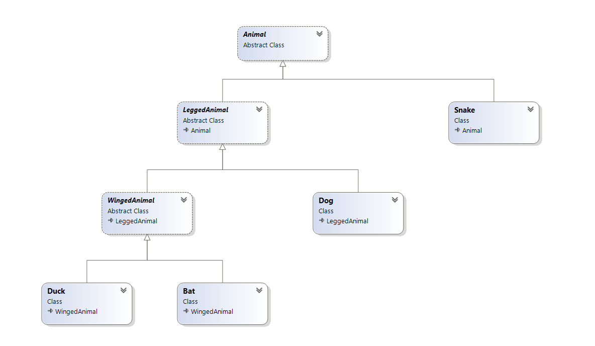
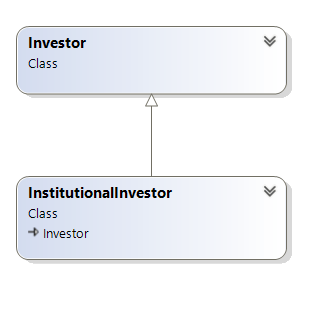

When you were introduced to object oriented programming (OOP), you probably used the canonical example domain of animals.

So we start off with an animal

```csharp
public class Animal
{
    public virtual void MakeSound() => "Noise";
}
```

A dog is an animal.

So we subclass `Animal` to get this:

```csharp
public class Dog : Animal
{
    public override void MakeSound() => "Woof";
}
```

A duck is also an animal. So we further subclass `Animal` to get this:

```csharp
public class Duck : Animal
{
    public override void MakeSound() => "Quack";
}
```

At this point we realize that it will never make sense to create an animal directly. So we make it an abstract class, so that you cannot directly create an animal.

```csharp
public abstract class Animal
{
    public virtual string MakeSound() => "Noise";
}
```

To verify that this is all working correctly we write a test.

```csharp
[Fact]
public void A_Collection_Of_Animals_Is_Processed_Correctly()
{
    var animals = new Animal[] {
        new Dog(),
        new Duck()
    };

    foreach (var animal in animals)
    {
        var sound = animal.MakeSound();
        sound.Should().NotBeEmpty();
        sound.Should().NotBe("Noise");
    }
}
```
        
Here we create a collection of `Animal` into which we put a `Dog` and a `Duck`.
  
We then iterate through each `Animal` in the collection and as it to make a noise.

So far so good.

We then decide we want to beef up our classes.

Animals have legs.

So we can add that property to the base class.

```csharp
public abstract class Animal
{
    public virtual string MakeSound() => "Noise";
    public byte Legs { get; set; }
}
```

And set them up in the constructors of the sub classes.

```csharp
public class Dog : Animal
{
    public override string MakeSound() => "Woof";
    public Dog() => Legs = 4;
}
```

```csharp
public class Duck : Animal
{
    public override string MakeSound() => "Quack";
    public Duck() => Legs = 2;
}
```

Great.

And then you are reminded that a `Snake` does not in fact have legs.

So our hierarchy is broken.

So we need to introduce another abstract subclass from which we can solve this problem - `LeggedAnimal`, that inherits from `Animal`

```csharp
public abstract class LeggedAnimal : Animal
{
    public byte Legs { get; set; }
}
```

We then change the `Dog` and the `Duck` like so:

```csharp
public class Dog : LeggedAnimal
{
    public override string MakeSound() => "Woof";
    public Dog() => Legs = 4;
}
```

```csharp
public class Duck : LeggedAnimal
{
    public override string MakeSound() => "Quack";
    public Duck() => Legs = 2;
}
```

We can now create our `Snake` as follows:

```csharp
public class Snake : Animal
{
    public override string MakeSound() => "Quack";
}
```

We can then update our test to add the `Snake`.

```csharp
public void A_Collection_Of_Animals_Is_Processed_Correctly()
{
    var animals = new Animal[] {
        new Dog(),
        new Duck(),
        new Snake()
    };

    foreach (var animal in animals)
    {
        var sound = animal.MakeSound();
        sound.Should().NotBeEmpty();
        sound.Should().NotBe("Noise");
    }
}
```

We then realize that we need to add more animals - a `Cow`, a `Goat`, a `Chicken`, a `Flamingo` and a `Bat`.

This introduces a need for further reflection.

A `Duck`, a `Chicken`, a `Flamingo` and a `Bat` have wings.

It might be of use to generalize those to `WingedAnimals`.

And so we introduce another abstract class. While it has wings, a `Bat` is a bit different from the others - it does not have feathers.

C# does not allow inheritance from multiple classes, but for this particular problem we do not need this. A winged animal (at least this far) also has legs.

So the class will look like this:

```csharp
public abstract class WingedAnimal : LeggedAnimal
{
    public byte Wings { get; set; }
    public bool HasFeathers { get; set; }
}
```

So the `Duck` now looks like this:

```csharp
public class Duck : WingedAnimal
{
    public override string MakeSound() => "Quack";
    public Duck() => (Legs, HasFeathers) = (2, true);
}
```

The new `Bat` looks like this:

```csharp
public class Bat : WingedAnimal
{
    public override string MakeSound() => "Squeak";
    public Bat() => (Legs, HasFeathers) = (2, false);

}
```

The class diagram of our types so far is this:




We then learn we need to add these:
1. Unicorn
2. Earthworm
3. Jellyfish
4. Whale
5. Bee
6. Ant
7. Sloth

With the addition of each of these you may find you need to introduce more and more classes to support the separation of concerns.

This can quickly become a nightmare.

It is even worse when your base classes are not abstract, and have logic. In which case you are then going to spend a disproportionate amount of time moving around and refactoring code.

So instead of writing logic, you are spending more and more time rearranging your code to fit into a hierarchy.

Is it doable? Yes. Is it a good use of your time? Debatable, but usually no.

You will fall into this problem most commonly when you are trying to solve a coding problem (i.e. you want to minimize the code you are writing using classes with logic that are inherited for overriding.)

So for business logic, this is **likely** a code smell. Likely. Not always. Business requirements and realities change all the time, including being reversed altogether.

As we have seen above, it is almost certain you will learn something new about the problem domain that will force you to revisit your existing code to update.

Take this (real) example.

You start off by implementing an `Investor` class

```csharp
public class Investor
{
    public string Name { get; set; }
    public string PhoneNumber { get; set; }
    public string PhysicalAddress { get; set; }
    public string PostalAddress { get; set; }
    public DateTime RegistrationDate { get; set; }
    public DateTime? TerminationDate { get; set; }
}
```

You then add methods, etc and all is well for some time.

Later the business says that there are certain investors that are not individuals - they are institutions. But all the properties and behaviour is identical.

So you do this:

```csharp
public class InstitutionalInvestor : Investor
{

}
```

Your hierarchy now looks like this:



And then a year later the business informs you:

> Actually, we need to collect PIN numbers for individual investors

Which leaves you with few choices, none of them pretty

1. Extract the truly common fields to a parent `Investor` Class. Subclass that to `IndiviualInvestor`. Add your new logic there. Then subclass `Investor` again to a `InstitutionalInvestor`
2. Add the new logic to `Investor`, but then ignore it in the `InstitutionalInvestor`. Other team members (and users) will need to be informed to ignore the `PINNumber` field.

Either way, your changes to the `Investor` have affected `InstitutionalInvestor`. Should this be the case?

So how do we solve this problem where we need to encapsulate expected behaviour in code? **Contracts**. We shall look into that in the next post.

The code is in my [Github](https://github.com/conradakunga/BlogCode/tree/master/2021-03-06%20-%20Inheritance).

Happy hacking!


