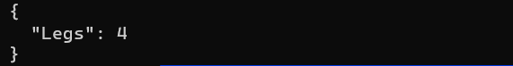

Assume we have the following class:

```csharp
public class Animal
{
    public string Name { get; set; }
    public byte Legs { get; set; }
}
```

If we wanted to serialize this to Json using the new Json engine, [System.Text.Json](https://docs.microsoft.com/en-us/dotnet/api/system.text.json?view=net-5.0), we would do it like so:

```csharp
var animal = new Animal()
{
    Name = "Dog",
    Legs = 4
};
var serialized = JsonSerializer.Serialize(animal, 
    new JsonSerializerOptions() { WriteIndented = true });
    
Console.WriteLine(serialized);
```
If we run this code we should get as follows:


Now, let us assume that we created the animal like this:

```csharp
var animal = new Animal()
{
    Name = null,
    Legs = 4
};
```

If we run the code we get the following:


You can see in the output that the null is output explicitly.

Now there are two main ways to handle this - the first is to have the attribute with a value of null, as we have done. The second is not to have the attribute there at all, if its value is null.

To achieve the second method we configure our serialization as follows:

```csharp
animal = new Animal()
{
    Name = null,
    Legs = 4
};
serialized = JsonSerializer.Serialize(animal, new JsonSerializerOptions()
{
    WriteIndented = true,
    IgnoreNullValues = true
});
```

If we run the code the output should be as follows:



Here we can see the Name property is not serialized at all.

There is a third technique - returning an empty string where there are nulls. This might not be the way most people would do, but this might be a requirement for an upstream API.

To do this we create a [JsonConverter](https://docs.microsoft.com/en-us/dotnet/api/system.text.json.serialization.jsonconverter-1?view=net-5.0). This is a special class that we can subclass and override to control the serialization (and deserialization) process of an object.

```csharp
public class NullToEmptyStringConverter : JsonConverter<string>
{
    // Override default null handling
    public override bool HandleNull => true;
    // Check the type
    public override bool CanConvert(Type typeToConvert)
    {
    	return typeToConvert == typeof(string);
    }
    // Ignore for this exampke
    public override string Read(ref Utf8JsonReader reader, Type typeToConvert, JsonSerializerOptions options)
    {
    	throw new NotImplementedException();
    }
    // 
    public override void Write(Utf8JsonWriter writer, string value, JsonSerializerOptions options)
    {
    	if (value == null)
            writer.WriteStringValue("");
    }
}
```

There are 4 important bits here
1. `HandleNull` by default is `false` - the serializer by default will output a null the instant it encounters one and will make no attempt to process it. In our code we need to override this and make it `true`.
2. `CanConvert` determines the type for which the serialization and deserialization code you are going to write will be processed.
3. `Read` is the code to deserialize the value.
4. `Write` is the code to serialize the value.

In our case here we are interested in the string type, and we simply want to write an empty string whenever we encounter a `null`

Once we have written our converter, we need to make our code aware of the new converter. This is done by adding it to an instance of the [JsonSerializationOptions](https://docs.microsoft.com/en-us/dotnet/api/system.text.json.jsonserializeroptions?view=net-5.0) class.

```csharp
animal = new Animal()
{
    Name = null,
    Legs = 4
};

// create the options
var options = new JsonSerializerOptions() 
{ 
    WriteIndented = true 
};
// register the converter
options.Converters.Add(new NullToEmptyStringConverter());
// serialize
serialized = JsonSerializer.Serialize(animal, options);

Console.WriteLine(serialized);
```

If we run the code, the output should be like this:


The code is in my [Github](https://github.com/conradakunga/BlogCode/tree/master/2021-03-09%20-%20Systm.Text.Json%20Empty%20String%20Handling).

Happy hacking!