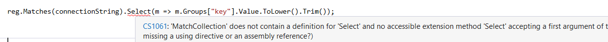
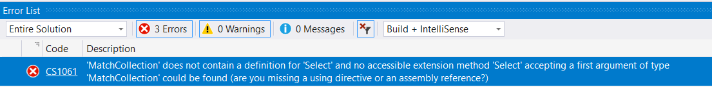

I have some code where I am running a regex and using LINQ to manipulate the matches.

```csharp
reg.Matches(connectionString).Select(m => m.Groups["key"].Value.ToLower().Trim());
```

Pretty straightforward - from the match collection I am projecting the first group (named `key` into a collection).

It works perfectly in .NET Core.

However the same code does not work in .NET Standard 2



The error itself is this:



```plaintext
'MatchCollection' does not contain a definition for 'Select' and no accessible extension method 'Select' accepting a first argument of type 'MatchCollection' could be found (are you missing a using directive or an assembly reference?
```

In short - in .NET Standard 2, the regex collections do not implement the extension methods that you need to get LINQ to work.

The solution to this is to use an `IEnumerable<Match>` instead of a `MatchCollection`.

Update your code as follows:

```csharp
var matches = reg.Matches(connectionString).Cast<Match>().Select(x => x);
```

What is happening here is we are extracting each `Match` from the `MatchCollection` and projecting it into an `IEnumerable<Match>`

This collection will support LINQ without any problems.

