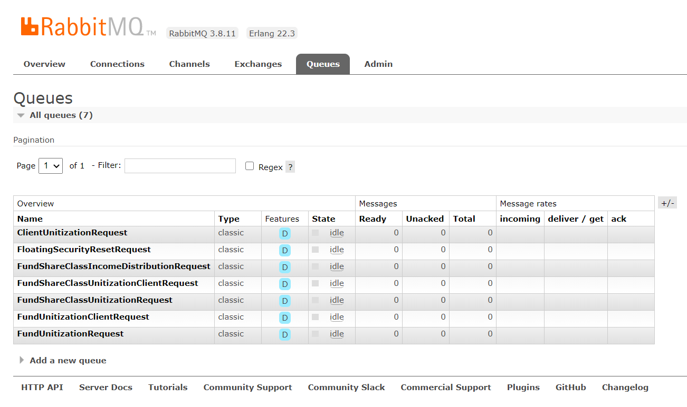

I recently had to delete all the queues in my RabbitMQ instance.

There is an admin interface for this



However it quickly gets monotonous having to click on each queue to delete it.

Luckily for us us there is a library to help with this: [EasyNetQ.Management.Client](https://github.com/EasyNetQ/EasyNetQ.Management.Client)

Install it the usual way

```bash
dotnet package add EasyNetQ.Management.Client
```

This is different from the usual library for interacting with RabbitMQ, EasyNetQ.

Once you install it, the following code should delete all the queues.

```csharp
// Connect to the management client object
var client = new ManagementClient("http://localhost", "guest", "guest");
// Retrieve the current queues
var queues = await client.GetQueuesAsync();
// Loop through the queues and invoke the delete
foreach (var queue in queues)
{
	Log.Information("Deleting queue {queue}", queue.Name);
	await client.DeleteQueueAsync(queue);
}
```

The `MangementClient` constructor takes three parameters: the **host**, the **username** and the **password**

Happy hacking!
