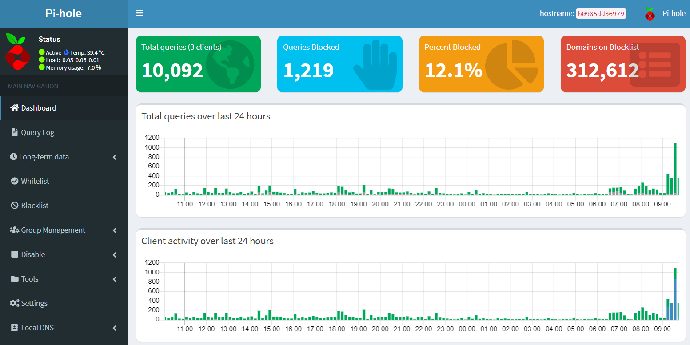

So I noticed that the Disqus comments that I've been had been displaying a range of scammy ads.

Why didn't I notice before, you ask?

Because I use [PiHole](https://pi-hole.net/) on my network and it furiously and raliably blocks all these things before I see them

So I have temporarily removed them in their entirety while I look for a minimal, no hassle comment solution for Jekyll.
