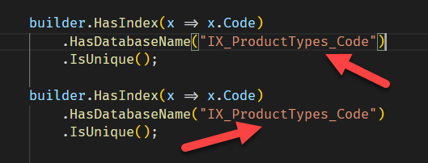

Today I got the following error when working with Entity Framework Core:

```plaintext
System.Reflection.TargetInvocationException: Exception has been thrown by the target of an invocation.
 ---> System.ArgumentException: The string argument 'propertyNames' cannot be empty.
   at Npgsql.EntityFrameworkCore.PostgreSQL.Utilities.Check.NullButNotEmpty[T](IReadOnlyCollection`1 value, String parameterName)
   at Microsoft.EntityFrameworkCore.NpgsqlIndexBuilderExtensions.IncludeProperties(IndexBuilder indexBuilder, String[] propertyNames)
   at Microsoft.EntityFrameworkCore.NpgsqlIndexBuilderExtensions.IncludeProperties[TEntity](IndexBuilder`1 indexBuilder, Expression`1 includeExpression)
```

Again, if perfectly working code barfs suddenly, the problem is something newly introduced.

If you get this error, your problem likely is **you have specified two indexes that have the same name.**




Happy hacking!