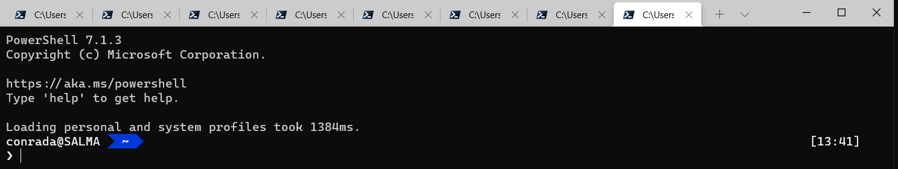
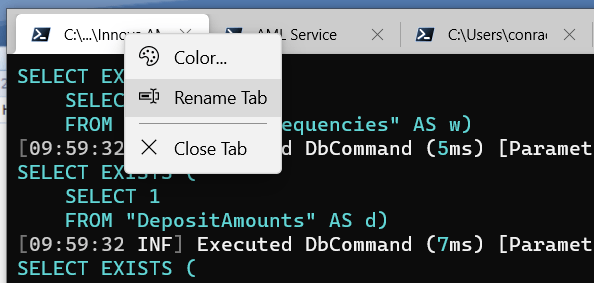
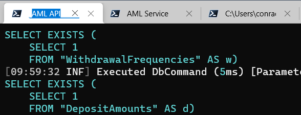
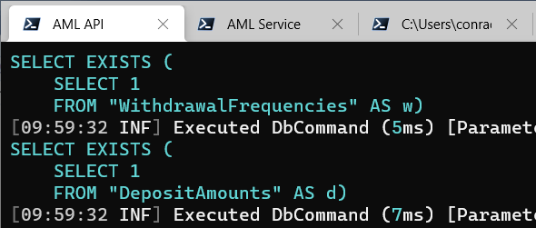
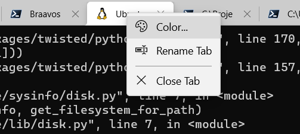
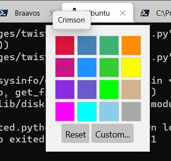
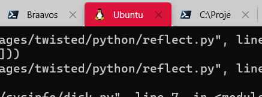
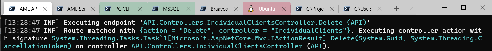

If you're on Windows and are not using Windows Terminal, you really should.

Get it off the Windows Store.

Once you have opened a couple of tabs, it will start to look like this:

With enough tabs open it starts to become to remember which tab is running what.

There is a solution for this - the tabs can be renamed so that the captions can be something other than the current path.

If you right-click you get the following menu:

You go on to click `Rename Tab` and type the caption that you want.

Once you accept you get your caption displayed.

You can even go a step further and set the colour of a tab.

Clicking `Color` will give you a colour wheel

Once you select the color you want the tab looks like this:

The Window now will look something like this:

Happy hacking!