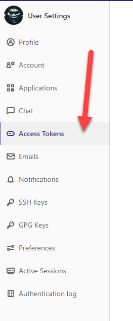
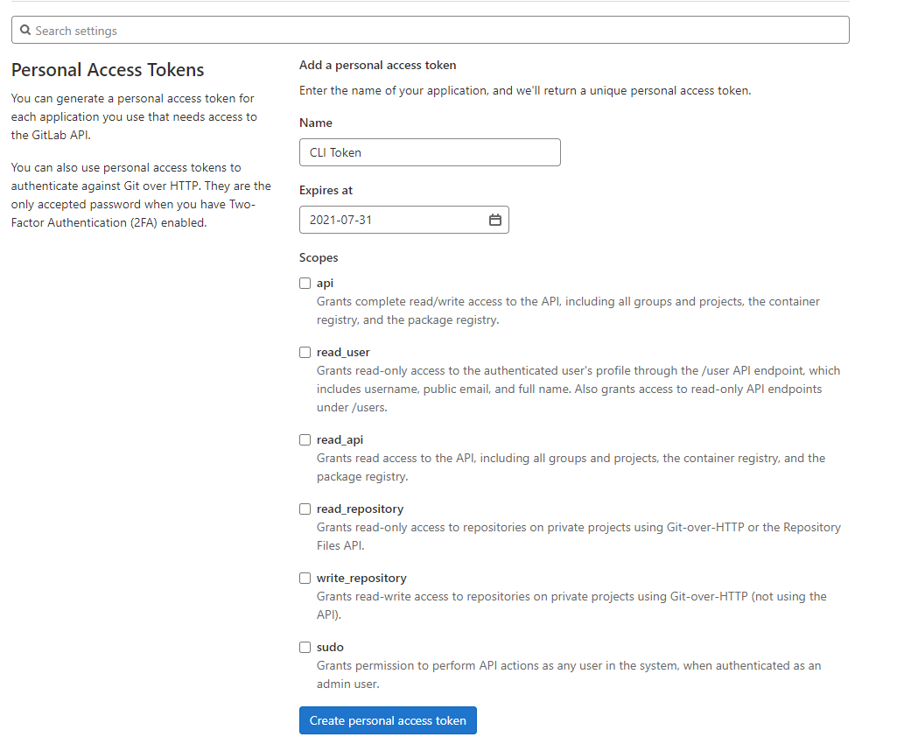
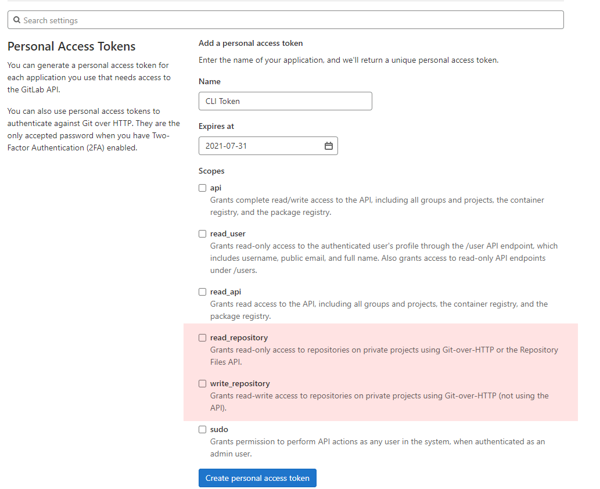
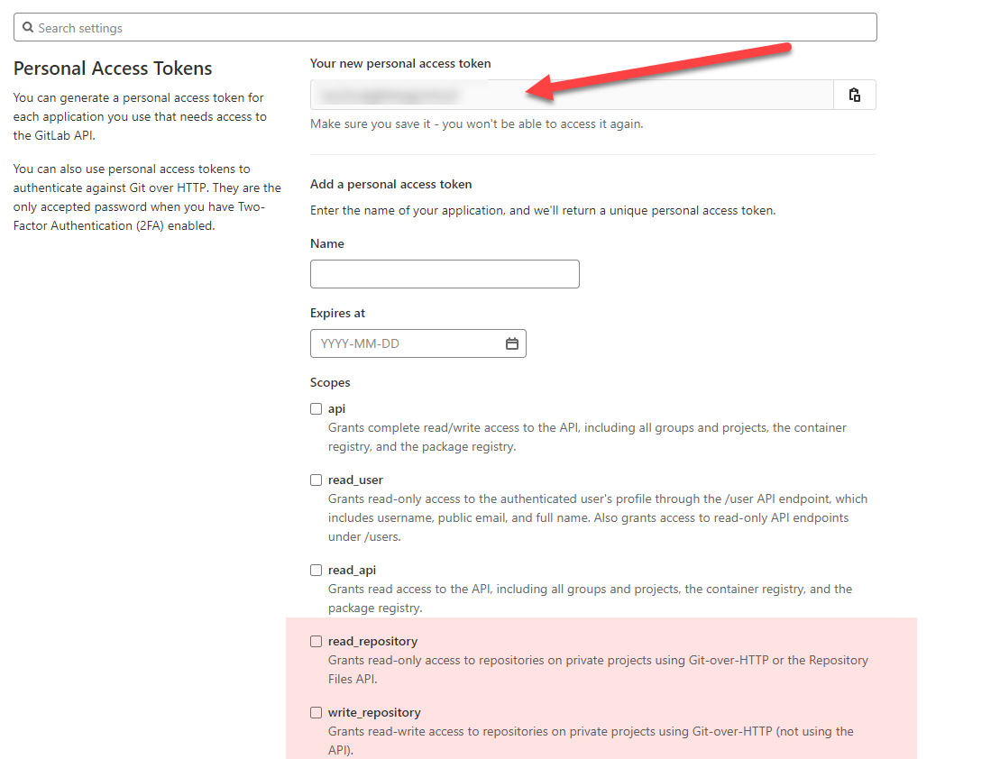

If you have turned on 2 factor authentication for [GitLab](https://about.gitlab.com/), you might be wondering how you can access and manipulate your repository over HTTPS.

Go to **User Settings** > **Access Tokens**

You will be taken to a menu to create a personal access token.

Give it a name and an expiry date. Probably a good idea not to give too long a date in case you forget about it.

Depending on what access you require, choose either `read_repository` (if you just want read access) or `write_repository` (if you want both read and write)

Finally click **Create personal Access Token**.

You should see a screen like this, with your new token generated:

Make sure you copy that token, as once you close this page you cannot retrieve it again.

This token now is to be used instead of the password to authenticate you over HTTP.

The next time you try to connect, you will get an authentication prompt. Enter your username as usual but instead of your password, enter this token.

Remember that in 3 months, or whatever time you set the token validity, it will expire and your authentication will fail. At which point you repeat this cycle again.

Happy hacking!