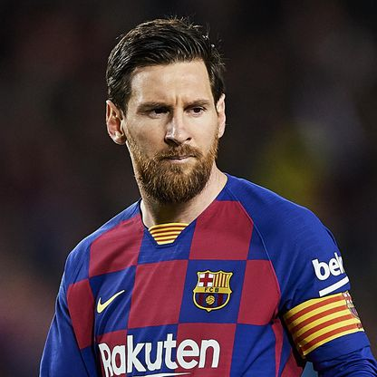
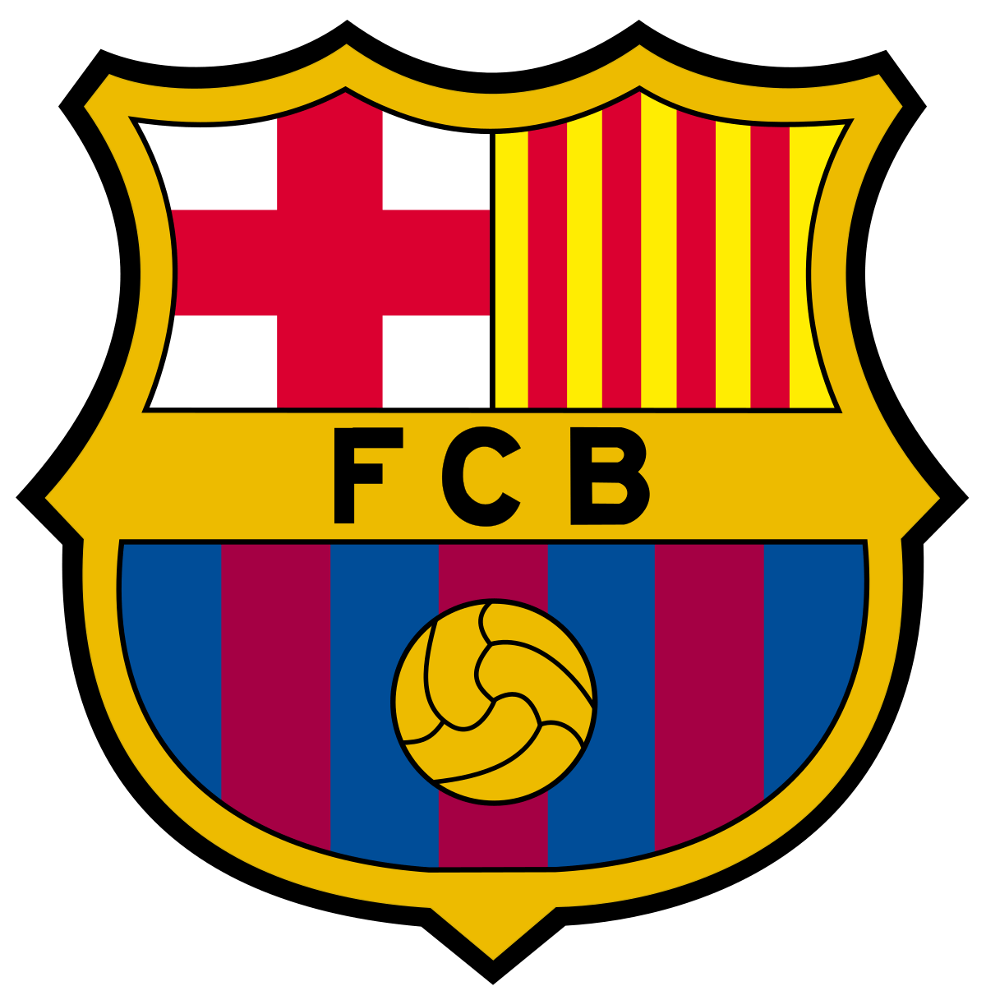
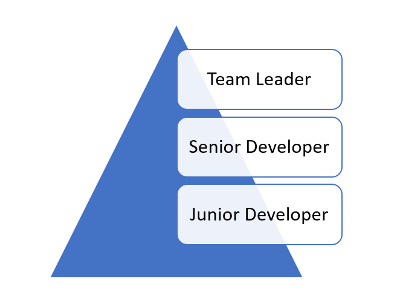

Lionel Messi is, by many accounts, the best football player in the world.

He is also the captain of the first men's team of the Barcelona Football Club.

Imagine you are also a player in this team, and then the club announces that Messi intends to move to a different team the next season.

This would mean over and above the vacancy for a forward, there would also be a vacancy for captain.

Assume there are very able forwards chomping at the bits, and you are one of these.

Assume, that you want to be the captain of Barcelona.

One stratagem would be to be the best forward the club, and the league has ever seen. To play the best football of your life.

Is being the best forward, or the best midfielder, or the best defender, or the best goalie good? Absolutely.

Would it increase your standings in the club, in the league, and in the world?

Absolutely.

Should that be grounds to make you the captain?

Absolutely not.

Because being the best striker / midfielder / defender / goalkeeper has absolutely no bearing when it comes to being a captain.

The question then arises - what is it that is expected of a team captain?

Here are a few responsibilities of what I feel would be expected of a captain:

1. Inspire / rally the team - either through example, or words or any other technique
2. On the pitch leadership - if the team is trailing and a player is sent off, changing strategy to focus on attack. Or vice versa if the team is leading.
3. Represent the player's interests to the management
4. Look out for the individual welfare of players - for example if one team member is down because of a sibling in hospital, arranging for the team bus to ferry the entire team to the hospital to rally both player and sibling.
5. Look out for the individual performance of each player and suggest ways to improve in case of lapses.

Being a good striker is absolutely irrelevant for any of these.

It would be a bonus, if in addition to carrying out the above, the captain was also the best in their position. But again - not relevant to the role of captain.

Imagine also there is another team member who, after Messi's departure, it is discovered this team member is the oldest person on the team.

Should this person the the captain by virtue of their age?

Absolutely not.

Imagine there is a third team member who it turns out has been on the starting lineup for longer than anyone else. Should this person be the captain?

Absolutely not.

Why? Because these factors have nothing to do with the expectations of captain.

So why do we apply this strategy to our careers?

