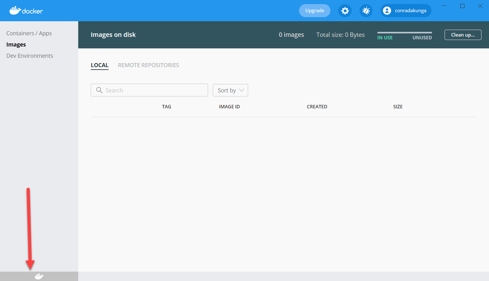
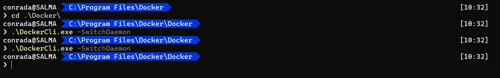
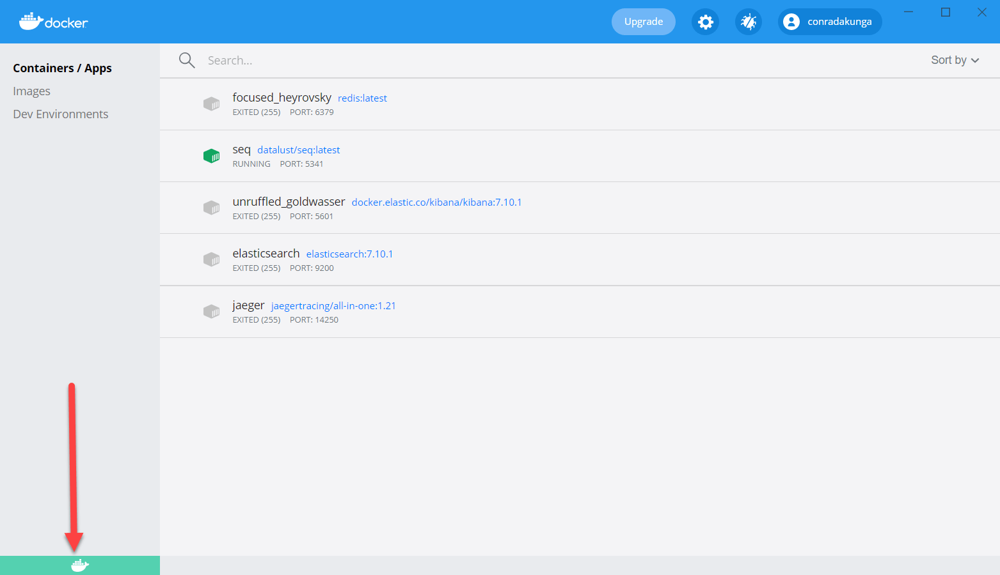

Occasionally [Docker](https://www.docker.com/) for [Windows](https://www.docker.com/products/docker-desktop) will cease to function.

The icon on the tray will look like this:


The app itself, if you launch it, will look like this:



If you try and restart the docker service you get this error:

```plaintext
error during connect: Get http://%2F%2F.%2Fpipe%2Fdocker_engine/v1.40/images/json: open //./pipe/docker_engine: The system cannot find the file specified. In the default daemon configuration on Windows, the docker client must be run elevated to connect. This error may also indicate that the docker daemon is not running.
```

The solution to this is as follows:

1. Launch an elevated command prompt
2. Navigate to the location you installed Docker, usually `C:\Program Files\Docker`
3. Navigate to the location the docker binaries are, usually `Docker`. You should now be here: `C:\Program Files\Docker\Docker` 
3. Execute the following command **TWICE** `.\DockerCli.exe -SwitchDaemon`



This does the following:
1. It [switches docker](https://docs.docker.com/docker-for-windows/) to use the Windows container daemon for the first execution
2. It switches back to the Linux container daemon for the second execution.

Naturally, if you are already on the Windows container daemon the commands will switch to Linux and then back to Windows.

This seems to fix the problem that tripped up Docker in the first place.




Happy hacking!

